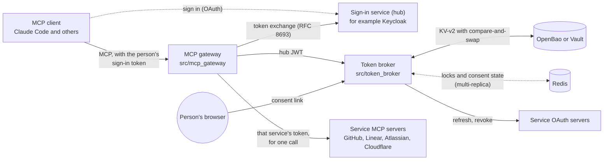

# vendor-token-broker

[](https://github.com/chief-builder/vendor-token-broker/actions/workflows/ci.yml)
[](https://github.com/chief-builder/vendor-token-broker/actions/workflows/codeql.yml)
[](LICENSE)

Let Claude Code and other AI assistants use GitHub, Linear, Jira and
Confluence (Atlassian), and Cloudflare as each signed-in person, without
anyone handling tokens. An **MCP gateway** gives the assistant allowlisted,
read-oriented tools for those services and calls each service's own MCP
server as the person who is signed in. A **token broker** runs the OAuth
consent flow once per person and service, keeps the resulting tokens in
OpenBao or Vault, refreshes them before they expire, and revokes them at the
service when the person disconnects. The assistant never sees a service
token, and no token is ever written to a log.

## Why it matters

The usual way to give an assistant access to a SaaS tool is a personal
access token pasted into a config file on a laptop: long-lived, broadly
scoped, invisible to the organization, and never revoked. This project
replaces that with the pattern an organization would want:

- **People sign in; nobody copies tokens.** A person connects an account
  through the service's own consent page, once, in their browser.
- **Least privilege by construction.** A reviewed registry caps the scopes
  the broker may request, and the gateway lists only allowlisted tools
  (read-only, except where a service's scopes already make a tool read-only).
- **Central custody and lifecycle.** Tokens live in a secrets store, are
  refreshed single-flight (safe across replicas), and are revoked at the
  vendor when someone disconnects.
- **Fails safe and says why.** A storage or coordination outage is a
  retryable 503, never mistaken for "not connected".

## Architecture



- **Gateway** (`src/mcp_gateway/`, FastMCP). Serves tools named
  `github_…`, `linear_…`, `atlassian_…`, and `cloudflare_…`, plus
  `connect_<service>` and `disconnect_<service>`. On each call it exchanges
  the caller's token at the hub, asks the broker for that person's service
  token, and forwards the call in a fresh session. If the account is not
  connected, the assistant shows a link (MCP URL elicitation). See
  [MCP gateway](docs/mcp-gateway.md).
- **Broker** (`src/token_broker/`, FastAPI). Exactly seven routes, checked
  by `tests/unit/test_routes.py` on every push. It keeps tokens; it never
  issues them: no token-minting endpoint and no signing keys of its own (it
  may sign `private_key_jwt` client assertions to vendors with keys held in
  storage). See [Design](docs/design.md) and the [broker API](docs/api.md).

How the broker behaves:

- **Hands out tokens** (`POST /v1/tokens/resolve`). It re-validates the hub
  JWT itself: only the algorithms in `HUB_ALGORITHMS` (default PS256/ES256,
  never RS256, HMAC, or `none`), the issuer, exactly one tier audience, and
  the contract version. It returns a live vendor token, refreshing it first
  if needed.
- **Connects accounts** (`/v1/authorize/{vendor}` → hub sign-in →
  `/v1/callback/_hub` → vendor → `/v1/callback/{vendor}`). The person must
  sign in as the user the link was made for, in the same browser for every
  step (a binding cookie). Both legs use PKCE, each link works once for 5
  minutes, the vendor's `iss` is checked when its metadata advertises it
  (RFC 9207), and scopes are capped by the registry.
- **Refreshes safely.** One refresh per person and service at a time; a
  KV-v2 compare-and-swap stops an older token pair from overwriting a newer
  one. A connection whose refresh fails for good becomes `STALE` and the
  person reconnects; many at once at one vendor raise an alert event.
- **Disconnects vendor-first.** Revokes the access and refresh tokens at
  the vendor (RFC 7009; GitHub uses its grant-deletion API), then deletes
  its copy. If the vendor is down, the grant is parked and retried.
- **Fails closed.** If token storage is down, it serves only what is in its
  short per-replica cache (`CACHE_TTL_S`, default 60 s), then answers 503
  `vault-unavailable`.

## Quickstart

You need Git, Python 3.14, and GNU Make. The integration suites also need
Docker with about 4 GB of memory (Docker Desktop, or Colima). From a clean
clone:

```sh
git clone https://github.com/chief-builder/vendor-token-broker.git
cd vendor-token-broker
make check     # creates .venv, then: lint, format check, mypy, unit tests with coverage, docs check
```

If `python3.14` is not on your PATH, create the venv first and `make`
reuses it: `uv venv --seed --python 3.14 .venv`.

To run everything locally, including a sign-in service (Keycloak), the
gateway, a broker, and stand-ins for all four services:

```sh
make test-all      # starts the stack (gateway profile) and runs the broker and gateway suites
make test-multi    # two brokers behind nginx sharing Redis (restarts the stack)
make stack-down    # stop it; the test storage is wiped
```

The stack binds host ports 6390, 8180, 8210, 8211, 8300, 8310, 8320, 8330,
8500, and 8600 (multi adds 8400 to 8402) and uses fixed container names
(`vtb-*`), so run one copy per Docker host. It needs no `.env` file. The
[Quickstart guide](docs/quickstart.md) continues from here: signing in,
connecting accounts, and using the gateway's tools from Claude Code or the
demo client, first with stand-ins and then with the real services.

## Configuration

Both services fail fast at startup and list every missing required setting
at once. The broker's required settings (full reference, including contract
pins and timing knobs, in [Deploy and operate](docs/operations.md#configuration-reference);
template in [`.env.example`](.env.example)):

| Variable | Meaning |
|---|---|
| `HUB_ISSUER`, `HUB_JWKS_URI` | Your sign-in service (the hub). Hub JWTs are checked against it |
| `BROKER_PUBLIC_URL` | Public base URL for consent redirects (https in production) |
| `VAULT_ADDR`, `VAULT_TOKEN` or `VAULT_TOKEN_FILE` | OpenBao or Vault KV-v2 custody, with a scoped token (never root) |
| `REGISTRY_PATH` | The reviewed vendor registry (see `registry.example.json` and `schemas/vendor-registry.schema.json`) |
| `HUB_LOGIN_CLIENT_ID` | The broker's OIDC client at the hub, for the consent sign-in (`HUB_LOGIN_CLIENT_SECRET` optional) |
| `COORD_BACKEND` | `memory` (default; one replica only) or `redis` with `REDIS_URL` (two or more replicas) |
| `<VENDOR>_CLIENT_ID` | Enables a registry vendor that names it in `enabled_env` (for example `GITHUB_CLIENT_ID`) |

The gateway requires `GATEWAY_PUBLIC_URL`, `HUB_ISSUER`, `HUB_JWKS_URI`,
`HUB_TOKEN_ENDPOINT`, `GATEWAY_CLIENT_ID`, `GATEWAY_CLIENT_SECRET`, and
`BROKER_URL`; which MCP servers it fronts comes from
`src/mcp_gateway/upstreams.json` or `GATEWAY_UPSTREAMS`
([gateway configuration](docs/mcp-gateway.md#configuration)).

Deployment shapes: `deploy/docker-compose.yml` (one replica) and
`deploy/docker-compose.multi.yml` (two replicas with Redis). Provision
custody per [Deploy and operate](docs/operations.md): two KV-v2 mounts, the
`deploy/openbao-policy.hcl` ACL, and a scoped token. Registry changes are
reviewed changes: the scope ceiling is a security boundary.

## Tests

| Suite | Command | Needs |
|---|---|---|
| Unit (real app over an offline harness; coverage floor 90%) | `make test` | Nothing |
| Broker integration (memory or `COORD_BACKEND=redis`) | `make stack-up test-integration` | Docker |
| Gateway end to end (Keycloak hub, stand-ins) | `make stack-up test-gateway` | Docker |
| Multi-replica (2 brokers, nginx, Redis) | `make test-multi` | Docker |
| Real services | `pytest tests/integration -m external` | Your own credentials |

CI (`.github/workflows/ci.yml`) runs lint, format, mypy, the unit suite
with coverage, a wheel and image build, `pip-audit` over all three locks, a
link check, and every Docker suite on each push to `main` and each pull
request. `tests/integration/test_wire_compat.py` freezes the broker's wire
contract (status codes, response fields, problem titles, audit event
names), so gateway plugins written against it keep working.

## Dependencies

Installs are hash-pinned: `requirements.lock` (broker image),
`requirements-gateway.lock` (gateway image, so FastMCP never enters the
broker image), and `requirements-dev.lock` (everything, for development and
CI). All three are generated from `pyproject.toml`; after changing a
dependency run `make lock` (needs [uv](https://docs.astral.sh/uv/)). Base
and test-stack images are pinned by digest.

## Project status and limitations

Version **1.1.0, unreleased** ([CHANGELOG](CHANGELOG.md)). A reference
implementation maintained by one person, tested against the MCP
specification revision **2026-07-28**; it makes no blanket claim of MCP
conformance. Main limitations ([details](docs/security.md#known-limitations)):

- **Issuer checks are partial.** Vendor discovery does not pin an expected
  issuer, and the hub callback does not reject a missing `iss`.
- **Removed signing keys linger briefly.** The broker trusts a fetched hub
  key set for up to 5 minutes; the gateway's JWKS cache holds keys for up
  to an hour.
- **Tool lists are pinned.** FastMCP 4.0.10 has no `subscriptions/listen`,
  so each service's tool schemas come from a checked-in snapshot
  (`src/mcp_gateway/snapshots/`); live changes are logged, not adopted.
- **Some vendor app secrets expire** (Linear and Cloudflare, about 90 days)
  and must be renewed by re-registering.
- **The Compose stacks are for development and tests.** They use plain HTTP
  and fixed test credentials; production needs TLS, private ingress, and
  your own storage policies ([Security](docs/security.md#deployment-controls)).
- The automated suites use stand-ins for the four services. Real-service
  behavior was checked by hand and with the `external` tests, most recently
  in September 2026.

## Documentation

Published site: **https://chief-builder.github.io/vendor-token-broker-docs/**
(generated from `docs/` by `tools/build-pages.py`; see
[Maintaining the docs](docs/maintaining.md)).

- [Overview](docs/overview.md) and [Quickstart](docs/quickstart.md)
- [MCP gateway](docs/mcp-gateway.md) and
  [Connect your own MCP server](docs/mcp-integration.md)
- [Broker API](docs/api.md), [Deploy and operate](docs/operations.md),
  [Security](docs/security.md)
- [Design](docs/design.md), [Token lifecycle](docs/token-lifecycle.md),
  [Smoke tests](docs/smoke-tests.md), and the
  [Redis decision](docs/adr/0001-redis-coordination.md)
- [Threat model](THREAT_MODEL.md), [Security policy](SECURITY.md),
  [Contributing](CONTRIBUTING.md), and the [audit (2026-09-30)](AUDIT.md)

## Provenance

Extracted and hardened from the Vendor Token Broker of the author's public
lab [`mcp-healthcare-reference`](https://github.com/chief-builder/mcp-healthcare-reference),
commit `ab699f3a46bb18ab96cb9d17f3cb9e883e6011c6`. The broker keeps that
lab's wire contract, which its Kong
[`vendor-token` plugin](https://github.com/chief-builder/mcp-healthcare-reference/tree/ab699f3a46bb18ab96cb9d17f3cb9e883e6011c6/plugins/vendor-token)
parses.

## License

[MIT](LICENSE).
