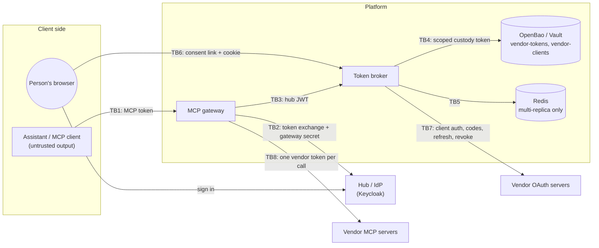

# Threat model

**Reviewed 2026-09-30 against the code on `main`.** This covers the token
broker (`src/token_broker/`), the MCP gateway (`src/mcp_gateway/`), and the
way they are meant to be deployed. The development Compose stacks under
`tests/stack/` are out of scope except where noted: they use fixed,
test-only credentials by design. Known limitations are also tracked in
[docs/security.md](docs/security.md#known-limitations); this document says
why each control exists and what is left over.

## 1. System and actors

| Actor | Trust |
|---|---|
| Signed-in person | Trusted for their own data only |
| The assistant / MCP client | **Not trusted.** Its behavior can be steered by the content it reads (prompt injection). It must never hold a vendor token or a hub JWT |
| Another signed-in person | Must never reach the first person's connections |
| Network attacker | Can observe or replay what crosses an unprotected link; can send a victim links |
| Vendor OAuth server / MCP server | Trusted for its own tokens and data; its responses are treated as untrusted input |
| Operator | Controls configuration, the registry, custody, and the hub. Trusted, but registry changes are reviewed |

## 2. Assets

| Asset | Where it lives | Why it matters |
|---|---|---|
| Vendor access and refresh tokens (per person, per vendor) | Custody `vendor-tokens/` (KV-v2), per-replica memory cache ≤ `CACHE_TTL_S`, one gateway call at a time | Direct access to the person's GitHub, Linear, Atlassian, or Cloudflare data |
| Vendor client credentials (client secrets, `private_key_jwt` keys) | Custody `vendor-clients/` | Let anyone redeem codes or refresh tokens as the broker |
| Broker custody token | `VAULT_TOKEN` / `VAULT_TOKEN_FILE` | Reads every stored vendor token |
| Hub JWT (tier audience) | Minted by the hub for the gateway per call | Resolves the subject's vendor tokens at the broker |
| MCP access token | Held by the MCP client; audience = the gateway | Calls the gateway as the person |
| Gateway client secret | `GATEWAY_CLIENT_SECRET` | Lets its holder perform the RFC 8693 exchange |
| Consent state (txn, state, PKCE verifiers, nonce, binding hash) | Coordination store (memory or Redis), ≤ `TXN_TTL_S` | Completing someone else's consent |
| Vendor registry (scope ceilings, endpoints) | `REGISTRY_PATH` | Policy: what the broker may request and where it sends credentials |
| Audit trail | stdout JSON lines (`broker.*`, `gateway.*`) | Detection and forensics |

## 3. Threats, mitigations, residual risk

Code references are to `src/`; test references are to `tests/`.

### T1. A vendor token or hub JWT reaches the assistant
- **Mitigations:** The gateway returns only the vendor's tool result
  (`mcp_gateway/server.py` `forward`). Every error the assistant sees is
  fixed text naming the service, never a token (`_dependency_errors`,
  `DISCONNECTED`). The MCP token goes only to the hub, and the hub JWT
  only to the broker (`mcp_gateway/clients.py`). `connect_<service>` returns
  a sentence, not a token.
- **Tests:** `unit/test_gateway.py::test_no_token_material_in_logs_or_results`;
  `integration/test_mcp_gateway.py::test_no_token_material_in_any_container_log`
  (logs **and** tool results).
- **Residual:** A vendor's own response can contain secrets that are
  already in the person's data (a file holding a key, for example). The
  gateway passes tool output through unchanged.

### T2. Token material in logs, errors, or audit events
- **Mitigations:** Audit events carry ids, states, and generations only
  (`token_broker/audit.py`). Exceptions that could carry hostnames or
  bodies use fixed messages, with raw text only at debug level
  (`CustodyUnavailable`, `CoordinationUnavailable`, `vendors._unreachable`).
  Upstream error details are logged with the token replaced and are capped
  at 200 characters (`server.py` `forward`). Refused MCP tokens are logged
  by reason, never by value (`_rejection_reason`).
- **Tests:** `integration/test_security.py::test_no_token_material_in_any_log`
  (broker: access token, refresh token, hub JWT signature, client secret,
  private key); `integration/test_keycloak_hub.py::test_no_token_material_in_any_container_log`;
  `unit/test_gateway_auth.py::test_bad_tokens_are_rejected_and_the_reason_audited`;
  `unit/test_vendor_client.py` (no hostnames or tokens in messages).
- **Residual:** Running third-party libraries at DEBUG in production could
  log request details. Keep production at INFO.

### T3. One person uses another person's connection
- **Mitigations:** The broker takes the subject from the **verified** hub
  JWT; a `sub` in the body is advisory, and a mismatch is a 400
  (`token_broker/resolve.py`). DELETE requires the path `sub` to equal the
  JWT `sub` (`grants.py`). The gateway exchanges the verified caller's own
  MCP token on every call (`server.py` `_mcp_token`, `vendor_token`), and
  keeps no per-user state between calls (`upstream.py`, a fresh session per
  call).
- **Tests:** `integration/test_mcp_gateway.py::test_each_call_runs_as_the_signed_in_person`
  (Bob is asked to connect his own account and never gets Alice's token;
  the broker resolves for Bob's subject);
  `unit/test_security_paths.py::test_a_user_cannot_delete_someone_elses_grant`;
  `integration/test_grants.py::test_grants_are_self_service_only`;
  `integration/test_consent.py::test_sub_mismatch_is_rejected`.

### T4. Forged, replayed, or misdirected hub JWT
- **Mitigations:** Signature from the hub JWKS; algorithms limited to
  `HUB_ALGORITHMS` (asymmetric only: no RS256, HMAC, or `none`); issuer;
  exactly one tier audience; required `exp`, `iat`, `sub`, `jti`; contract
  version (`token_broker/hub.py`, `config.py`). The raw MCP token is
  rejected by the broker (wrong audience).
- **Tests:** `integration/test_security.py::test_bad_hub_token_matrix`
  (RS256, wrong issuer, external tier, two tiers, expired, no jti, wrong or
  missing contract); `unit/test_hub.py`;
  `integration/test_keycloak_hub.py::test_broker_rejects_the_raw_mcp_token`.
- **Residual:** Whoever holds a valid hub JWT can resolve that person's
  vendor tokens until it expires. The broker does not authenticate *which*
  workload calls it: put it on private ingress so that only the gateway can
  reach it (a deployment control). A key the hub removes is still accepted
  for up to 5 minutes at the broker (`JWKS_CACHE_S`) and up to an hour at
  the gateway.

### T5. Token passthrough and confused deputy
- **Mitigations:** The gateway checks the MCP token's audience (this
  gateway), issuer, algorithm, and scope (`build_auth`), and never forwards
  it: it exchanges it at the hub (RFC 8693). Vendor tokens for servers with
  their own sign-in are bound to that server with RFC 8707 `resource`
  (`vendors.py`, `consent.py`).
- **Tests:** `integration/test_keycloak_hub.py::test_mcp_token_is_bound_to_the_gateway`,
  `::test_exchange_requires_a_token_meant_for_the_gateway`;
  `integration/test_mcp_gateway.py::test_tokens_not_issued_for_the_gateway_are_rejected`,
  `::test_tokens_only_work_at_the_server_they_were_issued_for`;
  `unit/test_resource_indicator.py`.

### T6. Consent account-linking attack (CSRF, a forwarded link)
An attacker sends a victim their own authorize link, so the victim's vendor
account would be stored under the attacker's subject (or the reverse).
- **Mitigations:** `/v1/authorize` sends the browser to sign in at the hub
  (OIDC code + PKCE + nonce) and requires the signed-in `sub` to equal the
  link's `sub`. An HttpOnly, SameSite=Lax binding cookie (hashed in the
  state record, compared in constant time) ties every leg to the browser
  that opened the link. Links and states are single use; a link expires
  after 5 minutes (`token_broker/consent.py`).
- **Tests:** `unit/test_consent_binding.py`;
  `integration/test_consent.py::test_link_forwarded_to_another_user_is_refused`,
  `::test_vendor_leg_finished_in_another_browser_is_refused`,
  `::test_authorize_link_is_single_use`;
  `integration/test_mcp_gateway.py::test_link_opened_by_someone_else_never_connects`.

### T7. Authorization code interception and mix-up
- **Mitigations:** PKCE S256 on both legs; single-use `state`, consumed
  before the code is redeemed; the RFC 9207 `iss` is compared before
  consumption, and a missing `iss` is rejected when the vendor advertises
  support (`consent.py` `callback`).
- **Tests:** `unit/test_security_paths.py` (missing or foreign issuer,
  replay, consumption race); `integration/test_consent.py::test_iss_tampering_never_redeems_the_code`,
  `::test_iss_omission_is_rejected_when_vendor_advertises_iss`,
  `::test_state_replay_is_a_security_event`.
- **Residual (documented):** Vendor discovery does not pin an expected
  issuer, and the hub callback does not reject a *missing* `iss`.

### T8. Scope escalation and write access
- **Mitigations:** The registry `scope_ceiling` caps what is requested,
  what is recorded, and what a caller may ask for (403
  `scope-exceeds-ceiling`); scopes a vendor widens are dropped and audited
  (`resolve.py`, `refresh.py`). The gateway exposes only allowlisted tools
  (`upstreams.json`), with pinned read-only schemas. GitHub calls carry
  `X-MCP-Readonly` and `X-MCP-Lockdown`. Cloudflare's `execute` is held to
  reading by read-only scopes. A tool outside the allowlist does not exist
  at the gateway.
- **Tests:** `unit/test_gateway_auth.py::test_bundled_upstreams_are_read_only`,
  `::test_bundled_snapshots_match_their_allowlists_and_are_read_only`;
  `unit/test_gateway.py::test_a_tool_outside_the_allowlist_cannot_be_called`;
  `integration/test_mcp_gateway.py::test_all_tools_are_listed_before_anyone_connects`,
  `::test_hidden_write_tool_cannot_be_called`;
  `integration/test_refresh.py::test_scope_ceiling_cannot_be_exceeded`;
  `unit/test_scope_math.py`.
- **Residual:** An empty ceiling (GitHub App) leaves permissions to the App
  configuration. "Read-only" also relies on each vendor's tool semantics
  and headers. Live schema drift is logged (`gateway.catalog`), not adopted.

### T9. Prompt injection through tool results
Content the assistant reads (an issue body, a page) may instruct it to
exfiltrate other data.
- **Mitigations here:** Tools are read-oriented, so an injected
  instruction cannot make the gateway write to a vendor.
- **Residual (out of scope):** The assistant can still read everything
  the person can read through the allowlisted tools, and may send it
  somewhere else through *other* tools in the same client. Limiting that is
  the MCP client's job (tool approval, egress policy).

### T10. Revoked or expired credentials are used anyway
- **Mitigations:** Expired or invalid MCP tokens get a 401 at the gateway,
  and expired hub JWTs a 401 at the broker. A refresh the vendor refuses
  (`invalid_grant`) marks the entry STALE with its token material blanked,
  and the person reconnects (`refresh.py` `_go_stale`). An upstream 401
  (revoked at the vendor) is reported as "reconnect", not retried
  (`upstream.py` `UpstreamRejected`). Disconnect revokes at the vendor first
  (RFC 7009 access then refresh token; GitHub grant deletion), then
  deletes; if the vendor is down, the entry is parked REVOKE_PENDING,
  unusable (409), and retried by the sweeper (`grants.py`, `sweeper.py`).
- **Tests:** `unit/test_gateway_auth.py::test_bad_tokens_are_rejected_and_the_reason_audited`
  (expired MCP token); `integration/test_security.py::test_bad_hub_token_matrix`
  (expired hub JWT); `integration/test_refresh.py::test_vendor_side_revocation_goes_stale_then_reconsent`;
  `integration/test_mcp_gateway.py::test_token_revoked_at_the_vendor_fails_closed_to_consent`,
  `::test_disconnect_revokes_at_the_vendor_and_the_next_call_asks_again`;
  `unit/test_gateway_upstream.py` (real HTTP 401); `unit/test_storage_hygiene.py`.
- **Residual:** A vendor without revocation keeps the token alive until it
  expires (disconnect reports `unsupported`). A token revoked at the vendor
  stays in the broker's cache for up to `CACHE_TTL_S`; the vendor still
  refuses it.

### T11. Refresh races corrupt or burn credentials
- **Mitigations:** Single-flight lock per person and vendor (memory, or
  Redis `SET NX PX` with compare-and-delete); a persisted REFRESHING marker
  on Redis; the KV-v2 compare-and-swap is the backstop, so a loser discards
  its pair and re-reads (`coordination.py`, `refresh.py`).
- **Tests:** `integration/test_refresh.py::test_twenty_parallel_resolves_one_vendor_refresh`;
  `integration/test_multi_replica.py`;
  `integration/test_mcp_gateway.py::test_parallel_calls_never_burn_the_rotating_token_family`;
  `unit/test_refresh_correctness.py`.
- **Residual:** A replica that dies after the vendor rotated a refresh
  token but before the write can burn a rotating family, and the person
  reconnects.

### T12. Custody compromise or misuse
- **Mitigations:** A scoped token with a narrow policy
  (`deploy/openbao-policy.hcl`: data and metadata on `vendor-tokens/*`,
  read on `vendor-clients/*`), never root; `VAULT_TOKEN_FILE` support;
  `max_versions=2` on the mount; STALE entries blanked; subjects encoded in
  paths (`custody.py`).
- **Residual:** Anyone with that token, or with custody read access, has
  every stored vendor token. Older KV versions keep earlier pairs until
  they are overwritten. Protect custody like the tokens themselves (audit
  device, network policy, periodic token rotation).

### T13. Outages turn into wrong answers (fail open)
- **Mitigations:** Custody down gives 503 `vault-unavailable`, never
  "not connected". Redis down gives 503 `coordination-unavailable` on every
  path that needs it; cache hits keep serving. Hub JWKS down gives 503
  `hub-unavailable`, not 401. At the gateway an outage is "retry", never
  "connect", and a malformed dependency answer is a typed error.
- **Tests:** `integration/test_security.py::test_custody_loss_fails_closed`;
  `unit/test_security_paths.py` (coordination on every path);
  `unit/test_error_mapping.py`;
  `integration/test_mcp_gateway.py::test_broker_outage_is_retryable_and_never_asks_to_connect`;
  `unit/test_gateway_clients.py`.

### T14. Consent pages as an attack surface
- **Mitigations:** Constant HTML pages, with no reflected parameters (a
  vendor `error` goes to the audit log only); `Cache-Control: no-store`,
  `Referrer-Policy: no-referrer`, `nosniff`. Redirects go only to the hub's
  discovered endpoint or the registry's vendor endpoint.
- **Tests:** `unit/test_security_paths.py::test_vendor_error_is_not_reflected_to_the_browser`;
  `unit/test_error_mapping.py`.

### T15. Registry or configuration tampering
- **Mitigations:** Vendor ids are checked against the schema's pattern at
  load (they become custody path segments); the registry validates against
  `schemas/vendor-registry.schema.json`; `revocation.type` is an enum;
  secrets are refused by the schema; both services fail fast on bad
  configuration (`config.py`).
- **Residual (documented):** Whoever can edit the registry or a vendor's
  metadata decides where client credentials and codes are sent. Treat
  registry changes as reviewed security changes.

### T16. Denial of service
- **Mitigations:** A bounded token cache (`CACHE_MAX_ENTRIES`); `min_ttl_s`
  clamped to `REFRESH_BUFFER_S` so a caller cannot force a refresh on every
  call; a sweep budget (`SWEEP_MAX_ENTRIES`); timeouts on every outbound
  call; a bounded consent wait at the gateway.
- **Residual:** There is no rate limiting at the broker or the gateway.
  Put it at the ingress.

### T17. Supply chain
- **Mitigations:** Hash-pinned locks (`--require-hashes`); base and stack
  images pinned by digest; GitHub Actions pinned by commit SHA; `pip-audit`
  on every CI run; Dependabot; CodeQL; `persist-credentials: false`;
  least-privilege workflow permissions; FastMCP kept out of the broker
  image.
- **Residual:** The gateway's lock pins about 80 packages. Review updates
  to it like code.

### T18. Test-only material mistaken for real secrets, or real secrets committed
- **Mitigations:** The keypair in `tests/stack/keys/` is intentional,
  documented in `tests/stack/keys/README.md`, and the only path excluded
  from secret scanning (`.github/secret_scanning.yml`). The Compose file
  labels every stack credential as test-only. `.gitignore` and
  `.dockerignore` keep `.env` files out of git and out of image builds.
- **Residual:** Local `.env` files hold real vendor client secrets on
  developer machines. Enable push protection (see the repository settings
  recommended in `AUDIT.md`).

## 4. Required properties and their evidence

| Property | Positive evidence | Negative evidence |
|---|---|---|
| Tokens are never returned to the assistant or logged | T1, T2 tests: result texts and every container log are searched for the MCP token, hub JWT, and vendor tokens | Error paths (outage, refusal, upstream failure) are asserted to carry no token (`unit/test_gateway.py::test_upstream_error_detail_is_logged_without_the_token`, `unit/test_gateway_upstream.py`) |
| Each call runs as the signed-in person | `integration/test_mcp_gateway.py::test_each_call_runs_as_the_signed_in_person`; `::test_tool_call_reaches_github_with_the_users_token_and_policy` | Other users' grants: 403 on DELETE, 400 on a `sub` mismatch, an empty listing (`unit/test_security_paths.py`, `integration/test_grants.py`) |
| Only read tools are listed by default | `integration/test_mcp_gateway.py::test_all_tools_are_listed_before_anyone_connects` (exact set); `unit/test_gateway_auth.py::test_bundled_snapshots_match_their_allowlists_and_are_read_only` | Hidden write tools cannot be called (`test_hidden_write_tool_cannot_be_called`, `test_a_tool_outside_the_allowlist_cannot_be_called`) |
| Connect and disconnect work | `integration/test_mcp_gateway.py::test_connect_runs_consent_then_lists_the_allowlisted_tools` (both protocol eras), `::test_disconnect_revokes_at_the_vendor_and_the_next_call_asks_again` | Declined consent, a link opened by someone else, a client without URL elicitation, broker outage while waiting (`test_mcp_gateway.py`, `unit/test_gateway.py`) |
| Revoked or expired tokens fail closed | `integration/test_refresh.py::test_vendor_side_revocation_goes_stale_then_reconsent`; `integration/test_mcp_gateway.py::test_token_revoked_at_the_vendor_fails_closed_to_consent` | Expired MCP token 401, expired hub JWT 401, upstream 401 → "reconnect" (T10) |

The Docker suites run in CI on every push to `main` and every pull request
(`.github/workflows/ci.yml`: `integration`, `gateway`, `multi`).

## 5. Deployment responsibilities (not provided by this code)

- TLS everywhere, and private ingress so that only the gateway can reach
  the broker.
- Rate limiting at the ingress.
- Custody: audit device, a periodic token, network policy, and backups
  that are protected like the tokens themselves.
- Hub: short access-token lifetimes, key rotation, and the gateway's
  token-exchange permission limited to the tier scope.
- Log shipping of the `broker.*` and `gateway.*` audit events, with alerts
  on `security_event: true` and `broker.stale.mass`.
