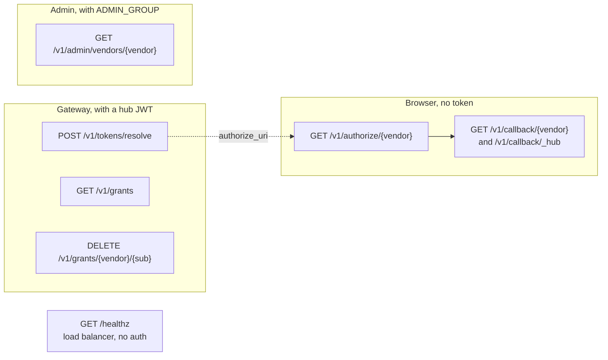
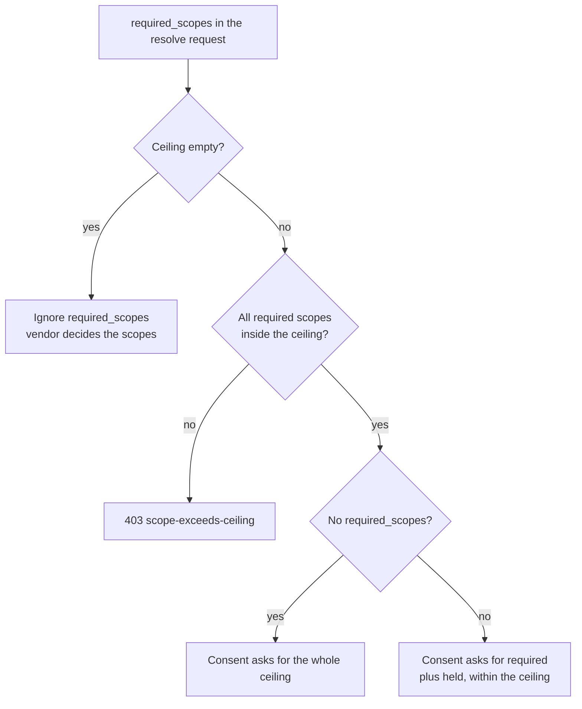

# Broker API reference

Use this page if you are writing your own gateway that calls the broker. It is the main reference for the broker's internal REST API.

- This is not the MCP protocol. MCP clients never talk to the broker directly.
- The shipped [MCP gateway](mcp-gateway.md) serves GitHub's, Linear's, Atlassian's, and Cloudflare's MCP servers and already calls this API for you. Use it if those are the servers you need.
- [Connect your own MCP server](mcp-integration.md) explains how an MCP server or gateway sits in front of the broker.

## Authentication and routes

The broker has exactly seven routes. Most of them need a hub JWT.

- **The hub** is your company's sign-in service (identity provider). A **hub JWT** is the signed token it issues for a user.
- Send `Authorization: Bearer <hub-jwt>` on resolve, list, delete, and admin requests.
- The broker trusts the JWT subject (`sub`) as the user's identity.
- The consent routes do not use a bearer token. They use short-lived transaction state and a cookie that ties the flow to one browser.
- `/healthz` needs no authentication.

| Method | Route | Purpose |
|---|---|---|
| POST | `/v1/tokens/resolve` | Get a vendor token for the caller |
| GET | `/v1/authorize/{vendor}?txn=…` | Start browser consent |
| GET | `/v1/callback/{vendor}` | Finish one consent step; `_hub` is the callback for the hub sign-in step |
| GET | `/v1/grants` | List the caller's connections, without any tokens |
| DELETE | `/v1/grants/{vendor}/{sub}` | Disconnect the caller from a vendor |
| GET | `/v1/admin/vendors/{vendor}` | Read one registry entry; the JWT's `groups` array must contain `ADMIN_GROUP` |
| GET | `/healthz` | Report whether this replica's custody token is healthy |



Three kinds of caller use the broker. Only the resolve answer links them: its `authorize_uri` is what the user's browser opens to start consent.

The broker has no endpoint that issues tokens. It also has no JWKS, OpenAPI, Swagger, or ReDoc endpoint. `tests/unit/test_routes.py` checks this.

### Hub JWT checks

On every request that carries a hub JWT, the broker checks:

- The signature, with a key from `HUB_JWKS_URI` and an algorithm in `HUB_ALGORITHMS`.
- The issuer (`HUB_ISSUER`) and the audience (`HUB_TIER_AUDIENCE`). The token must carry exactly one `mcp://tier/*` audience.
- The required claims `exp`, `iat`, `sub`, and `jti`. Time checks allow 30 seconds of clock skew.
- The `mcp_contract` claim, which must equal `HUB_CONTRACT_VERSION`.

A failed check returns 401 `invalid-hub-token`. If the broker cannot fetch the hub's signing keys, it returns 503 `hub-unavailable`.

## Resolve a token

Call resolve to get a live vendor token for the signed-in user. The broker may refresh the token during the call.

```http
POST /v1/tokens/resolve
Authorization: Bearer <internal-hub-jwt>
Content-Type: application/json

{"vendor":"mockhub","min_ttl_s":30,"required_scopes":["issues:read"]}
```

| Field | Default | Meaning |
|---|---|---|
| `vendor` | Required | ID of an enabled vendor in the registry |
| `sub` | JWT subject | Optional. If you send a non-empty value that differs from the JWT subject, the broker rejects the request |
| `min_ttl_s` | 120 | Non-negative integer. How long the token should still be valid, in seconds. Capped at `REFRESH_BUFFER_S` |
| `required_scopes` | `[]` | Array of scope strings. The vendor's scope policy decides how these are used |

On success the broker returns HTTP 200 with:

- `access_token` — the vendor token. Keep it inside the trusted gateway.
- `expires_at` — expiry time in Unix seconds. It may have a fractional part.
- `granted_scopes` — the scopes the broker has recorded for this connection.

**Lifetime is a target, not a guarantee.**

- A vendor can issue a new token that lives less than `min_ttl_s`. The broker still returns it.
- Check `expires_at` before you use the token.
- If you ask for more than the refresh buffer, the broker caps the request. The `broker.resolve` audit event then includes `min_ttl_clamped_from`.
- When the broker serves a token that another request or replica has just refreshed, and that token has less than `min_ttl_s` left, the audit event includes `short_ttl`. This is separate from capping.

### Scope policy

Each vendor in the registry has a scope ceiling (`scope_ceiling`): the most scopes the broker will ever ask for.

When the ceiling is **not empty**:

- It caps both requested and recorded scopes.
- A request for any scope outside the ceiling fails with 403 `scope-exceeds-ceiling`.
- If a caller sends no `required_scopes`, first-time consent asks for the whole ceiling, so callers need not send scopes.
- When the broker asks for more scopes, it asks for the scopes already held plus the new required ones, within the ceiling.

When the ceiling is **empty**, the vendor decides the scopes (GitHub works this way: the app's permissions are set at GitHub):

- The broker ignores `required_scopes` for that vendor. It neither requests nor enforces them, and never answers 403 or 409 for scopes.
- Filtering the stored `granted_scopes` list does **not** reduce what the token can actually do.



The ceiling is a hard boundary: nothing a caller sends can go past it. An empty ceiling hands the whole decision to the vendor.

In both cases:

- If a vendor grants scopes beyond a non-empty ceiling, the broker drops them from the stored list. It records them in the `scope_widened` field of the `broker.refresh` or `broker.consent.complete` audit event. With an empty ceiling there is nothing to compare, so the field never appears.
- Your gateway or server must still check what each operation is allowed to do.

## Errors and caller actions

Errors come back as `application/problem+json`. Branch on the HTTP status and the `title`.

- Each error has `type`, `title`, and `detail`, plus any extra fields in the table below.
- The `title` is stable. Do not parse `detail` (it is for people) or the `type` prefix (it is configurable).
- Request validation errors from the web framework may use FastAPI's 422 response shape instead.

| Status / title | Additional fields | Action |
|---|---|---|
| 400 `invalid-request` | — | Fix the malformed resolve input |
| 400 `sub-mismatch` | — | Use the signed-in user's subject |
| 400 `invalid-transaction` | — | Get a fresh connection URL |
| 401 `invalid-hub-token` | — | Fix the internal token's issuer, signature, expiry, audience, or contract |
| 403 `scope-exceeds-ceiling` | `required`, `ceiling` | Review the vendor's policy. Do not loop through consent |
| 403 `forbidden` | — | Check the self-service subject or the admin group |
| 404 `unknown-vendor` | — | Check the registry and whether the vendor is enabled |
| 404 `needs-consent` | `authorize_uri` | No usable connection. Connect or reconnect |
| 404 `no-grant` | — | Nothing to delete. The connection is already gone |
| 409 `needs-reconsent-scope` | `authorize_uri`, `missing_scopes` | Ask the user for more vendor permissions |
| 409 `revoke-pending` | — | Resolve cannot use a connection that is being revoked |
| 502 `revoke-pending` | — | Delete could not revoke at the vendor. The sweeper will retry |
| 503 `vendor-unavailable` | — | Retry with backoff. Check whether the vendor is up or refreshes are contending |
| 503 `vault-unavailable` | — | Restore custody (token storage). Do not ask users to reconnect |
| 503 `coordination-unavailable` | — | Restore Redis for the operations that need coordination |
| 503 `hub-unavailable` | — | Restore access to the hub's JWKS or OIDC discovery, or the hub itself |

The consent callbacks are browser pages, so they mostly return short HTML pages:

- 400 — bad state, issuer, or browser
- 403 — wrong user
- 502 — the token exchange failed
- 503 — a dependency is down

One exception: if the hub sign-in callback cannot start the vendor step, it returns problem JSON 503 (`vendor-unavailable`, `vault-unavailable`, or `coordination-unavailable`). [Consent internals](design.md#43-get-v1callbackvendorcodestate) explain how the broker handles state.

## Browser consent

Consent is how a user connects their vendor account. It happens in the user's browser in two steps.

1. The user opens the `authorize_uri` from resolve.
2. The broker checks who the user is through the hub.
3. The broker then starts vendor consent for that same user.

Time limits:

- **Authorize link:** the user must open it within five minutes (fixed), and it starts only one flow. If `TXN_TTL_S` is shorter than five minutes, the link expires after `TXN_TTL_S`.
- **Each consent step:** the state for the hub step and for the vendor step lasts `TXN_TTL_S` seconds (default 600, ten minutes) from when that step starts.
- **Binding cookie:** it lives `TXN_TTL_S` seconds.

The authorize route answers with its own problem JSON when it cannot start:

| Status / title | When |
|---|---|
| 400 `invalid-transaction` | The link is unknown, expired, already used, or for another vendor |
| 404 `unknown-vendor` | The vendor is not in the registry or not enabled |
| 503 `hub-unavailable` | The broker cannot reach the hub's OIDC discovery document |
| 503 `coordination-unavailable` | The broker cannot read or store consent state (Redis is down) |

Rules:

- The same browser must finish both steps. Keep cookies across redirects.
- The binding cookie is HttpOnly, SameSite=Lax, and scoped to `Path=/v1/callback`. It gets the Secure flag only when `BROKER_PUBLIC_URL` uses HTTPS.
- Use the exact registered callback URLs.
- If the transaction expired, was cancelled, or was already used, start again with a new resolve or connection attempt.

## List and disconnect

**List.** `GET /v1/grants` returns `{"grants":[…]}`.

- Each entry has `vendor`, `state`, `granted_scopes`, `vendor_user_id`, and `created_at`.
- The internal `REFRESHING` state shows as `ACTIVE`.
- Vendors switched off through `enabled_env` are left out, even if a stored connection exists.
- Tokens are never included.

**Disconnect.** `DELETE /v1/grants/{vendor}/{sub}` removes a connection. The MCP gateway's `disconnect_<service>` tools call this route with the user's hub JWT.

- The `sub` in the path must match the JWT subject, or the broker answers 403 `forbidden`. URL-encode it when you build the path.
- The broker revokes at the vendor first, then deletes its own copy.
- It holds the connection's refresh lock while it does this. If it cannot get the lock within `LOCK_TIMEOUT_S`, it answers 503 `vendor-unavailable` ("grant is being refreshed; retry").
- If the stored token pair changes after the vendor revoke, the broker revokes the newer pair too. It tries up to three times, then answers 503 `vendor-unavailable`.
- If the vendor is down, the broker marks the connection `REVOKE_PENDING` and answers 502 `revoke-pending`. The sweeper retries the revoke.
- Success returns `{"revoked":true}`.
- If the vendor does not support revocation, success also includes `"vendor_revocation":"unsupported"`. The broker deletes its own copy, but the vendor may still honour the permissions. Disconnect at the vendor too if you need to.

## Admin

`GET /v1/admin/vendors/{vendor}` returns that vendor's registry entry.

- The caller's `groups` claim must be a list that contains `ADMIN_GROUP`. Otherwise the answer is 403 `forbidden`, audited as `broker.admin.deny`.
- Any key whose name contains `secret` is removed from the answer.
- Vendors switched off through `enabled_env` are still returned. Only a vendor missing from the registry gives 404 `unknown-vendor`.

## Health

`GET /healthz` normally returns `{"ok":true,"custody":"ok"}`.

- If custody is down, it can still return HTTP 200 with `"custody":"unreachable"`. This keeps replicas serving valid cached entries.
- If the custody credentials are rejected or nearly expired, it returns 503.
- The broker caches health responses for ten seconds.

See [the runbook](operations.md#runbook) for what to do next.

## Legacy gateway mapping

Some existing gateway plugins translate broker results as shown below. It is an adapter convention, not part of this repository. `tests/integration/test_wire_compat.py` covers the broker side.

| Broker result | Legacy gateway behavior |
|---|---|
| 200 | Replace upstream Authorization with the vendor access token |
| 404 with `authorize_uri` | Custom 401 `authorization_required` challenge |
| 409 with `authorize_uri` | Custom 401 step-up challenge |
| Plain 409 | 403 carrying the problem title |
| 5xx | Retriable 503 `vendor_unavailable` |

For a new MCP adapter, follow [the integration guide](mcp-integration.md#connecting-a-vendor-during-a-tool-call) instead. Change the client-facing protocol if you need to, but keep this internal API as it is.
