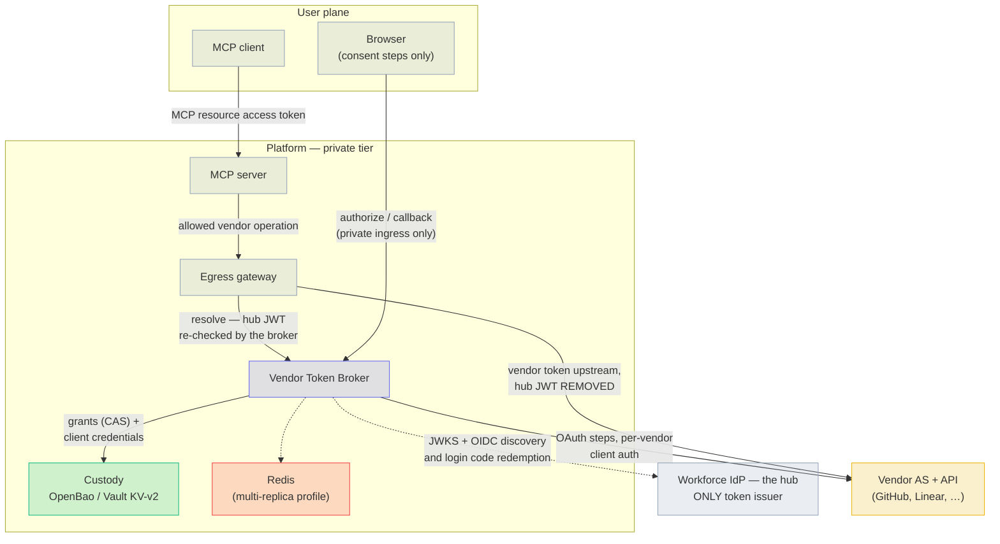
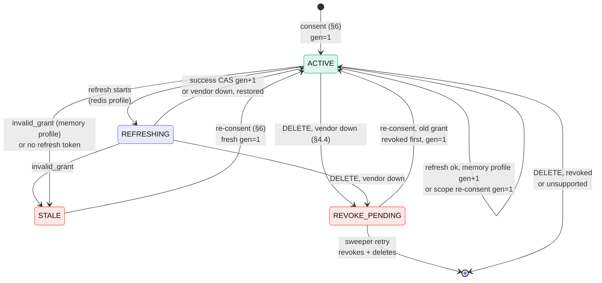
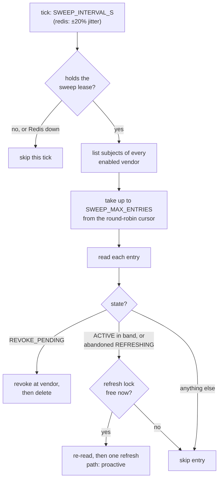
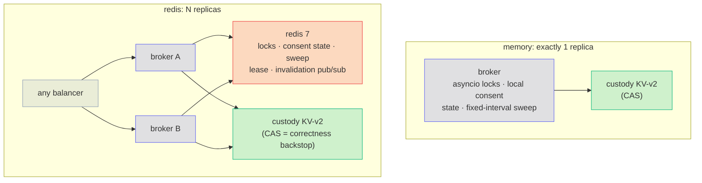

# Vendor Token Broker — Design

**Software:** 1.1.0 (unreleased) · **Reviewed:** 2026-09-27

This page is the normative design of the broker. It says how the broker
must behave inside. For a gentler start, read the [overview](overview.md),
the [API reference](api.md), or [security](security.md).

## Where the broker sits

The broker keeps each user's tokens for outside SaaS vendors (GitHub,
Linear, Atlassian, Cloudflare, …). It never talks to MCP clients directly.
It sits behind a trusted gateway:

- the [MCP gateway](mcp-gateway.md) in this repo, which lets Claude Code
  and other MCP clients use the official GitHub, Linear, Atlassian and
  Cloudflare MCP servers, or
- any other trusted egress gateway (the service that makes outbound calls
  to vendors).

The gateway asks the broker for a user's vendor token. It then calls the
vendor with that token. The user's browser talks to the broker only to
connect a vendor account (the consent steps).

Terms used on this page:

- **Hub** — your company's sign-in service (the workforce identity
  provider, or IdP). It is the only service that issues platform tokens.
- **Hub JWT** — the signed token the hub issues for a signed-in user.
- **Vendor AS** — the vendor's authorization server (where users grant
  access and tokens come from).
- **Custody** — the secret store that holds tokens (OpenBao or Vault
  KV v2).
- **Entry** — one stored token record for one user and one vendor.
- **`sub`** — the user id (the JWT "subject").
- **CAS** — compare-and-swap: a write that succeeds only if the stored
  version has not changed since it was read.

Section 14 describes the two deployment profiles (one replica, or many
with Redis). `token-lifecycle.md` draws every lifecycle path on this page
as a sequence diagram.

---

## 1. Role definition

The broker gets, stores, refreshes, and revokes OAuth tokens for each
user. Third-party SaaS authorization servers (GitHub, Linear, Atlassian,
…) issue those tokens. On each request, the broker returns the right token
to the egress gateway tier.

**The broker is an OAuth client and it stores credentials. It is not an
authorization server and MUST NOT issue access tokens.**

- It may sign `private_key_jwt` assertions to sign in to vendors.
- The hub stays the only token issuer for the platform.
- If a future need seems to require broker-issued tokens, treat it as a
  design error. Escalate it. Do not implement it.

The broker supports vendors that need a separate user OAuth grant. MCP
Enterprise-Managed Authorization (EMA) is a possible future migration
path. It fits only if it also gives the downstream vendor access the
application needs. This repo does not implement it. See
[the integration guide](mcp-integration.md).

## 2. Standards basis

Each row shows a standard and what the broker must do to meet it.

| Leg | Standard | What the broker must do |
|---|---|---|
| Getting tokens | RFC 6749 authorization code + OAuth 2.1 rules | Use PKCE (S256) on every flow. Match redirect URIs exactly. No implicit or password grants |
| Getting tokens | RFC 7636 PKCE | Create the verifier and keep it on the server, one per transaction |
| Discovery | RFC 8414 AS metadata | Find vendor endpoints from `.well-known`. Hardcoding is forbidden where metadata exists (the registry schema enforces `auth_metadata_url` xor `endpoints`) |
| Getting tokens | RFC 9207 issuer identification | When a recorded issuer exists, the callback checks `iss` against the issuer recorded when the transaction started. Use strict string comparison, no URI normalization. If the AS advertises support but sends no `iss`, reject the callback as a mix-up signal |
| Getting tokens | RFC 8707 resource indicators | For a vendor whose tokens are bound to one MCP server (registry `resource`), send `resource` on the vendor authorize request and on every token request: code exchange and refresh (refresh only if `resource_on_refresh` is not false, §2.1) |
| Client auth | RFC 7523 `private_key_jwt` | Prefer it where the vendor supports it. Otherwise use `client_secret_basic` or `client_secret_post` (set per vendor in the registry, default `client_secret_post`) |
| Hardening | RFC 9700 OAuth 2.0 Security BCP | Used as the review basis. [Known limitations](security.md#known-limitations) prevent a blanket conformance claim |
| Lifecycle | RFC 6749 §6 refresh | Only one refresh at a time per entry (single-flight, §8) |
| Lifecycle | RFC 7009 revocation | When a user removes a grant, call the vendor revocation endpoint before deleting the stored entry: the access token, then the refresh token. A 4xx on the access token is ignored (a server may not support revoking it); the refresh token's answer decides |
| Exchange (future) | MCP EMA: ID-JAG via RFC 8693 token exchange + RFC 7523 grant | Possible future migration only. No exchange is implemented here |

**`private_key_jwt` assertions** (`client_auth.py`): `iss` = `sub` = the
client id, `aud` = the vendor's token endpoint, a fresh `jti`, and a
300-second lifetime. Revocation requests also use the token endpoint as
the audience (RFC 7523 accepts any identifier of the AS). The signing key,
`alg` (default RS256) and optional `kid` come from
`vendor-clients/{vendor}` in custody.

### 2.1 Per-vendor deviations

Some vendors do not follow the standards above. Each deviation is set in
the reviewed registry and handled in `vendors.py`:

| Deviation | Vendor | What the broker does |
|---|---|---|
| No RFC 8414 metadata | GitHub | The registry lists `endpoints` explicitly. Allowed only where no metadata exists |
| Revocation by grant deletion, not RFC 7009 | GitHub (`revocation.type: github_grant`) | `DELETE https://api.github.com/applications/{client_id}/grant` with HTTP Basic (client id and secret) and the access token in the JSON body. 204, 404 and 422 count as revoked. Any other status is a vendor outage. An entry with no access token (a blanked STALE entry) needs no call. This deletes the whole user-to-app grant, which is why re-consent never revokes an ACTIVE or STALE predecessor (§4.3) |
| Token errors in a 200 response | GitHub | Any `error` field is a failure, whatever the HTTP status |
| `bad_refresh_token` instead of `invalid_grant` | GitHub | Treated exactly like `invalid_grant` (the entry goes STALE) |
| Scopes set by the vendor, not the request | GitHub App (empty `scope_ceiling`) | The broker requests no scopes and ignores `required_scopes` (§4.1) |
| Tokens that never expire | GitHub App with expiry turned off | Stored with a far-future expiry and never refreshed (§5) |
| Tokens bound to one MCP server | Linear, Atlassian, Cloudflare (registry `resource`) | RFC 8707 `resource` on authorize, code exchange and every refresh |
| `resource` refused on refresh | Linear (`resource_on_refresh: false`) | Sent on authorize and code exchange only. Linear keeps the refreshed token bound to the same MCP server |
| Revoking the refresh token leaves the access token alive | Linear | Why every RFC 7009 revocation also revokes the access token (§2 Lifecycle) |

## 3. Architecture and trust boundaries

The hub JWT never goes past the gateway and broker, and vendor tokens
never reach the MCP client.



This repo's MCP gateway plays both the MCP server and the egress gateway
role. Any other gateway must do the same jobs.

Every deployment needs these two boundaries:

- The **hub JWT stops at the gateway and broker**. The gateway removes it
  before anything goes upstream to a vendor.
- **Vendor tokens must never reach the MCP client.**

The gateway must enforce both. The internal hub JWT is a separate
credential contract from MCP resource authorization. See
[three authorization boundaries](mcp-integration.md#three-authorization-boundaries).

Who calls whom, and how much each side is trusted:

- **Egress gateway → broker** (`/v1/tokens/resolve`, `/v1/grants`,
  `DELETE /v1/grants/…`). The request carries the end user's hub JWT. The
  broker checks it again on its own (`hub.py`), in this order:
  1. the signing key is found in the hub JWKS by `kid` (JWKS unreachable
     → 503 `hub-unavailable`, any other failure → 401),
  2. one `jwt.decode` call checks together: the algorithm is in
     `HUB_ALGORITHMS` (default PS256, ES256; only PS256/384/512,
     ES256/384/512 and EdDSA may be configured), the signature, `iss` =
     `HUB_ISSUER`, `aud` contains `HUB_TIER_AUDIENCE`, `exp`, and that
     `exp`, `iat`, `sub`, `jti` are present (30 s clock leeway),
  3. `mcp_contract` = `HUB_CONTRACT_VERSION` (default `1.0`),
  4. exactly one audience starts with `mcp://tier/`.

  Any failure is 401 `invalid-hub-token`. This is defense in depth. The
  broker never simply trusts the gateway. Production deployments add
  mutual TLS with workload identity between gateway and broker.
- **User browser → broker** (`/v1/authorize`, `/v1/callback`). Private
  ingress only. The callback host is never on the public tier.
- **Broker → vendor AS**. Outbound TLS. The broker signs in with its own
  confidential client credential for that vendor, stored at
  `vendor-clients/{vendor}`. It prefers `private_key_jwt` over shared
  secrets where the vendor supports it.
- **Broker → custody backend**. The broker's policy is the only one this
  repo defines for `vendor-tokens/*`. Keeping other roles (such as
  admins) from reading it is up to the deployment. Operators must turn on
  custody-backend audit logging to record reads. The broker does not emit
  its own audit event for every storage read.

## 4. API (the whole surface — 7 routes)

The broker has exactly 7 routes: the six in §4.1–4.5 below, plus `GET /healthz` (health check, see `docs/operations.md`). Error and field rules for all of them:

- Errors use RFC 9457 problem details. Browser-facing consent steps
  (`/v1/callback/…`) answer with short HTML pages instead (§4.3).
- No token material ever appears in an error body or log line.
- The `title` slugs and response fields are a frozen wire contract (see
  `docs/operations.md`).

### 4.1 `POST /v1/tokens/resolve`

The gateway calls this route to get a user's vendor token. See
[resolve a token](api.md#resolve-a-token) for request fields, lifetime
exceptions, and scope policy. The full list of errors and caller actions
is in the [error/action table](api.md#errors-and-caller-actions).

- The JWT subject (`sub`) decides whose token is returned. A body `sub`
  that differs is 400 `sub-mismatch`.
- `min_ttl_s` (default 120) is capped at `REFRESH_BUFFER_S`. A larger
  value is lowered, and the audit line records `min_ttl_clamped_from`.
  Without the cap, a caller could force a vendor refresh on every call.
- Resolve reads the local cache or custody (§7).
- If needed, it refreshes the token inline, during the request.
- §§7–8 explain how concurrent requests are handled.

**Scope math.** `ceiling` is the vendor's registry `scope_ceiling`, and
`required` is the request's `required_scopes`.

| Case | What the broker does |
|---|---|
| Empty `ceiling` | Scopes are governed by the vendor (for example GitHub App permissions). `required` is ignored. Consent requests no scopes |
| `required` ⊄ `ceiling` | 403 `scope-exceeds-ceiling`. A caller can never widen past the ceiling |
| No entry, or STALE | 404 `needs-consent`. The consent link asks for `required` ∩ `ceiling`, or the whole `ceiling` when `required` is empty |
| REVOKE_PENDING | 409 `revoke-pending`. The entry is never used |
| ACTIVE, but `required` has scopes the entry lacks | 409 `needs-reconsent-scope` with `missing_scopes` and an `authorize_uri` |
| Otherwise | Serve or refresh (§7) |

**Union re-consent.** The 409 link asks for the union of held and required
scopes, capped by the ceiling, in ceiling order:

```
reconsent_scopes = [s for s in ceiling if s in (granted_scopes ∪ required)]
```

So a step-up never drops a scope the user already granted. It also never
asks for more than the ceiling. The new consent overwrites the entry with
a fresh generation 1 (§4.3).

The absent, STALE and 409 cases mint a consent link. That needs the
coordination store. In the redis profile, a Redis outage turns them into
503 `coordination-unavailable` (§9).

### 4.2 `GET /v1/authorize/{vendor}?txn=…`
This route starts consent (§6). The user opens this link in a browser.

1. The link (`txn`) is single use. It is taken atomically, and works only
   within 5 minutes of being minted (`AUTHORIZE_LINK_TTL_S` = 300). An
   unknown, used, expired or other-vendor link is 400
   `invalid-transaction`.
2. The broker sets a binding cookie `vtb_consent_{vendor}`: a random
   value, HttpOnly, `SameSite=Lax`, `Path=/v1/callback`, `Max-Age` =
   `TXN_TTL_S`, and `Secure` when `BROKER_PUBLIC_URL` is https. The server
   keeps only its SHA-256 hash and compares it in constant time.
3. The broker sends the browser to sign in at the hub. This uses OIDC
   authorization code with PKCE (S256) and a nonce.
   - `login_hint` = the link's `sub` when `HUB_LOGIN_HINT=sub` (the
     default). `HUB_LOGIN_HINT=none` sends no hint, for real IdPs that
     expect a username or email. The hint is only for convenience: the
     signed-in `sub` is still checked.
   - The hub's endpoints come from its OIDC discovery document:
     `HUB_DISCOVERY_URL` when set (for an internal URL), otherwise
     `{HUB_ISSUER}/.well-known/openid-configuration`. The document must
     name `HUB_ISSUER` as its issuer.
4. The broker builds the vendor step only after that sign-in succeeds as
   the same `sub` (§4.3).

Errors: 404 `unknown-vendor`, 503 `hub-unavailable` (hub discovery
failed), 503 `coordination-unavailable` (Redis down while taking the link
or storing the login state).

Each browser step's `state` is an opaque handle to a record on the server.
The records live `TXN_TTL_S` (default 600 s = 10 min) and are single use.
`state` is never a JWT and the browser can never decode it.

| Record | Fields |
|---|---|
| Consent link (`txn`) | `sub`, `vendor`, `scopes`, `created_at` |
| Hub-login state | `leg: "hub"`, `txn_id`, `sub`, `vendor`, `scopes`, `nonce`, `pkce_verifier`, `binding` (hash), `created_at` |
| Vendor state | `leg: "vendor"`, `txn_id`, `sub`, `vendor`, `pkce_verifier`, `nonce`, `issuer`, `iss_required`, `binding` (same hash as the hub leg), `scopes`, `created_at` |

- `issuer` is the vendor AS issuer from its metadata (none for vendors
  with hardcoded endpoints).
- `iss_required` is true when the metadata advertises
  `authorization_response_iss_parameter_supported`.
- `scopes` are always within the registry ceiling (§4.1).

The vendor authorize redirect carries `client_id`, `response_type=code`,
`redirect_uri` (`{BROKER_PUBLIC_URL}/v1/callback/{vendor}`), `scope`,
`state`, `code_challenge`, `code_challenge_method=S256`, and `resource`
when the registry sets one (RFC 8707).

### 4.3 `GET /v1/callback/{vendor}?code&state`
The browser returns here after each sign-in step. There are two kinds of
callback. Both answer the browser with short HTML pages sent with
`Cache-Control: no-store`, `Referrer-Policy: no-referrer` and
`X-Content-Type-Options: nosniff`. The raw vendor or hub `error` value goes
to the audit line only, never into the page.

**Hub sign-in return (`/v1/callback/_hub`).** `_` never appears in a
vendor id. The broker, in order:

1. checks the login state: it exists, has not expired or been used, and is
   a hub-leg state (else 400 and a security event),
2. requires the binding cookie (a different browser gets 400 and a
   security event, `reason: browser_mismatch`),
3. checks `iss` against `HUB_ISSUER` when `iss` is present (else 400 and
   a security event),
4. uses up the login state atomically (losing that race counts as a
   replay: 400 and a security event),
5. stops with 400 if the hub returned an `error`,
6. redeems the hub code with the PKCE verifier and checks the ID token:
   signature from the hub JWKS, issuer, audience = the broker's client id
   (`HUB_LOGIN_CLIENT_ID`), expiry, nonce (failure: 502 page),
7. requires the ID token's `sub` to equal the link's `sub` (otherwise 403
   and a security event, `reason: login_sub_mismatch`),
8. starts the vendor step: reads the vendor metadata and client
   credential, stores the vendor state, and redirects to the vendor (§4.2).

Step 8 is the one place a callback answers with problem JSON, because the
browser has not yet reached the vendor: 503 `vendor-unavailable` (metadata
unreachable or no client credential), `vault-unavailable`, or
`coordination-unavailable`.

**Vendor return.** The broker, in order:

1. Checks `state`: it exists, has not expired, has not been used, matches
   the vendor, and was issued for the vendor step (else 400 and a
   security event, `reason: state_invalid_or_replayed`).
2. Checks the RFC 9207 `iss` when a recorded issuer exists: a present
   `iss` must equal it exactly, and a missing `iss` is rejected when
   `iss_required` is set (400 and a security event,
   `reason: iss_mismatch`). This runs **before** the state is used up, so
   a tampered callback never burns the state the real callback needs.
3. Requires the binding cookie. A different browser gets 400 and a
   security event, and no code is redeemed.
4. Uses up the state atomically **before** redeeming the code. So exactly
   one callback per state ever reaches the token endpoint. Losing that
   race counts as a replay.
5. Stops with 400 "Authorization failed." if the vendor returned an
   `error`.
6. Handles the user's earlier grant for this vendor (see below).
7. Exchanges the code + PKCE verifier for tokens, with client auth and
   `resource` when set (failure: 502 "Token exchange failed.").
8. Looks up the vendor user id (best effort, below).
9. Writes the entry: fresh generation 1, overwriting any entry
   (`cas=None`). Granted scopes are capped to the ceiling (§5).
10. Drops the cached entry on every replica (§7) and shows "Connected —
    return to your client."

What happens to the user's earlier grant for this vendor (step 6):

- **`REVOKE_PENDING`**: the broker revokes and removes it *before* it
  exchanges the code, and audits `broker.revoke` with `path: reconsent`.
  If the vendor has no revocation endpoint, the old entry is removed
  locally. If the vendor cannot revoke it yet, consent stops with a 503
  page ("Your previous connection is still being revoked. Try again
  later.") and the user starts again later.
- **ACTIVE or STALE**: the broker overwrites it. It does not revoke it,
  because some vendors revoke per user and client (GitHub grant deletion,
  many RFC 7009 servers), which would also revoke the new grant.

Other rules:

- **Vendor user id.** Read from the registry's `vendor_user_endpoint`, or
  the metadata `userinfo_endpoint`, using `id`, `login` or `sub` from the
  answer. It is for audit joins only. Any failure, or no endpoint, records
  `"unknown"` and consent goes on.
- **Code spent, entry not stored.** If the custody write fails after the
  code was redeemed, the broker revokes the new grant at the vendor (best
  effort) so it is not orphaned there. It audits `broker.consent.fail`
  with `reason: post_redeem_failure` and `new_grant_revoked`, and shows a
  503 "Credential store unavailable." page. The user runs consent again.
- **Custody down** while reading the earlier grant: 503 "Credential store
  unavailable." page.
- **Redis down** (redis profile) during steps 1–4 of either callback: the
  page "Coordination store unavailable." with status 503. It carries no
  problem `title`.

A `state` replay or mismatch is a security alert, not only a 400.

### 4.4 `DELETE /v1/grants/{vendor}/{sub}`
A user removes their own grant. The `sub` must match the hub JWT (else
403 `forbidden`). An unknown vendor is 404 `unknown-vendor`. The
[MCP gateway](mcp-gateway.md)'s `disconnect_<service>` tools call this
route with the person's hub JWT.

The broker first waits for the entry's refresh lock (up to
`LOCK_TIMEOUT_S`, default 10 s). Holding it means no refresh can rotate
the token pair between the vendor revoke and the custody delete.

- Redis down (redis profile): 503 `coordination-unavailable`.
- Lock not free in time: 503 `vendor-unavailable` ("grant is being
  refreshed; retry").

Under the lock, in this order:

1. Read the entry. None: 404 `no-grant`.
2. Revoke at the vendor (RFC 7009, or the vendor's deviation, §2.1).
3. Re-read the entry. If its KV version changed (a pair landed after a
   lost lock), revoke the newer pair too. Up to 3 revoke rounds, then 503
   `vendor-unavailable` ("grant kept changing during revocation; retry").
4. Delete the custody entry (all versions and metadata) and drop it from
   every replica's cache.
5. Audit `broker.revoke` with `outcome` and `hub_jti`.
6. Answer `{"revoked": true}`.

What the vendor revoke sends: the refresh token (`token_type_hint:
refresh_token`, its access tokens go with it), else the access token for a
non-expiring grant. A STALE entry has no tokens (§5), so it needs no
vendor call.

If something goes wrong:

- **Vendor revoke fails** (unreachable, 4xx or 5xx): the broker CAS-writes
  the entry it read, whatever its state, as `REVOKE_PENDING`. If the entry
  moved since the read, it re-reads once and parks the newer pair (that is
  the refresh token the sweeper must revoke). If the entry is gone: 404
  `no-grant`. If it still keeps moving: 503 `vendor-unavailable`. Once
  parked, the response is 502 `revoke-pending` and the audit line has
  `outcome: "pending"`. Resolve cannot use the entry. The sweeper retries
  (§8.1). Re-consent revokes it first (§4.3).
- **Vendor has no revocation endpoint**: the broker cannot revoke. It
  deletes the entry locally and audits it with `outcome: "unsupported"`.
  The response adds `"vendor_revocation": "unsupported"`. The grant on the
  vendor side lives until it expires on its own.
- **Custody down**: 503 `vault-unavailable`.

### 4.5 `GET /v1/grants` · `GET /v1/admin/vendors/{vendor}`
- `GET /v1/grants` lists the caller's own grants on enabled vendors:
  `vendor`, `state`, `granted_scopes`, `vendor_user_id`, `created_at`. A
  `REFRESHING` entry is listed as `ACTIVE`.
- `GET /v1/admin/vendors/{vendor}` lets a signed-in admin read one
  registry record, without keys that contain `secret`. The hub JWT's
  `groups` claim must contain `ADMIN_GROUP`. `groups` must be a JSON
  array. A string claim never matches.

There is no route to change the registry, on purpose. Registry changes
are reviewed git changes, checked against
`schemas/vendor-registry.schema.json`. For this broker that is the
stronger control, not a gap. Changing `scope_ceiling` needs sign-off at
the token-contract level.

## 5. Custody schema

Custody holds two kinds of record: one token entry per user per vendor,
and one client credential per vendor.

```
vendor-tokens/{vendor}/sub-b64.{base64url(sub), unpadded}
                               {access_token, refresh_token, expires_at,
                                granted_scopes[], vendor_user_id,
                                state: ACTIVE|REFRESHING|STALE|REVOKE_PENDING,
                                refresh_generation, last_refresh_at, created_at
                                (+ refresh_owner, refresh_started_at on a
                                 REFRESHING marker)}
vendor-clients/{vendor}        {client_id, client_secret | private_key (+alg, kid)}
```

The code binds this to OpenBao/Vault KV v2 (`custody.py`). Any backend
can replace it if it meets this contract:

- versioned compare-and-swap (CAS) on write,
- fails closed and can tell the difference (an outage is not the same as
  "absent"),
- two mounts: the broker may read and write `vendor-tokens` but only read
  `vendor-clients`. This is one `broker` policy covering both mounts
  (`deploy/openbao-policy.hcl`, which the test stack applies). It grants
  nothing to humans. Restricting admin reads is up to the deployment's own
  policies,
- encryption of stored data at rest. This is a deployment requirement:
  this repo does not configure it.

`refresh_generation` is a counter that only goes up. §8's race defense
relies on it. The KV-v2 version is the CAS handle.

**Key encoding.** The `sub` is stored as one KV key: `sub-b64.` plus the
unpadded base64url of the `sub`. So any subject (URIs with `/`, dots,
spaces) is exactly one key, never a nested folder the sweeper cannot list.
Entries at the older raw path `vendor-tokens/{vendor}/{sub}` are still
read. They move to the encoded path on their next write:

- a CAS write against a raw-path entry creates the encoded entry only if
  none exists (`cas=0`, so a replica that migrated first wins), then
  removes the raw one,
- a consent overwrite also removes the raw one,
- a delete removes both,
- the sweeper's listing decodes and de-duplicates keys. It skips raw
  folder keys (subjects with `/` at the raw path), which only a direct
  read can reach.

How the broker builds an entry from a vendor token response:

| Vendor response | What the broker does |
|---|---|
| Neither `expires_in` nor a `refresh_token` | Treats it as a non-expiring token. Stores it with a far-future `expires_at` (10 years). Never refreshes it |
| Has a refresh token but no `expires_in` | Assumes it lasts 8 hours |
| No `refresh_token` on a refresh | Keeps the previous refresh token (a vendor that does not rotate) |
| `scope` in the answer | Recorded as `granted_scopes`, capped to a non-empty ceiling. Without `scope`, the requested scopes are recorded |
| `scope` wider than the ceiling | The extra scopes are dropped from the entry and listed as `scope_widened` on `broker.consent.complete` or `broker.refresh` |

A refresh keeps the entry's `created_at` (the consent time) and
`vendor_user_id`.

An entry with no refresh token that reaches its refresh buffer goes STALE
without a vendor call. The user then consents again. The broker audits it
as `broker.stale`, but it does not count toward the mass-STALE page.

**STALE entries hold no tokens.** Going STALE blanks both
`access_token` and `refresh_token`. A STALE entry is only ever
re-consented over or deleted.

## 6. Consent dance (first-time)

The first time a user needs a vendor, they connect the account in a
browser. (Full sequence diagram: `token-lifecycle.md` §1. Route details:
§4.2–4.3.)

1. Resolve returns 404 + `authorize_uri(txn)`.
2. The browser opens `/v1/authorize/{vendor}`. The link is used up and the
   binding cookie is set.
3. The user signs in at the hub.
4. The browser returns to `/v1/callback/_hub`. It must be the same
   browser, and the signed-in `sub` must equal the link's `sub`.
5. The broker sends the browser to the vendor AS, with `resource` when the
   vendor's tokens are bound to one MCP server. The user consents there.
6. The browser returns to `/v1/callback/{vendor}?code&state&iss`.
7. The broker checks state, iss, and binding, uses up the state, and
   redeems the code on the server (with `resource` when set).
8. The broker writes the entry as `ACTIVE gen=1`, holding the entry's
   refresh lock for that write. If the lock doesn't free within
   `LOCK_TIMEOUT_S`, it writes anyway: the code is spent, and losing the
   new grant would be worse.
9. The browser shows a "connected" page.
10. The caller retries, and resolve returns 200.

What this guarantees:

- PKCE verifiers stay out of browser URLs. The broker sends them only in
  server-side token requests.
- `state` values the browser sees are opaque handles to records the
  broker holds.
- The registry ceiling caps scopes, whatever the tool asked for.
- Consent is bound to both the **user** and the **browser**:

  - **User.** The hub sign-in proves the browser belongs to the user the
    link was issued for. The broker refuses a link that was forwarded to
    someone else or stolen from its user. This happens before the vendor
    is involved. Without it, an attacker could send their own link to a
    victim and get the victim's vendor account stored under the
    attacker's `sub`.
  - **Browser.** The binding cookie ties every step to the browser that
    opened the link. So the broker refuses a forwarded hub sign-in
    callback (login CSRF) or a vendor authorization URL completed
    elsewhere. The user check alone would not stop an attacker who
    forwards the callback of their own successful sign-in.

- Here the broker is an OIDC *relying party* of the hub. It uses a hub ID
  token and still issues nothing (§1).

## 7. Steady-state resolve

After consent, each resolve follows the same short path. (Sequence
diagrams: `token-lifecycle.md` §2 cache hit, §3 lazy refresh.)

1. Check the in-memory cache on this replica (`CACHE_TTL_S`, default 60s,
   `0` = no cache). This is also the only grace during a custody outage
   (§9).
2. Otherwise read custody. The broker emits no audit event for this. The
   custody backend's own audit log records it.
3. Serve the token if `expires_at - now ≥ max(min_ttl, REFRESH_BUFFER_S)`.
   Because `min_ttl` is capped at `REFRESH_BUFFER_S` (§4.1), this is
   `REFRESH_BUFFER_S` (default 300 s) in practice.
4. Otherwise refresh inline, one refresh at a time (single-flight, §8).

**The cache is bounded.** It holds at most 10,000 entries per replica.
Past that, the oldest insert is evicted. Expired entries are purged at
most once per `CACHE_TTL_S`, when an entry is added, so token material
for users who never come back does not stay in memory.

**When a cached entry is dropped.** The broker drops the entry on this
replica and, in the redis profile, broadcasts the drop to the others
(best effort) when it:

- completes a consent (§4.3), including the removal of a REVOKE_PENDING
  predecessor,
- marks an entry STALE,
- parks an entry REVOKE_PENDING,
- deletes an entry (DELETE or sweeper retry).

It also drops the local copy before every re-read under the refresh lock.
A successful refresh replaces the local copy. Other replicas keep the
older, still-valid token until their `CACHE_TTL_S` runs out.

## 8. Refresh state machine and race defense

Each entry moves between four states. Only one refresh may run per entry
at a time.



What to notice:

- DELETE parks whatever state it read. In practice that is ACTIVE or an
  abandoned REFRESHING marker. A STALE entry has no tokens, so DELETE
  removes it without a vendor call.
- Both lazy (resolve) and proactive (sweeper) refreshes can end in STALE.
- Re-consent overwrites any state with a fresh `gen=1`.

(Message-level sequences for every transition: `token-lifecycle.md`
§§3–5, 7–8.)

Some vendors (GitHub-class) rotate the refresh token on every refresh. If
two refreshes race, the vendor burns the whole token family. The broker
has three layers of defense:

1. **Single-flight lock** per `{vendor, sub}`.
   - In-process in the memory profile. Redis `SET NX PX` in the redis
     profile.
   - Held for the whole refresh critical section: re-read, marker write,
     vendor round-trip, outcome CAS write.
   - Resolves wait up to `LOCK_TIMEOUT_S` (default 10 s). In the memory
     profile they park on the lock. In the redis profile they retry every
     200 ms ± 25%, re-reading the entry each time, and serve the winner's
     token as soon as the generation moves forward.
   - The sweeper never waits: if the lock is held, it skips the entry.
2. **Persisted `REFRESHING`** (redis profile only), with owner and
   start time.
   - Other replicas can tell an in-flight refresh from a stale one.
   - The next lock holder takes over a marker left behind longer than
     `REFRESHING_TTL_S` (default 30 s).
   - Callers never see this state.
3. **Generation CAS** — the correctness backstop in every profile.
   - A CAS failure means another writer won.
   - The loser throws away its result, re-reads, and never writes the
     older pair.
   - So a lost lock can never corrupt custody.

**What a resolve does once it holds the lock.** It drops its cached copy
and re-reads the entry:

| Re-read finds | Result |
|---|---|
| No entry, or STALE | 404 `needs-consent` |
| REVOKE_PENDING (parked while it waited) | 409 `revoke-pending`. Never refreshed back to ACTIVE |
| A fresh REFRESHING marker (another replica's lock ran out) | Serve the current token if it still has `min_ttl` left, else 503 `vendor-unavailable`. Never refresh over it |
| ACTIVE with a newer generation (a concurrent refresh won) | Serve that token, even if it has less than `min_ttl` left. The audit line adds `short_ttl: true`. Refreshing again cannot give a longer-lived token |
| Otherwise | Refresh (below) |

If the lock does not come within `LOCK_TIMEOUT_S`, the resolve re-reads
once. It serves an ACTIVE token with at least `min_ttl` left, else 503
`vendor-unavailable`.

**One refresh** (`refresh.py`, shared by resolve and sweeper):

1. No refresh token: go STALE without a vendor call (not counted toward
   mass-STALE).
2. Redis profile: CAS-write a `REFRESHING` marker. A CAS loss ends the
   attempt as a lost race.
3. Call the vendor token endpoint (`grant_type=refresh_token`, client
   auth, `resource` when set).
4. The outcome:

| Vendor answer | Result |
|---|---|
| New token | CAS-write ACTIVE `gen+1`. Audit `broker.refresh` (`generation_from`, `generation_to`, `path: proactive` from the sweeper, `scope_widened` when set) |
| `invalid_grant` or `bad_refresh_token` | CAS-write STALE with tokens blanked. Audit `broker.stale`. Resolve returns 404 `needs-consent` |
| Unreachable, timeout, 5xx, any other error code (for example `invalid_client`), malformed answer, no `access_token` | 503 `vendor-unavailable`. The entry keeps its tokens. In the redis profile the marker is CAS-written back to ACTIVE at once, instead of waiting for the takeover TTL |
| CAS lost on the outcome write | Throw the result away. Resolve re-reads and serves an ACTIVE entry, else 503 `vendor-unavailable` |

A CAS loss while writing STALE is a lost race, not a STALE: it is not
audited or counted.

When a refresh starts:

- **Lazy**: a resolve finds the token inside `REFRESH_BUFFER_S` (default
  300 s).
- **Proactive**: the sweeper refreshes ACTIVE entries with
  `REFRESH_BUFFER_S < remaining ≤ PROACTIVE_REFRESH_S` (default 300–900
  s), and takes over abandoned REFRESHING markers (§8.1).

**Mass-STALE.** When a refresh fails with `invalid_grant`, the entry goes
STALE. If one vendor has ≥`MASS_STALE_THRESHOLD` (default 3) such STALEs
inside `MASS_STALE_WINDOW_S` (default 60 s), the broker emits
`broker.stale.mass` with `page: true` and `security_event: true`, once
per window per vendor. This signals a possible org-level uninstall.
Monitoring must route it to on-call. If the coordination store is down,
the per-entry `broker.stale` is still written but the burst is not
counted.

### 8.1 The sweeper

The sweeper is a background loop that retries pending revocations and
refreshes tokens before callers need them. It runs every
`SWEEP_INTERVAL_S` (default 60 s, `0` = off).



The pass cost is bounded, and every entry is still reached over
consecutive passes.

- **Lease.** The memory profile is always the leader, on a fixed interval.
  In the redis profile only the holder of `vtb:sweep-lease` sweeps (§14).
  If Redis is down, the tick is skipped.
- **Budget.** A pass visits at most `SWEEP_MAX_ENTRIES` (default 500)
  entries, starting where the previous pass stopped. A vendor whose
  listing fails (custody down) is skipped for that pass. Entries the
  budget skips are still refreshed lazily by resolve.
- **REVOKE_PENDING retry.** The sweeper takes the entry's refresh lock
  without waiting and skips the entry if someone holds it. Under the lock
  it re-reads the entry and calls the vendor revoke with that pair. On
  success, or when the vendor has no revocation endpoint, it re-reads once
  more and deletes the entry only if its version is unchanged, then drops
  it from every cache and audits `broker.revoke` with `path: sweep-retry`.
  Custody has no conditional delete, so this check plus the lock (which
  consent also holds while it writes) keeps the sweeper from deleting a
  grant written meanwhile. If the vendor is still down, it leaves the
  entry for the next pass.
- **Refresh band.** An ACTIVE entry with `REFRESH_BUFFER_S < remaining ≤
  PROACTIVE_REFRESH_S`, or a REFRESHING marker older than
  `REFRESHING_TTL_S`, is refreshed under the lock. The sweeper takes the
  lock without waiting and skips the entry if a resolve holds it. It
  re-reads under the lock and refreshes only an ACTIVE entry or an
  abandoned marker.
- **Errors.** A failure on one entry is audited as `broker.sweep.error`
  and the pass goes on. A failure of the whole pass is audited the same
  way and the loop goes on.

## 9. Failure modes

The broker fails closed, and callers can tell the failures apart.
(Outage sequences: `token-lifecycle.md` §9. Replica-death recovery: §5.)

| Failure | How it is detected | What the broker does |
|---|---|---|
| User revoked the grant at the vendor | `invalid_grant` on refresh | Entry → STALE. The next resolve returns needs-consent |
| Org app uninstalled at the vendor | Burst of STALEs for one vendor | Mass-stale page. Each entry behaves as usual |
| Refresh token expired from disuse | `invalid_grant` after dormancy | STALE → re-consent. Expected, not an incident |
| Custody unavailable | Read/write errors (`VAULT_TIMEOUT_S`, default 3 s) | **Fail closed.** No grace beyond the in-memory cache (`CACHE_TTL_S`, default 60s). 503 `vault-unavailable` on API routes, a 503 "Credential store unavailable." page on callbacks |
| Hub JWKS unreachable | Key fetch fails | 503 `hub-unavailable` (never 401). Also on authorize when hub discovery fails |
| Coordination (redis) unavailable | Lock/store errors | Problem JSON 503 `coordination-unavailable` from: resolve when it needs a refresh or a consent link (so absent, STALE, or insufficient-scope resolves get 503, not 404/409), authorize, DELETE, and the hub callback's vendor-step start. The browser callbacks otherwise answer with the page "Coordination store unavailable." (status 503, no problem `title`). Resolves served without a refresh still return 200. The sweeper skips its tick |
| Vendor AS outage | Timeouts, 5xx, or any token-endpoint error other than `invalid_grant`/`bad_refresh_token` (for example `invalid_client`) | 503 `vendor-unavailable`. The entry keeps its tokens. In the redis profile its REFRESHING marker is CAS-written back to ACTIVE |
| Vendor revocation fails | Revoke call fails on DELETE | Entry parked REVOKE_PENDING, 502 `revoke-pending`. The sweeper retries |
| Refresh lock not free in time | `LOCK_TIMEOUT_S` passes | Resolve: re-read once, serve if usable, else 503 `vendor-unavailable`. DELETE: 503 `vendor-unavailable` |
| Custody write fails after a consent code was redeemed | Write error | The new grant is revoked at the vendor (best effort). 503 page, the user retries consent |
| `state` replay / mismatch | Server-side store check | 400 + security alert (possible CSRF or binding attack) |
| Replica dies mid-refresh | Lock TTL + takeover of the abandoned REFRESHING marker | Waiting requests retry. CAS prevents any stale write. Worst case: the family burns → STALE → re-consent |

## 10. Security requirements

The broker must meet all of these:

- **No token issuing.** No access-token issuance and no JWKS endpoint. A
  route audit in CI checks this.
- **Signing only toward vendors.** The broker may sign vendor
  client-authentication assertions with keys from custody.
- **No token material in output.** Never in logs, errors, or traces. A
  token-in-log grep in CI checks this.
- **Pinned hub algorithms.** Only PS256/384/512, ES256/384/512 and EdDSA
  can be configured. RS256 and every HMAC algorithm fail startup.
- **Per-user entries only.** No shared vendor service accounts through
  this path.
- **Scope ceilings.** The broker enforces registry scope ceilings at
  authorize time and caps recorded scopes to them.
- **Bound consent.** Consent is bound to the user the hub signed in and to
  the browser that started it (§6).
- **Private callback.** The callback host is on the private tier only.
- **Pen testing.** Include the consent dance in deployment penetration
  testing: CSRF, mix-up, and code injection (per RFC 9700 §4). This repo
  provides no pen-test report.
- **No business data.** The broker stores credentials, not business data.
  DLP (data loss prevention) at the egress gateway, not the broker, is the
  control that stops sensitive data from reaching vendors.

## 11. Audit events

The broker writes one JSON line per event to stdout:
`{"audit": <event>, "ts": <unix time>, …fields}`. Events hold ids,
states, and generations only.

The event names are wire-frozen:

| Event | Records |
|---|---|
| `broker.resolve` | `decision` + `path`, `hub_jti`, `sub`, `vendor`. May add `min_ttl_clamped_from`, `short_ttl`, `missing`, `generation`, `error` |
| `broker.consent.start`, `broker.consent.complete`, `broker.consent.fail` | consent steps. `complete` has `vendor_user_id` (and `scope_widened` when set). `fail` has `reason` and `security_event` |
| `broker.refresh` | generation transition (`generation_from`, `generation_to`, optional `path`, `scope_widened`) |
| `broker.stale` | entry went STALE (`generation`) |
| `broker.stale.mass` | mass-STALE signal (`count`, `window_s`, `page`, `security_event`) |
| `broker.revoke` | revocation: `outcome` (`revoked`, `unsupported`, `pending`), optional `path` (`sweep-retry`, `reconsent`). `hub_jti` on a self-service DELETE that finished (`revoked` or `unsupported`) |
| `broker.admin.deny` | admin access denied |
| `broker.sweep.error` | sweeper error |
| `broker.custody.renew_failed` | the broker's own custody token could not be renewed (`ttl_remaining_s`) |

You can trace every vendor-side action end to end: hub `jti` → resolve →
gateway record → vendor audit log via `vendor_user_id`.

## 12. SLOs and capacity

**These are design targets, not measured results.**

- Resolve p99 ≤ 25 ms (cache hit) / 400 ms (inline refresh).
- Availability 99.9%. This is the egress hot path. Gateways treat 503 as
  retriable.
- Sizing: about tens of vendor refreshes per user per day. Cache-served
  resolves make up the hot path.

One modest replica pair is for high availability, not for throughput.

## 13. Sunset criteria (per vendor)

Before you retire the broker for a vendor, a proposed migration needs:

- compatible clients, identity provider, and resource authorization
  server, and
- evidence that the replacement gives the needed downstream vendor access.

Check parity in a controlled dual-run before you retire consent and drain
grants.

`ema_status` is for tracking only. No registry flag automates ID-JAG
exchange, consent shutdown, or scheduled draining. Those features need a
separate implementation and rollout plan.

## 14. Deployment profiles

Run one replica with no extra infrastructure, or many replicas with Redis.



### Single replica (`COORD_BACKEND=memory`, the default)

- In-process asyncio lock per `{vendor, sub}`. Locks are
  reference-counted and removed when idle, so the table holds only entries
  with a refresh in flight or waiters.
- Consent records kept on the replica. Expired ones are removed every 60
  s by a cleanup timer of their own, which runs even when the sweeper is
  off (`SWEEP_INTERVAL_S=0`).
- Fixed-interval sweeper.
- `REFRESHING` is never persisted.
- Zero extra infrastructure.

**Correct only while replicas = 1.**

### Multi-replica (`COORD_BACKEND=redis`)

Redis 7 provides:

- the distributed single-flight lock (`LOCK_TTL_MS`, default 20000; it
  must be at least `(VENDOR_TIMEOUT_S + 2 × VAULT_TIMEOUT_S) × 1000` or
  startup fails),
- shared single-use consent state, so consent may start on one replica
  and call back on another (no session affinity needed),
- persisted `REFRESHING` with takeover of abandoned markers,
- the sweep leader lease (+ jittered interval),
- the shared mass-STALE window,
- best-effort pub/sub cache invalidation (§7). Without it, the worst case
  stays the per-replica `CACHE_TTL_S` (default 60s).

Redis only helps availability. The KV-v2 CAS remains the correctness
guarantee. See `docs/adr/0001-redis-coordination.md`.

Both profiles pass the same acceptance suite. The multi profile also
passes `tests/integration/test_multi_replica.py`.
