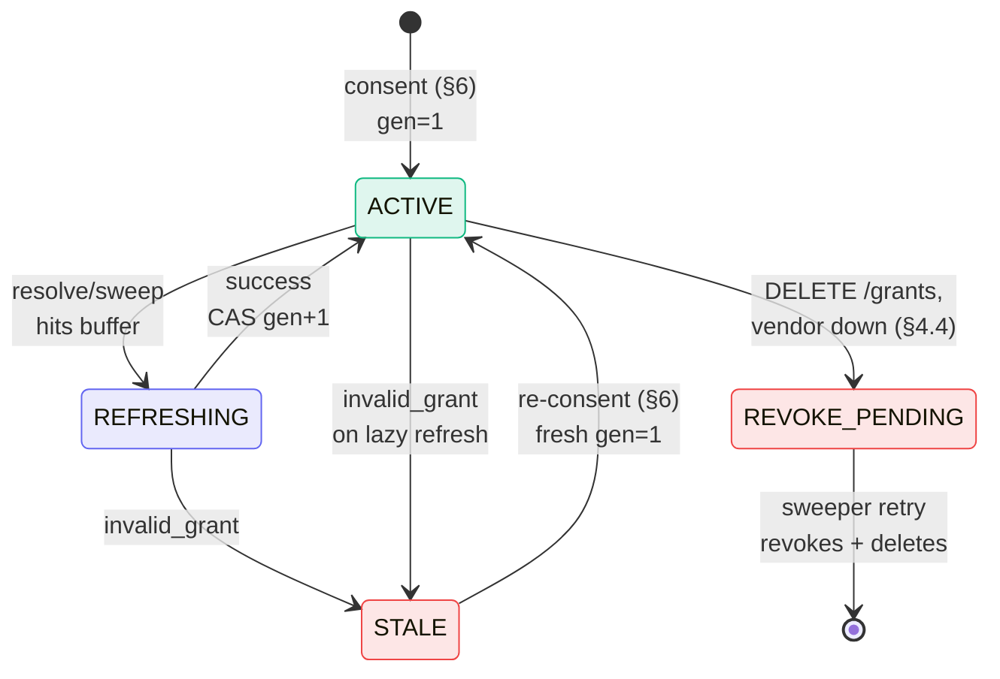
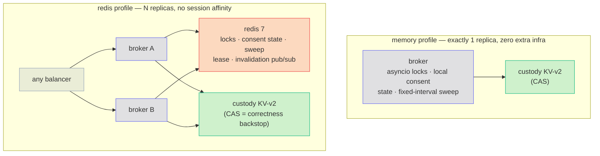

# Vendor Token Broker — Design

**Software:** 1.1.0 (unreleased) · **Reviewed:** 2026-09-25

Start with the [overview](overview.md), [API reference](api.md), or
[security and MCP alignment](security.md). This page explains internal behavior.

Adapted from the source lab's design document; the lab's known
implementation deltas (single-replica-only locking, `client_secret_post`-only
vendor auth, fixed-interval sweeper) are closed by this implementation and
replaced by the deployment profiles in §14. Every lifecycle path described
here is drawn as a sequence diagram in `token-lifecycle.md`.

---

## 1. Role definition

The Vendor Token Broker acquires, custodies, refreshes, and revokes OAuth
credentials issued by third-party SaaS authorization servers (GitHub,
Notion, Atlassian, …) on behalf of individual enterprise users, and
resolves them per-request for the egress gateway tier.

**The broker is an OAuth client and credential custodian. It is not an
authorization server and MUST NOT issue access tokens.** It may sign
`private_key_jwt` assertions to authenticate to vendors. The
workforce IdP (the "hub") remains the sole issuer for the platform. Any
future requirement that appears to need broker-issued tokens is a design
error to be escalated, not implemented.

The broker supports vendors that require a separate user OAuth grant.
MCP Enterprise-Managed Authorization (EMA) is a possible future migration
path when it also supplies the downstream access needed by the application.
It is not implemented here. See [the integration guide](mcp-integration.md).

## 2. Standards basis

| Leg | Standard | Broker obligation |
|---|---|---|
| Acquisition | RFC 6749 authorization code + OAuth 2.1 discipline | PKCE (S256) on every flow; exact redirect-URI match; no implicit/password grants |
| Acquisition | RFC 7636 PKCE | Verifier generated and held server-side per transaction |
| Discovery | RFC 8414 AS metadata | Vendor endpoints resolved from `.well-known`; hardcoding forbidden where metadata exists |
| Acquisition | RFC 9207 issuer identification | When a recorded issuer exists, callback validates `iss` (when present or advertised) against the issuer recorded at transaction creation — strict string comparison, no URI normalization; a missing `iss` from an AS that advertises support is rejected as a mix-up signal |
| Client auth | RFC 7523 `private_key_jwt` | Preferred where the vendor supports it; `client_secret_basic` and `client_secret_post` otherwise (per registry) |
| Hardening | RFC 9700 OAuth 2.0 Security BCP | Review basis; [known limitations](security.md#known-limitations) prevent a blanket conformance claim |
| Lifecycle | RFC 6749 §6 refresh | Single-flight refresh per entry (§8) |
| Lifecycle | RFC 7009 revocation | Offboarding calls the vendor revocation endpoint before deleting the custody entry |
| Exchange (future) | MCP EMA: ID-JAG via RFC 8693 token exchange + RFC 7523 grant | Conditional future migration; no exchange implementation here |

## 3. Architecture and trust boundaries


Required deployment boundaries: the **hub JWT stops at
the gateway/broker** (stripped before anything goes upstream to a vendor),
and **vendor tokens must never reach the MCP client**. The gateway must
enforce these boundaries; this repository does not implement the gateway.
The internal hub JWT is a separate credential contract from MCP resource
authorization. See [three authorization boundaries](mcp-integration.md#three-authorization-boundaries).

Callers and trust:

- **Egress gateway → broker** (`/v1/tokens/resolve`): the request carries the
  end-user hub JWT, which the broker independently re-validates (issuer,
  signature with pinned algorithms, expiry, exactly one tier audience,
  contract version) — defense in depth, never trust-the-gateway. Production
  deployments add mutual TLS with workload identity between gateway and
  broker.
- **User browser → broker** (`/v1/authorize`, `/v1/callback`): private
  ingress only; the callback host is never on the public tier.
- **Broker → vendor AS**: outbound TLS; broker authenticates with its
  per-vendor confidential client credential from `vendor-clients/{vendor}`,
  preferring `private_key_jwt` over shared secrets where supported.
- **Broker → custody backend**: the only role with read on
  `vendor-tokens/*` under the deployed policy. Operators must configure
  custody-backend audit logging to record reads; the broker does not emit
  a dedicated audit event for every storage read.

## 4. API (the whole surface — 7 routes)

Errors follow RFC 9457 problem details. No token material ever appears in
an error body or log line. The `title` slugs and response fields are wire
contract (see `docs/operations.md`).

### 4.1 `POST /v1/tokens/resolve`

See [resolve a token](api.md#resolve-a-token) for request fields, lifetime
exceptions, scope policy, and the canonical [error/action table](api.md#errors-and-caller-actions).
The JWT subject is authoritative. Resolve reads the local cache or custody,
then refreshes inline when necessary; §§7–8 explain concurrency.

### 4.2 `GET /v1/authorize/{vendor}?txn=…`
Starts consent (§6). The link is single use and valid for 5 minutes. The
broker sets an HttpOnly, `SameSite=Lax` binding cookie (`Secure` behind
https) and sends the browser to log in at the hub: OIDC authorization code
with PKCE and a nonce, `login_hint` = the link's `sub`. The vendor leg is
built only after that login succeeds as the same `sub`: its `state` is an
opaque handle to a server-side record `{sub, vendor, nonce,
pkce_verifier, issuer, created_at, scopes, binding}` (TTL 10 min, single
use); never a JWT, never decodable client-side. Scopes = min(tool
requirement, registry ceiling).

### 4.3 `GET /v1/callback/{vendor}?code&state`
`/v1/callback/_hub` is the hub-login return (`_` never appears in a vendor
id): it checks the binding cookie and `iss`, consumes the login state,
redeems the hub code, validates the ID token (signature from the hub
JWKS, issuer, audience = the broker's client id, expiry, nonce), and
requires its `sub` to equal the link's `sub` (403 and a security event
otherwise) before redirecting to the vendor.

For a vendor: validates `state` (exists, unexpired, unconsumed, vendor
match, and issued for the vendor leg); requires the binding cookie
(another browser: 400 and a security event, no code redeemed); validates
RFC 9207 `iss` against the recorded issuer **before** consumption — a
tampered callback never burns the state the legitimate one needs; consumes
the state atomically **before** code redemption (exactly one callback per
state ever reaches the token endpoint); exchanges code + PKCE verifier;
writes the entry (fresh generation 1). If the user's previous grant is
parked `REVOKE_PENDING`, it is revoked and removed *before* the code is
exchanged; if the vendor cannot revoke it yet, the consent fails and the
user retries later. An ACTIVE or STALE predecessor is simply overwritten:
revoking it could also revoke the new grant at vendors that revoke per
user and client. A `state` replay or mismatch is a
security alert, not just a 400.

### 4.4 `DELETE /v1/grants/{vendor}/{sub}`
Self-service (sub must match the hub JWT). Order: RFC 7009 revoke at
vendor → delete custody entry → audit, all under the entry's refresh lock
so no refresh can rotate the pair in between (a pair that lands after a
lost lock is revoked too). Vendor failure parks the entry
`REVOKE_PENDING` (502; unusable for resolve; sweeper retries). A vendor
with no revocation endpoint cannot revoke: the entry is deleted locally,
audited `outcome: "unsupported"`, and the response adds
`"vendor_revocation": "unsupported"` (the vendor-side grant lives until
its own expiry).

### 4.5 `GET /v1/grants` · `GET /v1/admin/vendors/{vendor}`
Self-service listing; authenticated admin read of a registry record
(requires `ADMIN_GROUP` in the hub JWT's `groups` claim, which must be a
JSON array; a string claim never matches). Registry mutation is deliberately
a reviewed git change validated against
`schemas/vendor-registry.schema.json` — for this broker that is the
stronger control, not a gap. Changing `scope_ceiling` requires
token-contract-level sign-off.

## 5. Custody schema

```
vendor-tokens/{vendor}/sub-b64.{base64url(sub)}
                               {access_token, refresh_token, expires_at,
                                granted_scopes[], vendor_user_id,
                                state: ACTIVE|REFRESHING|STALE|REVOKE_PENDING,
                                refresh_generation, last_refresh_at, created_at}
vendor-clients/{vendor}        {client_id, client_secret | private_key (+alg, kid)}
```

Bound to OpenBao/Vault KV v2 (`custody.py`); any backend satisfying
this contract substitutes: versioned compare-and-swap on write,
fail-closed-distinguishably (outage ≠ absent), two mounts with two
policies, encryption at rest under a dedicated key. `refresh_generation`
is the monotonic counter behind §8's race defense; the KV-v2 version is
the CAS handle.

Token shapes: a vendor response with neither `expires_in` nor a
`refresh_token` is a non-expiring token; it is stored with a far-future
`expires_at` (10 years) and never refreshed. A refreshable token that omits
`expires_in` is assumed to last 8 hours. An entry with no refresh token
that reaches its refresh buffer goes STALE without a vendor call (the user
re-consents); it is audited `broker.stale` but does not count toward the
mass-STALE page.

## 6. Consent dance (first-time)

(Full sequence diagram: `token-lifecycle.md` §1.)

resolve → 404 + `authorize_uri(txn)` → browser →
`/v1/authorize/{vendor}` (link used up, binding cookie set) → hub login →
`/v1/callback/_hub` (same browser, logged-in `sub` == link `sub`) →
vendor AS consent → `/v1/callback/{vendor}?code&state&iss` → binding,
state and iss validated, state consumed, code redeemed server-side →
entry written `ACTIVE gen=1` → "connected" page → retry resolves 200.

Properties: PKCE verifiers stay out of browser URLs and are sent only in
server-side token requests; browser-visible `state` values are opaque handles
to records held by the broker; scopes are capped by the registry ceiling regardless of
what the tool asked for; and consent is bound to both the **user** and the
**browser**:

- The hub login proves the browser belongs to the user the link was issued
  for. A link forwarded to someone else, or stolen from its user, is
  refused before the vendor is ever involved. (Before 1.1, anyone holding
  an authorize link could complete it, so an attacker could send their own
  link to a victim and have the victim's vendor account stored under the
  attacker's `sub`.)
- The binding cookie ties every leg to the browser that opened the link,
  so a forwarded hub-login callback (login CSRF) or a vendor authorization
  URL completed elsewhere is refused. The user check alone would not stop
  an attacker who forwards the callback of their own, successful login.
- The broker is an OIDC *relying party* of the hub here: it consumes a hub
  ID token and still issues nothing (§1).

## 7. Steady-state resolve

(Sequence diagrams: `token-lifecycle.md` §2 cache hit, §3 lazy refresh.)

Per-replica in-memory cache (`CACHE_TTL_S`, default 60s, also the §10 outage
grace cap) → custody read (no broker audit event; the custody backend's own
audit log records it) → serve if `expires_at - now ≥ max(min_ttl,
REFRESH_BUFFER_S)` → otherwise inline single-flight refresh (§8).

## 8. Refresh state machine and race defense



(Message-level sequences for every transition: `token-lifecycle.md`
§§3–5, 7–8.)

Rotating-refresh-token vendors (GitHub-class) burn the whole token family
if two refreshes race. Defense in depth:

1. **Single-flight lock** per `{vendor, sub}` — in-process (memory profile)
   or Redis `SET NX PX` (redis profile); held for the refresh critical
   section (re-read, marker write, vendor round-trip, outcome CAS write); waiters re-read and serve the winner's token.
2. **Persisted `REFRESHING`** (redis profile) with owner + started-at:
   other replicas distinguish in-flight from stale; a marker abandoned past
   `REFRESHING_TTL_S` is taken over by the next lock holder. Never surfaces
   externally.
3. **Generation CAS** — the correctness backstop everywhere: a CAS failure
   means another writer won; the loser discards its result, re-reads, and
   never writes the older pair. A lost lock can never corrupt custody.

Triggers: lazy (resolve inside `REFRESH_BUFFER_S`) and proactive (sweeper,
entries expiring within `PROACTIVE_REFRESH_S`, leader-only + jittered in
the redis profile). `invalid_grant` → STALE; ≥`MASS_STALE_THRESHOLD`
STALEs for one vendor inside `MASS_STALE_WINDOW_S` emits a possible org-level uninstall alert signal (`broker.stale.mass`);
monitoring must route it to on-call.

## 9. Failure modes

(Outage sequences: `token-lifecycle.md` §9; replica-death recovery: §5.)

| Failure | Detection | Behavior |
|---|---|---|
| User revoked grant at vendor | `invalid_grant` on refresh | Entry → STALE; next resolve returns needs-consent |
| Org app uninstalled at vendor | Burst of STALEs for one vendor | Mass-stale page; per-entry behavior unchanged |
| Refresh token disuse expiry | `invalid_grant` after dormancy | STALE → re-consent; expected, not an incident |
| Custody unavailable | Read/write errors | **Fail closed.** No grace beyond the in-memory cache (`CACHE_TTL_S`, default 60s); 503 `vault-unavailable` |
| Coordination (redis) unavailable | Lock/store errors | 503 `coordination-unavailable` on every path that needs redis: refresh, minting a consent link (so absent/STALE/insufficient-scope resolves get 503, not 404/409), authorize, callbacks, DELETE. Resolves served without a refresh still return 200 |
| Vendor AS outage | Timeouts/5xx on token endpoint | 503 `vendor-unavailable`; entries untouched |
| `state` replay / mismatch | Server-side store check | 4xx + security alert (possible CSRF/binding attack) |
| Replica death mid-refresh | Lock TTL + abandoned-REFRESHING takeover | Waiters retry; CAS prevents any stale write; worst case the family burns → STALE → re-consent |

## 10. Security requirements

No access-token issuance or JWKS endpoint (route audit in CI). Vendor
client-authentication assertions may be signed using keys from custody. Token material never logged, never in errors, never in traces
(token-in-log grep in CI). Per-user entries only — no shared vendor
service accounts through this path. Registry scope ceilings enforced at
authorize time. Consent is bound to the hub-authenticated user and to the
initiating browser (§6). Callback host on the private tier only. Include the consent dance (CSRF, mix-up, code injection per RFC 9700 §4)
in deployment penetration testing; this repository provides no pen-test report. The broker stores credentials, not business data; DLP at the
egress gateway (not the broker) is the control preventing sensitive data
reaching vendors.

## 11. Audit events

One JSON line per event on stdout; ids, states, and generations only.
Vocabulary (wire-frozen): `broker.resolve` (decision + path),
`broker.consent.start|complete|fail`, `broker.refresh` (generation
transition), `broker.stale`, `broker.stale.mass`, `broker.revoke`,
`broker.admin.deny`, `broker.sweep.error`, and (added in 1.1)
`broker.custody.renew_failed`. Every vendor-side action is
joinable: hub `jti` → resolve → gateway record → vendor audit log via
`vendor_user_id`.

## 12. SLOs and capacity

**Design targets, not measured results:** resolve p99 ≤ 25 ms (cache hit) / 400 ms (inline refresh); availability
99.9% (egress hot path; gateways treat 503 as retriable). Sizing: ~tens of
vendor refreshes per user per day — the hot path is cache-served resolves.
One modest replica pair is HA engineering, not throughput engineering.

## 13. Sunset criteria (per vendor)

A proposed migration requires compatible clients, identity provider, and
resource authorization server, plus evidence that the replacement supplies
the required downstream vendor access. Evaluate parity in a controlled
dual-run before retiring consent and draining grants.

`ema_status` is informational tracking only. No registry flag currently
automates ID-JAG exchange, consent shutdown, or scheduled draining. Those
features require a separate implementation and rollout plan.

## 14. Deployment profiles



### Single replica (`COORD_BACKEND=memory`, the default)

In-process asyncio lock per `{vendor, sub}`, replica-local consent
records, fixed-interval sweeper, `REFRESHING` never persisted. Zero extra
infrastructure. **Correct only while replicas = 1.**

### Multi-replica (`COORD_BACKEND=redis`)

Redis 7 provides: the distributed single-flight lock, shared single-use
consent state (so consent may authorize on one replica and call back on
another — no session affinity required), persisted `REFRESHING` with
abandoned-marker takeover, the sweep leader lease (+ jittered interval),
the shared mass-STALE window, and best-effort pub/sub cache invalidation
on revoke/STALE/delete (worst case without it stays the per-replica `CACHE_TTL_S`, default
60s). Redis is an availability optimization; the KV-v2 CAS remains the correctness guarantee. See
`docs/adr/0001-redis-coordination.md`.

Both profiles pass the same acceptance suite; the multi profile
additionally passes `tests/integration/test_multi_replica.py`.
