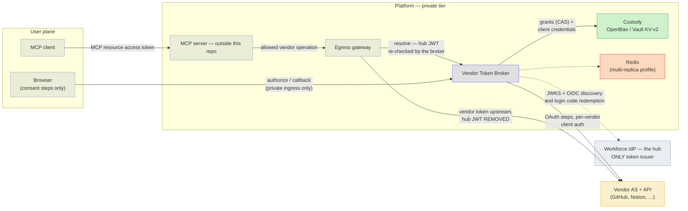
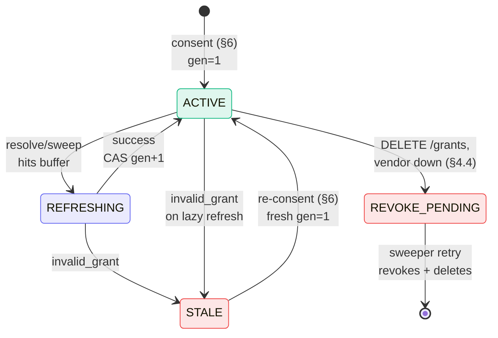
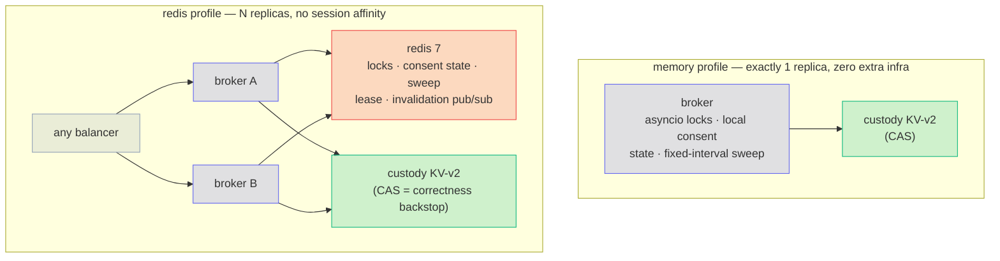

# Vendor Token Broker — Design

**Software:** 1.1.0 (unreleased) · **Reviewed:** 2026-09-25

This page is the normative design of the broker. It says how the broker
must behave inside. For a gentler start, read the [overview](overview.md),
the [API reference](api.md), or [security](security.md).

## Where the broker sits

The broker keeps each user's tokens for outside SaaS vendors (GitHub,
Notion, Atlassian, …). It never talks to MCP clients directly. It sits
behind a trusted gateway:

- the [MCP gateway](mcp-gateway.md) in this repo, which lets Claude Code
  and other MCP clients use GitHub's MCP server, or
- any other trusted egress gateway (the service that makes outbound calls
  to vendors).

The gateway asks the broker for a user's vendor token. It then calls the
vendor with that token. The user's browser talks to the broker only to
connect a vendor account (the consent steps).

Terms used on this page:

- **Hub** — your company's sign-in service (the workforce identity
  provider, or IdP). It is the only service that issues platform tokens.
- **Hub JWT** — the signed token the hub issues for a signed-in user.
- **Vendor AS** — the vendor's authorization server (where users grant
  access and tokens come from).
- **Custody** — the secret store that holds tokens (OpenBao or Vault
  KV v2).
- **Entry** — one stored token record for one user and one vendor.
- **`sub`** — the user id (the JWT "subject").

This design is adapted from the source lab's design document. The lab had
known gaps: locking that worked on one replica only, `client_secret_post`
as the only vendor auth method, and a fixed-interval sweeper. This
implementation closes them and replaces them with the deployment profiles
in §14. `token-lifecycle.md` draws every lifecycle path on this page as a
sequence diagram.

---

## 1. Role definition

The broker gets, stores, refreshes, and revokes OAuth tokens for each
user. Third-party SaaS authorization servers (GitHub, Notion, Atlassian,
…) issue those tokens. On each request, the broker returns the right token
to the egress gateway tier.

**The broker is an OAuth client and it stores credentials. It is not an
authorization server and MUST NOT issue access tokens.**

- It may sign `private_key_jwt` assertions to sign in to vendors.
- The hub stays the only token issuer for the platform.
- If a future need seems to require broker-issued tokens, treat it as a
  design error. Escalate it. Do not implement it.

The broker supports vendors that need a separate user OAuth grant. MCP
Enterprise-Managed Authorization (EMA) is a possible future migration
path. It fits only if it also gives the downstream vendor access the
application needs. This repo does not implement it. See
[the integration guide](mcp-integration.md).

## 2. Standards basis

Each row shows a standard and what the broker must do to meet it.

| Leg | Standard | What the broker must do |
|---|---|---|
| Getting tokens | RFC 6749 authorization code + OAuth 2.1 rules | Use PKCE (S256) on every flow. Match redirect URIs exactly. No implicit or password grants |
| Getting tokens | RFC 7636 PKCE | Create the verifier and keep it on the server, one per transaction |
| Discovery | RFC 8414 AS metadata | Find vendor endpoints from `.well-known`. Hardcoding is forbidden where metadata exists |
| Getting tokens | RFC 9207 issuer identification | When a recorded issuer exists, the callback checks `iss` (when present or advertised) against the issuer recorded when the transaction started. Use strict string comparison, no URI normalization. If the AS advertises support but sends no `iss`, reject the callback as a mix-up signal |
| Client auth | RFC 7523 `private_key_jwt` | Prefer it where the vendor supports it. Otherwise use `client_secret_basic` or `client_secret_post` (set per vendor in the registry) |
| Hardening | RFC 9700 OAuth 2.0 Security BCP | Used as the review basis. [Known limitations](security.md#known-limitations) prevent a blanket conformance claim |
| Lifecycle | RFC 6749 §6 refresh | Only one refresh at a time per entry (single-flight, §8) |
| Lifecycle | RFC 7009 revocation | When a user is removed, call the vendor revocation endpoint before deleting the stored entry |
| Exchange (future) | MCP EMA: ID-JAG via RFC 8693 token exchange + RFC 7523 grant | Possible future migration only. No exchange is implemented here |

## 3. Architecture and trust boundaries

The hub JWT never goes past the gateway and broker, and vendor tokens
never reach the MCP client.



Every deployment needs these two boundaries:

- The **hub JWT stops at the gateway and broker**. The gateway removes it
  before anything goes upstream to a vendor.
- **Vendor tokens must never reach the MCP client.**

The gateway must enforce both. This repo's broker does not implement the
gateway. The internal hub JWT is a separate credential contract from MCP
resource authorization. See
[three authorization boundaries](mcp-integration.md#three-authorization-boundaries).

Who calls whom, and how much each side is trusted:

- **Egress gateway → broker** (`/v1/tokens/resolve`). The request carries
  the end user's hub JWT. The broker checks it again on its own: issuer,
  signature with pinned algorithms, expiry, exactly one tier audience, and
  contract version. This is defense in depth. The broker never simply
  trusts the gateway. Production deployments add mutual TLS with workload
  identity between gateway and broker.
- **User browser → broker** (`/v1/authorize`, `/v1/callback`). Private
  ingress only. The callback host is never on the public tier.
- **Broker → vendor AS**. Outbound TLS. The broker signs in with its own
  confidential client credential for that vendor, stored at
  `vendor-clients/{vendor}`. It prefers `private_key_jwt` over shared
  secrets where the vendor supports it.
- **Broker → custody backend**. Under the deployed policy, the broker is
  the only role that can read `vendor-tokens/*`. Operators must turn on
  custody-backend audit logging to record reads. The broker does not emit
  its own audit event for every storage read.

## 4. API (the whole surface — 7 routes)

The broker has exactly 7 routes: the six in §4.1–4.5 below, plus `GET /healthz` (health check, see `docs/operations.md`). Error and field rules for all of them:

- Errors use RFC 9457 problem details.
- No token material ever appears in an error body or log line.
- The `title` slugs and response fields are a frozen wire contract (see
  `docs/operations.md`).

### 4.1 `POST /v1/tokens/resolve`

The gateway calls this route to get a user's vendor token. See
[resolve a token](api.md#resolve-a-token) for request fields, lifetime
exceptions, and scope policy. The full list of errors and caller actions
is in the [error/action table](api.md#errors-and-caller-actions).

- The JWT subject (`sub`) decides whose token is returned.
- Resolve reads the local cache or custody.
- If needed, it refreshes the token inline, during the request.
- §§7–8 explain how concurrent requests are handled.

### 4.2 `GET /v1/authorize/{vendor}?txn=…`
This route starts consent (§6). The user opens this link in a browser.

1. The link is single use and valid for 5 minutes.
2. The broker sets a binding cookie: HttpOnly, `SameSite=Lax`, and
   `Secure` behind https.
3. The broker sends the browser to sign in at the hub. This uses OIDC
   authorization code with PKCE and a nonce, with `login_hint` = the
   link's `sub`.
4. The broker builds the vendor step only after that sign-in succeeds as
   the same `sub`.

The vendor step's `state` is an opaque handle to a record on the server:
`{sub, vendor, nonce, pkce_verifier, issuer, created_at, scopes, binding}`.

- The record lives 10 min and is single use.
- `state` is never a JWT and the browser can never decode it.
- Scopes = min(tool requirement, registry ceiling).

### 4.3 `GET /v1/callback/{vendor}?code&state`
The browser returns here after each sign-in step. There are two kinds of
callback.

**Hub sign-in return (`/v1/callback/_hub`).** `_` never appears in a
vendor id. The broker, in order:

1. checks the binding cookie and `iss`,
2. uses up the login state,
3. redeems the hub code,
4. checks the ID token: signature from the hub JWKS, issuer,
   audience = the broker's client id, expiry, nonce,
5. requires the ID token's `sub` to equal the link's `sub` (otherwise 403
   and a security event),
6. then redirects to the vendor.

**Vendor return.** The broker, in order:

1. Checks `state`: it exists, has not expired, has not been used, matches
   the vendor, and was issued for the vendor step.
2. Requires the binding cookie. A different browser gets 400 and a
   security event, and no code is redeemed.
3. Checks the RFC 9207 `iss` against the recorded issuer **before** using
   up the state. So a tampered callback never burns the state the real
   callback needs.
4. Uses up the state atomically **before** redeeming the code. So exactly
   one callback per state ever reaches the token endpoint.
5. Exchanges the code + PKCE verifier for tokens.
6. Writes the entry (fresh generation 1).

What happens to the user's earlier grant for this vendor:

- **`REVOKE_PENDING`**: the broker revokes and removes it *before* it
  exchanges the code. If the vendor cannot revoke it yet, consent fails
  and the user retries later.
- **ACTIVE or STALE**: the broker overwrites it. It does not revoke it,
  because some vendors revoke per user and client, which could also
  revoke the new grant.

A `state` replay or mismatch is a security alert, not only a 400.

### 4.4 `DELETE /v1/grants/{vendor}/{sub}`
A user removes their own grant. The `sub` must match the hub JWT.

The steps run in this order:

1. revoke at the vendor (RFC 7009),
2. delete the custody entry,
3. write the audit event.

All three run under the entry's refresh lock, so no refresh can rotate the
token pair in between. If a pair lands after a lost lock, the broker
revokes it too.

If something goes wrong:

- **Vendor revoke fails**: the entry is parked as `REVOKE_PENDING`. The
  response is 502. Resolve cannot use the entry. The sweeper retries.
- **Vendor has no revocation endpoint**: the broker cannot revoke. It
  deletes the entry locally and audits it with `outcome: "unsupported"`.
  The response adds `"vendor_revocation": "unsupported"`. The grant on the
  vendor side lives until it expires on its own.

### 4.5 `GET /v1/grants` · `GET /v1/admin/vendors/{vendor}`
- `GET /v1/grants` lists the caller's own grants.
- `GET /v1/admin/vendors/{vendor}` lets a signed-in admin read one
  registry record. The hub JWT's `groups` claim must contain `ADMIN_GROUP`.
  `groups` must be a JSON array. A string claim never matches.

There is no route to change the registry, on purpose. Registry changes
are reviewed git changes, checked against
`schemas/vendor-registry.schema.json`. For this broker that is the
stronger control, not a gap. Changing `scope_ceiling` needs sign-off at
the token-contract level.

## 5. Custody schema

Custody holds two kinds of record: one token entry per user per vendor,
and one client credential per vendor.

```
vendor-tokens/{vendor}/sub-b64.{base64url(sub)}
                               {access_token, refresh_token, expires_at,
                                granted_scopes[], vendor_user_id,
                                state: ACTIVE|REFRESHING|STALE|REVOKE_PENDING,
                                refresh_generation, last_refresh_at, created_at}
vendor-clients/{vendor}        {client_id, client_secret | private_key (+alg, kid)}
```

The code binds this to OpenBao/Vault KV v2 (`custody.py`). Any backend
can replace it if it meets this contract:

- versioned compare-and-swap (CAS) on write,
- fails closed and can tell the difference (an outage is not the same as
  "absent"),
- two mounts with two policies,
- encryption at rest under a dedicated key.

`refresh_generation` is a counter that only goes up. §8's race defense
relies on it. The KV-v2 version is the CAS handle.

How the broker handles different token shapes:

| Vendor response | What the broker does |
|---|---|
| Neither `expires_in` nor a `refresh_token` | Treats it as a non-expiring token. Stores it with a far-future `expires_at` (10 years). Never refreshes it |
| Has a refresh token but no `expires_in` | Assumes it lasts 8 hours |

An entry with no refresh token that reaches its refresh buffer goes STALE
without a vendor call. The user then consents again. The broker audits it
as `broker.stale`, but it does not count toward the mass-STALE page.

## 6. Consent dance (first-time)

The first time a user needs a vendor, they connect the account in a
browser. (Full sequence diagram: `token-lifecycle.md` §1.)

1. Resolve returns 404 + `authorize_uri(txn)`.
2. The browser opens `/v1/authorize/{vendor}`. The link is used up and the
   binding cookie is set.
3. The user signs in at the hub.
4. The browser returns to `/v1/callback/_hub`. It must be the same
   browser, and the signed-in `sub` must equal the link's `sub`.
5. The user consents at the vendor AS.
6. The browser returns to `/v1/callback/{vendor}?code&state&iss`.
7. The broker checks binding, state, and iss, uses up the state, and
   redeems the code on the server.
8. The broker writes the entry as `ACTIVE gen=1`.
9. The browser shows a "connected" page.
10. The caller retries, and resolve returns 200.

What this guarantees:

- PKCE verifiers stay out of browser URLs. The broker sends them only in
  server-side token requests.
- `state` values the browser sees are opaque handles to records the
  broker holds.
- The registry ceiling caps scopes, whatever the tool asked for.
- Consent is bound to both the **user** and the **browser**:

  - **User.** The hub sign-in proves the browser belongs to the user the
    link was issued for. The broker refuses a link that was forwarded to
    someone else or stolen from its user. This happens before the vendor
    is involved. (Before 1.1, anyone holding an authorize link could
    complete it. An attacker could send their own link to a victim and get
    the victim's vendor account stored under the attacker's `sub`.)
  - **Browser.** The binding cookie ties every step to the browser that
    opened the link. So the broker refuses a forwarded hub sign-in
    callback (login CSRF) or a vendor authorization URL completed
    elsewhere. The user check alone would not stop an attacker who
    forwards the callback of their own successful sign-in.

- Here the broker is an OIDC *relying party* of the hub. It uses a hub ID
  token and still issues nothing (§1).

## 7. Steady-state resolve

After consent, each resolve follows the same short path. (Sequence
diagrams: `token-lifecycle.md` §2 cache hit, §3 lazy refresh.)

1. Check the in-memory cache on this replica (`CACHE_TTL_S`, default 60s).
   This is also the §10 outage grace cap.
2. Otherwise read custody. The broker emits no audit event for this. The
   custody backend's own audit log records it.
3. Serve the token if `expires_at - now ≥ max(min_ttl, REFRESH_BUFFER_S)`.
4. Otherwise refresh inline, one refresh at a time (single-flight, §8).

## 8. Refresh state machine and race defense

Each entry moves between four states. Only one refresh may run per entry
at a time.



(Message-level sequences for every transition: `token-lifecycle.md`
§§3–5, 7–8.)

Some vendors (GitHub-class) rotate the refresh token on every refresh. If
two refreshes race, the vendor burns the whole token family. The broker
has three layers of defense:

1. **Single-flight lock** per `{vendor, sub}`.
   - In-process in the memory profile. Redis `SET NX PX` in the redis
     profile.
   - Held for the whole refresh critical section: re-read, marker write,
     vendor round-trip, outcome CAS write.
   - Requests that wait re-read and serve the winner's token.
2. **Persisted `REFRESHING`** (redis profile only), with owner and
   start time.
   - Other replicas can tell an in-flight refresh from a stale one.
   - The next lock holder takes over a marker left behind longer than
     `REFRESHING_TTL_S`.
   - Callers never see this state.
3. **Generation CAS** — the correctness backstop in every profile.
   - A CAS failure means another writer won.
   - The loser throws away its result, re-reads, and never writes the
     older pair.
   - So a lost lock can never corrupt custody.

When a refresh starts:

- **Lazy**: a resolve finds the token inside `REFRESH_BUFFER_S`.
- **Proactive**: the sweeper refreshes entries that expire within
  `PROACTIVE_REFRESH_S`. In the redis profile only the leader sweeps, on a
  jittered interval.

When a refresh fails with `invalid_grant`, the entry goes STALE. If one
vendor has ≥`MASS_STALE_THRESHOLD` STALEs inside `MASS_STALE_WINDOW_S`, the
broker emits `broker.stale.mass`. This signals a possible org-level
uninstall. Monitoring must route it to on-call.

## 9. Failure modes

The broker fails closed, and callers can tell the failures apart.
(Outage sequences: `token-lifecycle.md` §9. Replica-death recovery: §5.)

| Failure | How it is detected | What the broker does |
|---|---|---|
| User revoked the grant at the vendor | `invalid_grant` on refresh | Entry → STALE. The next resolve returns needs-consent |
| Org app uninstalled at the vendor | Burst of STALEs for one vendor | Mass-stale page. Each entry behaves as usual |
| Refresh token expired from disuse | `invalid_grant` after dormancy | STALE → re-consent. Expected, not an incident |
| Custody unavailable | Read/write errors | **Fail closed.** No grace beyond the in-memory cache (`CACHE_TTL_S`, default 60s). 503 `vault-unavailable` |
| Coordination (redis) unavailable | Lock/store errors | 503 `coordination-unavailable` on every path that needs redis: refresh, minting a consent link (so absent, STALE, or insufficient-scope resolves get 503, not 404/409), authorize, callbacks, DELETE. Resolves served without a refresh still return 200 |
| Vendor AS outage | Timeouts/5xx on the token endpoint | 503 `vendor-unavailable`. Entries are not touched |
| `state` replay / mismatch | Server-side store check | 4xx + security alert (possible CSRF or binding attack) |
| Replica dies mid-refresh | Lock TTL + takeover of the abandoned REFRESHING marker | Waiting requests retry. CAS prevents any stale write. Worst case: the family burns → STALE → re-consent |

## 10. Security requirements

The broker must meet all of these:

- **No token issuing.** No access-token issuance and no JWKS endpoint. A
  route audit in CI checks this.
- **Signing only toward vendors.** The broker may sign vendor
  client-authentication assertions with keys from custody.
- **No token material in output.** Never in logs, errors, or traces. A
  token-in-log grep in CI checks this.
- **Per-user entries only.** No shared vendor service accounts through
  this path.
- **Scope ceilings.** The broker enforces registry scope ceilings at
  authorize time.
- **Bound consent.** Consent is bound to the user the hub signed in and to
  the browser that started it (§6).
- **Private callback.** The callback host is on the private tier only.
- **Pen testing.** Include the consent dance in deployment penetration
  testing: CSRF, mix-up, and code injection (per RFC 9700 §4). This repo
  provides no pen-test report.
- **No business data.** The broker stores credentials, not business data.
  DLP (data loss prevention) at the egress gateway, not the broker, is the
  control that stops sensitive data from reaching vendors.

## 11. Audit events

The broker writes one JSON line per event to stdout. Events hold ids,
states, and generations only.

The event names are wire-frozen:

| Event | Records |
|---|---|
| `broker.resolve` | decision + path |
| `broker.consent.start`, `broker.consent.complete`, `broker.consent.fail` | consent steps |
| `broker.refresh` | generation transition |
| `broker.stale` | entry went STALE |
| `broker.stale.mass` | mass-STALE signal |
| `broker.revoke` | revocation |
| `broker.admin.deny` | admin access denied |
| `broker.sweep.error` | sweeper error |
| `broker.custody.renew_failed` | added in 1.1 |

You can trace every vendor-side action end to end: hub `jti` → resolve →
gateway record → vendor audit log via `vendor_user_id`.

## 12. SLOs and capacity

**These are design targets, not measured results.**

- Resolve p99 ≤ 25 ms (cache hit) / 400 ms (inline refresh).
- Availability 99.9%. This is the egress hot path. Gateways treat 503 as
  retriable.
- Sizing: about tens of vendor refreshes per user per day. Cache-served
  resolves make up the hot path.

One modest replica pair is for high availability, not for throughput.

## 13. Sunset criteria (per vendor)

Before you retire the broker for a vendor, a proposed migration needs:

- compatible clients, identity provider, and resource authorization
  server, and
- evidence that the replacement gives the needed downstream vendor access.

Check parity in a controlled dual-run before you retire consent and drain
grants.

`ema_status` is for tracking only. No registry flag automates ID-JAG
exchange, consent shutdown, or scheduled draining today. Those features
need a separate implementation and rollout plan.

## 14. Deployment profiles

Run one replica with no extra infrastructure, or many replicas with Redis.



### Single replica (`COORD_BACKEND=memory`, the default)

- In-process asyncio lock per `{vendor, sub}`.
- Consent records kept on the replica.
- Fixed-interval sweeper.
- `REFRESHING` is never persisted.
- Zero extra infrastructure.

**Correct only while replicas = 1.**

### Multi-replica (`COORD_BACKEND=redis`)

Redis 7 provides:

- the distributed single-flight lock,
- shared single-use consent state, so consent may start on one replica
  and call back on another (no session affinity needed),
- persisted `REFRESHING` with takeover of abandoned markers,
- the sweep leader lease (+ jittered interval),
- the shared mass-STALE window,
- best-effort pub/sub cache invalidation on revoke, STALE, and delete.
  Without it, the worst case stays the per-replica `CACHE_TTL_S` (default
  60s).

Redis only helps availability. The KV-v2 CAS remains the correctness
guarantee. See `docs/adr/0001-redis-coordination.md`.

Both profiles pass the same acceptance suite. The multi profile also
passes `tests/integration/test_multi_replica.py`.
