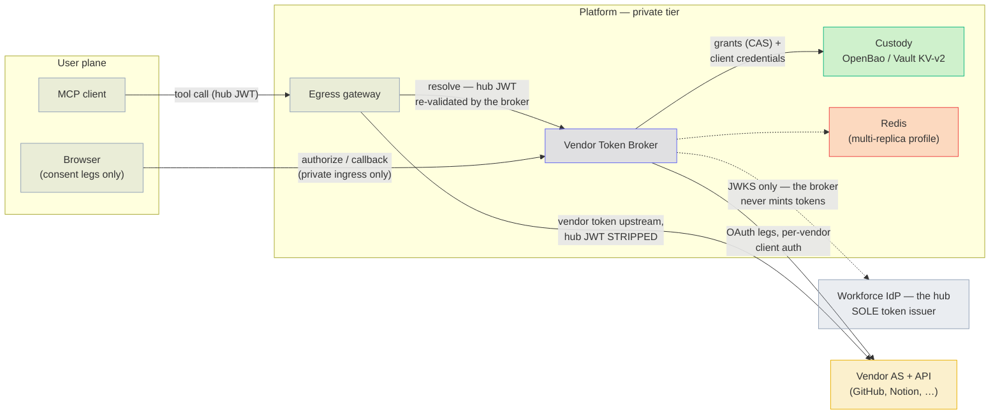
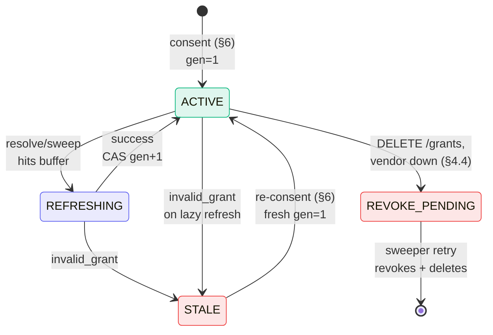
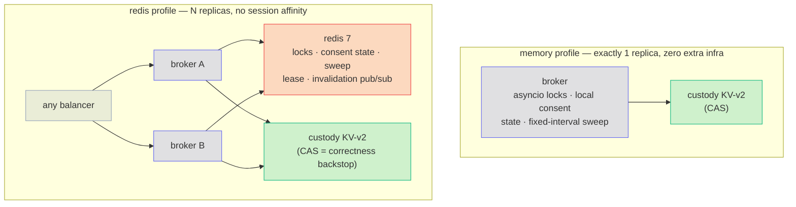

# Vendor Token Broker — Design

**Version:** 1.0 · **Status:** implemented (this repository)

Adapted from the source lab's design document; the lab's known
implementation deltas (single-replica-only locking, `client_secret_post`-only
vendor auth, fixed-interval sweeper) are closed by this implementation and
replaced by the deployment profiles in §14. Every lifecycle path described
here is drawn as a sequence diagram in `token-lifecycle.md`.

---

## 1. Role definition

The Vendor Token Broker acquires, custodies, refreshes, and revokes OAuth
credentials issued by third-party SaaS authorization servers (GitHub,
Notion, Atlassian, …) on behalf of individual enterprise users, and
resolves them per-request for the egress gateway tier.

**The broker is an OAuth client and credential custodian. It is not an
authorization server and MUST NOT mint, sign, or transform tokens.** The
workforce IdP (the "hub") remains the sole issuer for the platform. Any
future requirement that appears to need broker-issued tokens is a design
error to be escalated, not implemented.

The broker exists because most SaaS vendors' authorization servers do not
yet accept the Identity Assertion JWT Authorization Grant (ID-JAG) on which
MCP Enterprise-Managed Authorization (EMA) is built. It is deliberately
transitional: §13 defines per-vendor sunset criteria. Architect every
vendor integration as a removable module.

## 2. Standards basis

| Leg | Standard | Broker obligation |
|---|---|---|
| Acquisition | RFC 6749 authorization code + OAuth 2.1 discipline | PKCE (S256) on every flow; exact redirect-URI match; no implicit/password grants |
| Acquisition | RFC 7636 PKCE | Verifier generated and held server-side per transaction |
| Discovery | RFC 8414 AS metadata | Vendor endpoints resolved from `.well-known`; hardcoding forbidden where metadata exists |
| Acquisition | RFC 9207 issuer identification | Callback validates `iss` (when present or advertised) against the issuer recorded at transaction creation — strict string comparison, no URI normalization; a missing `iss` from an AS that advertises support is rejected as a mix-up signal |
| Client auth | RFC 7523 `private_key_jwt` | Preferred where the vendor supports it; `client_secret_basic` and `client_secret_post` otherwise (per registry) |
| Hardening | RFC 9700 OAuth 2.0 Security BCP | Normative checklist for the whole client stack; deviations documented per vendor |
| Lifecycle | RFC 6749 §6 refresh | Single-flight refresh per entry (§8) |
| Lifecycle | RFC 7009 revocation | Offboarding calls the vendor revocation endpoint before deleting the custody entry |
| Exchange (future) | MCP EMA: ID-JAG via RFC 8693 token exchange + RFC 7523 grant | The standardized replacement; drives §13 sunset |

## 3. Architecture and trust boundaries



Two tokens never cross a boundary they shouldn't: the **hub JWT stops at
the gateway/broker** (stripped before anything goes upstream to a vendor),
and **vendor tokens never reach the client** (they exist only between
gateway, broker, custody, and vendor).

Callers and trust:

- **Egress gateway → broker** (`/v1/tokens/resolve`): the request carries the
  end-user hub JWT, which the broker independently re-validates (issuer,
  signature with pinned algorithms, expiry, exactly one tier audience,
  contract version) — defense in depth, never trust-the-gateway. Production
  deployments add mutual TLS with workload identity between gateway and
  broker.
- **User browser → broker** (`/v1/authorize`, `/v1/callback`): private
  ingress only; the callback host is never on the public tier.
- **Broker → vendor AS**: outbound TLS; broker authenticates with its
  per-vendor confidential client credential from `vendor-clients/{vendor}`,
  preferring `private_key_jwt` over shared secrets where supported.
- **Broker → custody backend**: the only role with read on
  `vendor-tokens/*`; every read is an audited event.

## 4. API (the whole surface — 7 routes)

Errors follow RFC 9457 problem details. No token material ever appears in
an error body or log line. The `title` slugs and response fields are wire
contract (see `docs/operations.md`).

### 4.1 `POST /v1/tokens/resolve`
Request: `{"vendor", "sub"?, "min_ttl_s"?, "required_scopes"?}` + hub JWT.
The JWT's `sub` is authoritative; a mismatched body `sub` is a 400.
`required_scopes` is capped by the registry `scope_ceiling` (403
`scope-exceeds-ceiling` beyond it). An empty ceiling means scopes are
governed vendor-side (e.g. GitHub App permissions): the broker then neither
requests nor enforces `required_scopes` for that vendor.
- `200 {access_token, expires_at, granted_scopes}` — live for ≥ `min_ttl_s`
  (refresh performed inline if needed)
- `404 needs-consent {authorize_uri}` — no entry or STALE entry
- `409 needs-reconsent-scope {missing_scopes, authorize_uri}` — grant
  narrower than required; re-consent unions held+required (≤ ceiling)
- `409 revoke-pending` — entry mid-revocation
- `503 vendor-unavailable | vault-unavailable | coordination-unavailable` —
  retriable; entry state unchanged

### 4.2 `GET /v1/authorize/{vendor}?txn=…`
Builds the vendor authorization URL: `state` = opaque handle to a
server-side record `{sub, vendor, nonce, pkce_verifier, issuer,
created_at, scopes}` (TTL 10 min, single use); never a JWT, never
decodable client-side. Scopes = min(tool requirement, registry ceiling).

### 4.3 `GET /v1/callback/{vendor}?code&state`
Validates `state` (exists, unexpired, unconsumed, vendor match); validates
RFC 9207 `iss` against the recorded issuer **before** consumption — a
tampered callback never burns the state the legitimate one needs; consumes
the state atomically **before** code redemption (exactly one callback per
state ever reaches the token endpoint); exchanges code + PKCE verifier;
writes the entry (fresh generation 1). A `state` replay or mismatch is a
security alert, not just a 400.

### 4.4 `DELETE /v1/grants/{vendor}/{sub}`
Self-service (sub must match the hub JWT). Order: RFC 7009 revoke at
vendor → delete custody entry → audit. Vendor failure parks the entry
`REVOKE_PENDING` (502; unusable for resolve; sweeper retries).

### 4.5 `GET /v1/grants` · `GET /v1/admin/vendors/{vendor}`
Self-service listing; authenticated admin read of a registry record
(requires `ADMIN_GROUP` in the hub JWT's `groups` claim, which must be a
JSON array; a string claim never matches). Registry mutation is deliberately
a reviewed git change validated against
`schemas/vendor-registry.schema.json` — for this broker that is the
stronger control, not a gap. Changing `scope_ceiling` requires
token-contract-level sign-off.

## 5. Custody schema

```
vendor-tokens/{vendor}/{sub}   {access_token, refresh_token, expires_at,
                                granted_scopes[], vendor_user_id,
                                state: ACTIVE|REFRESHING|STALE|REVOKE_PENDING,
                                refresh_generation, last_refresh_at, created_at}
vendor-clients/{vendor}        {client_id, client_secret | private_key (+alg, kid)}
```

Bound to OpenBao/Vault KV v2 (`custody.py`); any backend satisfying
this contract substitutes: versioned compare-and-swap on write,
fail-closed-distinguishably (outage ≠ absent), two mounts with two
policies, encryption at rest under a dedicated key. `refresh_generation`
is the monotonic counter behind §8's race defense; the KV-v2 version is
the CAS handle.

## 6. Consent dance (first-time)

(Full sequence diagram: `token-lifecycle.md` §1.)

resolve → 404 + `authorize_uri(txn)` → browser →
`/v1/authorize/{vendor}` (PKCE verifier + single-use `state` created,
TTL 10 min) → vendor AS consent → `/v1/callback/{vendor}?code&state&iss` →
state + iss validated, state consumed, code redeemed server-side →
entry written `ACTIVE gen=1` → "connected" page → retry resolves 200.

Properties: the PKCE verifier and `state` never leave the broker in
decodable form; `state` binds the callback to the initiating `sub` (a
stolen callback URL cannot attach someone else's vendor account); scopes
are capped by the registry ceiling regardless of what the tool asked for.

## 7. Steady-state resolve

(Sequence diagrams: `token-lifecycle.md` §2 cache hit, §3 lazy refresh.)

Per-replica in-memory cache (TTL ≤ 60s, also the §10 outage grace cap) →
custody read (audited) → serve if `expires_at - now ≥ max(min_ttl,
REFRESH_BUFFER_S)` → otherwise inline single-flight refresh (§8).

## 8. Refresh state machine and race defense



(Message-level sequences for every transition: `token-lifecycle.md`
§§3–5, 7–8.)

Rotating-refresh-token vendors (GitHub-class) burn the whole token family
if two refreshes race. Defense in depth:

1. **Single-flight lock** per `{vendor, sub}` — in-process (memory profile)
   or Redis `SET NX PX` (redis profile); held only for the vendor
   round-trip; waiters re-read and serve the winner's token.
2. **Persisted `REFRESHING`** (redis profile) with owner + started-at:
   other replicas distinguish in-flight from stale; a marker abandoned past
   `REFRESHING_TTL_S` is taken over by the next lock holder. Never surfaces
   externally.
3. **Generation CAS** — the correctness backstop everywhere: a CAS failure
   means another writer won; the loser discards its result, re-reads, and
   never writes the older pair. A lost lock can never corrupt custody.

Triggers: lazy (resolve inside `REFRESH_BUFFER_S`) and proactive (sweeper,
entries expiring within `PROACTIVE_REFRESH_S`, leader-only + jittered in
the redis profile). `invalid_grant` → STALE; ≥`MASS_STALE_THRESHOLD`
STALEs for one vendor inside `MASS_STALE_WINDOW_S` is treated as an
org-level uninstall and pages (`broker.stale.mass`).

## 9. Failure modes

(Outage sequences: `token-lifecycle.md` §9; replica-death recovery: §5.)

| Failure | Detection | Behavior |
|---|---|---|
| User revoked grant at vendor | `invalid_grant` on refresh | Entry → STALE; next resolve returns needs-consent |
| Org app uninstalled at vendor | Burst of STALEs for one vendor | Mass-stale page; per-entry behavior unchanged |
| Refresh token disuse expiry | `invalid_grant` after dormancy | STALE → re-consent; expected, not an incident |
| Custody unavailable | Read/write errors | **Fail closed.** No grace beyond the ≤60s in-memory cache; 503 `vault-unavailable` |
| Coordination (redis) unavailable | Lock/store errors | 503 `coordination-unavailable` on the refresh path only; cache hits still serve |
| Vendor AS outage | Timeouts/5xx on token endpoint | 503 `vendor-unavailable`; entries untouched |
| `state` replay / mismatch | Server-side store check | 4xx + security alert (possible CSRF/binding attack) |
| Replica death mid-refresh | Lock TTL + abandoned-REFRESHING takeover | Waiters retry; CAS prevents any stale write; worst case the family burns → STALE → re-consent |

## 10. Security requirements

No issuance: no signing keys, no token or JWKS endpoint (route audit in
CI). Token material never logged, never in errors, never in traces
(token-in-log grep in CI). Per-user entries only — no shared vendor
service accounts through this path. Registry scope ceilings enforced at
authorize time. Callback host on the private tier only. The consent dance
(CSRF, mix-up, code injection per RFC 9700 §4) is in annual pen-test
scope. The broker stores credentials, not business data; DLP at the
egress gateway (not the broker) is the control preventing sensitive data
reaching vendors.

## 11. Audit events

One JSON line per event on stdout; ids, states, and generations only.
Vocabulary (wire-frozen): `broker.resolve` (decision + path),
`broker.consent.start|complete|fail`, `broker.refresh` (generation
transition), `broker.stale`, `broker.stale.mass`, `broker.revoke`,
`broker.admin.deny`, `broker.sweep.error`. Every vendor-side action is
joinable: hub `jti` → resolve → gateway record → vendor audit log via
`vendor_user_id`.

## 12. SLOs and capacity

resolve p99 ≤ 25 ms (cache hit) / 400 ms (inline refresh); availability
99.9% (egress hot path; gateways treat 503 as retriable). Sizing: ~tens of
vendor refreshes per user per day — the hot path is cache-served resolves.
One modest replica pair is HA engineering, not throughput engineering.

## 13. Sunset criteria (per vendor)

A vendor exits the broker when: its Resource Authorization Server
advertises `urn:ietf:params:oauth:grant-profile:id-jag`, the workforce IdP
issues ID-JAGs, and a 30-day dual-run shows EMA-path parity. Exit =
registry flag flips, consent disabled, existing entries revoked on a drain
schedule. The broker's success metric is its own shrinking registry.

## 14. Deployment profiles



### Single replica (`COORD_BACKEND=memory`, the default)

In-process asyncio lock per `{vendor, sub}`, replica-local consent
records, fixed-interval sweeper, `REFRESHING` never persisted. Zero extra
infrastructure. **Correct only while replicas = 1.**

### Multi-replica (`COORD_BACKEND=redis`)

Redis 7 provides: the distributed single-flight lock, shared single-use
consent state (so consent may authorize on one replica and call back on
another — no session affinity required), persisted `REFRESHING` with
abandoned-marker takeover, the sweep leader lease (+ jittered interval),
the shared mass-STALE window, and best-effort pub/sub cache invalidation
on revoke/STALE/delete (worst case without it stays the documented ≤60s
per-replica cache TTL). Redis is an availability optimization on the
refresh path; the KV-v2 CAS remains the correctness guarantee. See
`docs/adr/0001-redis-coordination.md`.

Both profiles pass the same acceptance suite; the multi profile
additionally passes `tests/integration/test_multi_replica.py`.
