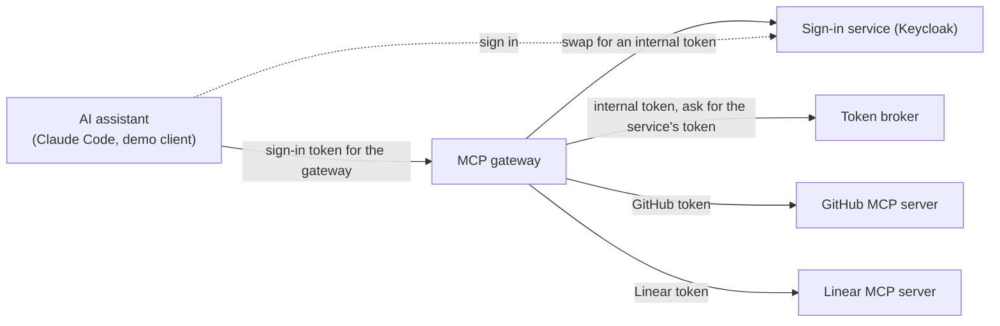
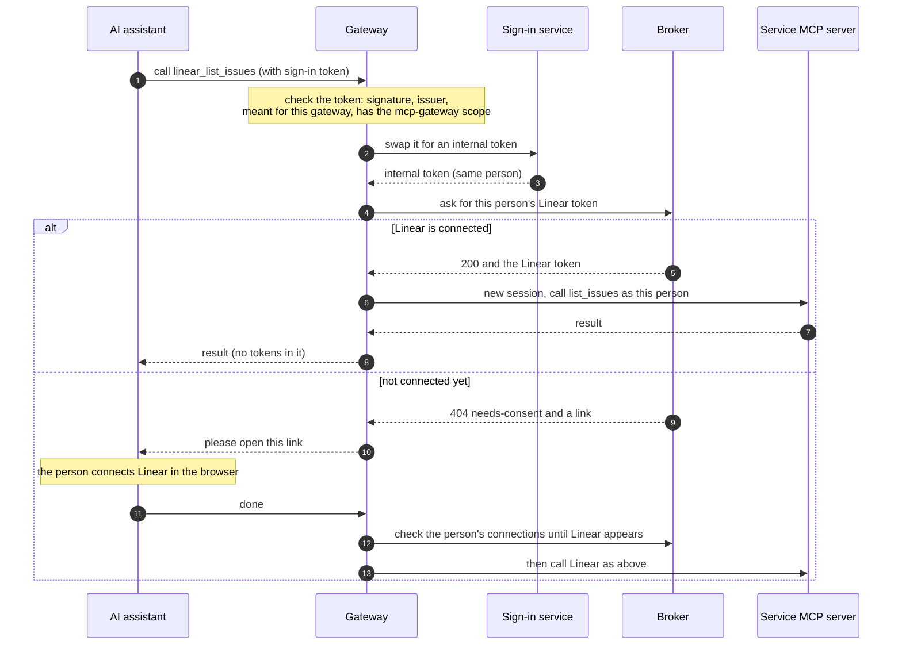

# MCP gateway

**Checked on 2026-09-27 with MCP 2026-07-28, FastMCP 4.0.10, Keycloak 26.7.4, and Claude Code 2.1.283.**

The MCP gateway lets AI assistants such as Claude Code use tools from several services, each as the signed-in person. Today it serves **GitHub**, **Linear**, **Atlassian** (Jira and Confluence), and **Cloudflare**.

- To the assistant, it looks like one ordinary MCP server, protected by your company's sign-in service (the "hub").
- Behind it, it is an MCP client of each service's own MCP server.
- On every tool call, it gets that person's token for that service from the [token broker](api.md), uses it once, and throws it away.

The gateway is a separate service (`src/mcp_gateway/`). Adding it changed nothing in the broker: the broker still has exactly seven routes and never issues tokens of its own.

## Supported servers

| Service | Its MCP server | Tools | Read-only by |
|---|---|---|---|
| GitHub | `https://api.githubcopilot.com/mcp/` | 7: `github_get_me`, `github_search_repositories`, `github_get_file_contents`, `github_list_issues`, `github_issue_read`, `github_list_pull_requests`, `github_pull_request_read` | `X-MCP-Readonly: true` header, plus the tool list |
| Linear | `https://mcp.linear.app/mcp/readonly` | 13: `linear_list_issues`, `linear_get_issue`, `linear_list_comments`, `linear_list_projects`, `linear_get_project`, `linear_list_cycles`, `linear_list_teams`, `linear_get_team`, `linear_list_issue_statuses`, `linear_list_users`, `linear_get_user`, `linear_list_documents`, `linear_get_document` | Linear's read-only URL, the `read` scope, plus the tool list |
| Atlassian | `https://mcp.atlassian.com/v2/mcp` | 8: `atlassian_getJiraIssue`, `atlassian_searchJiraIssuesUsingJql`, `atlassian_getConfluenceContent`, `atlassian_searchConfluence`, `atlassian_executeRead`, `atlassian_discover`, `atlassian_atlassianUserInfo`, `atlassian_getAccessibleAtlassianResources` | Read and search scopes only, plus the tool list |
| Cloudflare | `https://mcp.cloudflare.com/mcp` | 3: `cloudflare_search`, `cloudflare_docs`, `cloudflare_execute` | **Scopes only.** `execute` runs code against the whole Cloudflare API. What stops it writing is that the token only has 13 read scopes |

Each service also has a `connect_<service>` tool (`connect_github`, `connect_linear`, `connect_atlassian`, `connect_cloudflare`). Each person connects each service separately: connecting GitHub doesn't connect Linear.

Atlassian and Cloudflare run their own sign-in for their MCP servers, so the broker is registered with each of them once. See [Servers with their own sign-in](mcp-gateway.md#servers-with-their-own-sign-in).

## What happens on a tool call





Four rules keep this safe:

- **The sign-in token only goes to the sign-in service.** The gateway swaps it; it never forwards it. The broker only sees the internal token. Each service only sees its own token.
- **Each service only ever gets its own token.** GitHub never sees a Linear token, and Linear never sees a GitHub token.
- **Service tokens are used once.** Each call opens a new session with the service and closes it afterwards. The token is never cached, logged, or sent to the assistant.
- **While waiting, the gateway checks the connection list, not the token.** After the person agrees to connect, the gateway polls `GET /v1/grants` every 2 seconds, for up to `CONSENT_WAIT_S`. Asking for the token instead would create a new connection link every time.

## Identity handoff: what the hub must do

The gateway swaps the person's sign-in token for an internal token (a "hub JWT") that the broker accepts. The hub (your sign-in service) does the swap, so it must support the following. The right-hand column shows how the test setup does it in Keycloak (`tests/stack/keycloak/mcp-realm.json`).

| The hub must | Why | In the Keycloak test realm |
|---|---|---|
| Let the gateway's app swap tokens (token exchange) | So the sign-in token is never forwarded | `standard.token.exchange.enabled` on `mcp-gateway` |
| Sign tokens with PS256 or ES256 | The broker never accepts RS256 or shared-secret (HMAC) signatures | `defaultSignatureAlgorithm: PS256` |
| Give the swapped token exactly one `mcp://tier/*` audience and an `mcp_contract` claim | That's what the broker checks | `hub-tier` client scope |
| Make sign-in tokens name the gateway as their audience | The gateway refuses tokens meant for anything else | `mcp-gateway` client scope |
| Use the same user IDs for sign-in, the swap, and the broker's own sign-in page | The broker refuses a connection link opened by a different person (403) | All three apps are in one realm |

Two notes on other sign-in services:

- **Keycloak ignores the "resource" parameter** that MCP clients send to say which server a token is for. So the gateway tells clients to ask for the `mcp-gateway` scope instead, and that scope sets the audience.
- **Okta and Entra sign with RS256**, and Entra uses its own "on-behalf-of" flow instead of standard token exchange. With those, you'd need a small internal service to issue the internal token.

The test realm lets MCP clients register themselves, which is how stock clients like Claude Code sign up. It only allows this for apps that return to `localhost`, only for the `mcp-gateway` and `offline_access` scopes, and only after a consent screen. That's fine on a laptop, not in production.

Standards: token exchange is RFC 8693. The `resource` parameter is RFC 8707. The audience a token is meant for is its `aud` claim.

## Tools

Every tool is named `<service>_<tool>`, for example `github_get_me` or `linear_list_issues`. The gateway strips the prefix before calling the service. Tools that change things, such as GitHub's `create_issue` or Linear's `save_issue`, are never listed.

**All of these are listed from the moment the gateway starts.** Their descriptions come from a saved copy of each service's tool list (`src/mcp_gateway/snapshots/<service>.json`). The first time someone with a connected account uses a service after a restart, the gateway reads that service's live tool list and writes a `gateway.catalog` log line for it:

- `changed`: the service describes the tool differently now. The gateway keeps listing the saved copy, because the list is shared by every user and a service may personalize what it returns (Cloudflare puts the signed-in user's email and account ID in a description). Refresh the saved copy when you see this.
- `added`: allowed but missing from the saved copy, so the gateway adds it and tells clients the list changed.
- `missing`: the service no longer offers it. It stays listed, and calling it returns the service's error.

Why keep saved copies? The newest MCP version (2026-07-28) only lets servers announce a changed tool list over a separate subscription channel, which FastMCP 4.0.10 doesn't support. Without the saved copies, Claude Code would only see the `connect_…` tools until it reconnected.

Protocol details: from 2026-07-28, `notifications/tools/list_changed` may only be sent on the `subscriptions/listen` stream. The gateway still sends it when it adds a tool, which only older clients act on.

To update a saved copy from the live service:

```sh
UPSTREAM_TOKEN=$(gh auth token) .venv/bin/python tools/refresh-tool-snapshot.py github
UPSTREAM_TOKEN=<Linear API key> .venv/bin/python tools/refresh-tool-snapshot.py linear
UPSTREAM_TOKEN=<token from the broker> .venv/bin/python tools/refresh-tool-snapshot.py atlassian
```

For Atlassian and Cloudflare, the token has to come from the broker: connect the account first, then resolve it at the broker (see [Broker API](api.md)).

The script uses exactly the gateway's URL, headers, and allowlist for that service. Tests fail if any saved copy and its tool list ever disagree, if a saved tool isn't marked read-only (Cloudflare is the one exception: its scopes are what keep it read-only), or if a saved copy contains an email address or a 32-character hex ID.

**Check a new saved copy before you commit it.** It was fetched with someone's token, and a service may write that person's details into it. Cloudflare's `execute` description names the person's email and account ID; the committed copy replaces that line with "your Cloudflare account".

Treat what services return (issue text, file contents, comments) as untrusted input for the assistant. The gateway passes it through unchanged and never acts on it.

## Connecting a service during a tool call

If the person hasn't connected a service yet, any of its tools, or its `connect_…` tool, asks the assistant to open the broker's connection link for that service. What that looks like depends on the assistant:

| Assistant | What happens |
|---|---|
| Speaks MCP 2026-07-28 and can open links (Claude Code) | The call comes back asking for input. The assistant asks the person, opens the link, and repeats the call with their answer. The gateway runs the tool again from the start on that second try. |
| Speaks MCP 2025-11-25 and can open links | The gateway asks the assistant to open the link during the call, and waits for the answer. |
| Can't open links | The tool returns an error that contains the link. Open it yourself, then try again. |

Protocol details: on 2026-07-28 the call returns an `InputRequiredResult` carrying a URL-mode elicitation request. On 2025-11-25 the gateway sends `elicitation/create` with mode `url` during the call. "Can open links" means the client advertised the `url` elicitation capability.

Saying yes only means the person chose to open the link. The gateway then waits up to `CONSENT_WAIT_S` for the connection to appear. Saying no, or cancelling, ends the call with an error straight away.

## Errors

Messages name the service involved, for example "Connect Linear first".

| What went wrong | What the assistant gets | Log line |
|---|---|---|
| Not connected, and the person said no | Error: the service was not connected | `gateway.consent` outcome `decline` or `cancel` |
| Said yes, but didn't finish in time | Error: finish in the browser, then try again | `gateway.consent` outcome `timeout` |
| Broker, sign-in service, or the service down (or 5xx), or too slow | Error: try again shortly. Never "connect" | `gateway.call` outcome `unavailable` or `upstream-error` (with a `detail`, such as a timeout) |
| The sign-in service refused the swap, or the broker answered 401 | Error: the gateway is misconfigured | `gateway.call` outcome `error` |
| A disconnect is still in progress (`revoke-pending`) | Error naming the problem, with no link | `gateway.call` outcome `deny` |
| The service refused the token | Error: reconnect the service and try again | `gateway.call` outcome `upstream-error`, reason `rejected` |
| The assistant's sign-in token was refused | HTTP 401, with `WWW-Authenticate: Bearer scope="mcp-gateway", resource_metadata=…` telling it how to sign in | `gateway.auth` with reason `expired`, `audience`, `issuer`, `scope`, `algorithm`, `signature`, `malformed`, or `missing` |

Log lines are one JSON object each. They contain IDs (the service, the person's `sub`, the app's client ID, the tool name) and outcomes, never tokens. If a service's error message ever contained the token, the gateway would replace it with `<token>` before logging. A test searches every container's logs for the sign-in token, the internal token, and each service's token.

## Configuration

Required settings: `GATEWAY_PUBLIC_URL`, `HUB_ISSUER`, `HUB_JWKS_URI`, `HUB_TOKEN_ENDPOINT`, `GATEWAY_CLIENT_ID`, `GATEWAY_CLIENT_SECRET`, `BROKER_URL`. If any are missing, the gateway won't start, and it lists every missing name.

| Setting | Default | What it does |
|---|---|---|
| `GATEWAY_PUBLIC_URL` | — | The gateway's public address. Clients connect to `{GATEWAY_PUBLIC_URL}/mcp`, and sign-in tokens must name that address as their audience |
| `HUB_ISSUER` | — | The sign-in service's public address, as it appears in tokens and as clients see it |
| `HUB_JWKS_URI`, `HUB_TOKEN_ENDPOINT` | — | Where to get the sign-in service's signing keys and where to swap tokens. These may be internal addresses |
| `GATEWAY_CLIENT_ID`, `GATEWAY_CLIENT_SECRET` | — | The gateway's own app at the sign-in service, used for the swap |
| `BROKER_URL` | — | The broker's internal address |
| `GATEWAY_UPSTREAMS` | the bundled `upstreams.json` | Path to a different upstreams file (see below) |
| `GATEWAY_ENABLED_UPSTREAMS` | all | Comma-separated service names to serve, for example `github` |
| `HUB_ALGORITHM` | `PS256` | Signature type sign-in tokens must use. RS256 and HMAC are refused |
| `GATEWAY_SCOPE` | `mcp-gateway` | Scope sign-in tokens must include. Clients are told to ask for it |
| `HUB_EXCHANGE_SCOPE` | `hub-tier` | Scope requested in the swap. It must produce what the broker expects |
| `MIN_TTL_S` | `120` | Minimum seconds of life left on each service token |
| `CONSENT_WAIT_S` | `120` | How long to wait for someone to finish connecting after they say yes |
| `HTTP_TIMEOUT_S` | `15` | Time limit for each call to the sign-in service, the broker, and a service. Keep it well above the slowest tool (some Linear list calls take several seconds) |

### The upstreams file

`src/mcp_gateway/upstreams.json` lists the services. Each entry:

| Field | Meaning |
|---|---|
| `name` | Short lowercase name. It becomes the tool prefix and `connect_<name>` |
| `display_name` | Used in messages, for example "Connect your Linear account" |
| `vendor` | The broker's vendor ID for this service's tokens (see the [vendor registry](operations.md)) |
| `url` | The service's MCP server. Use its read-only address where it has one |
| `tools` | The allowlist: the service's own tool names |
| `headers` | Extra headers on every call, such as GitHub's `X-MCP-Readonly`. `Authorization` is not allowed here |
| `auth_scheme` | `Bearer` (default), or `Sentry-Bearer` for Sentry's MCP server |
| `protocol` | `legacy` (default, for servers that stop at MCP 2025-11-25, like GitHub and Linear), `auto`, or `2026-07-28` |
| `snapshot` | Saved tool list: a file name in `snapshots/`, or a path relative to the upstreams file |

The gateway checks the file at startup and refuses to start if it's wrong, for example duplicate or invalid names, an empty tool list, or an `Authorization` header.

The gateway is built from `Dockerfile.gateway`. Its dependencies come from its own checked lock file, `requirements-gateway.lock`, so FastMCP never ends up in the broker's image.

## Add another server

Services whose MCP server accepts an ordinary token from that service's own OAuth app work like GitHub and Linear. Sentry, GitLab, Azure DevOps, Slack, and PagerDuty are in this group.

1. **Register an OAuth app** with the service. Use callback `https://<broker>/v1/callback/<vendor>` and read-only scopes.
2. **Add a broker registry entry** (`registry.example.json`) with the service's OAuth endpoints, `scope_ceiling`, and `enabled_env`. Store the app's client ID and secret in custody at `vendor-clients/<vendor>`. See [Deploy and operate](operations.md).
3. **Add an upstreams entry** with the MCP server's URL, the read-only tools you want, and any read-only headers or URL.
4. **Save its tool list:** `UPSTREAM_TOKEN=… .venv/bin/python tools/refresh-tool-snapshot.py <name>`.
5. **Test it:** add the service to the stand-in (`tests/stack/mock-mcp`) for CI, and to `tests/integration/test_external_mcp_servers.py` for a real-account check.

Services that run their own MCP sign-in (Atlassian, Cloudflare, Notion, and many others) need two more steps; see the next section.

## Servers with their own sign-in

Atlassian's and Cloudflare's MCP servers don't accept a token from an ordinary OAuth app. They run their own OAuth sign-in, and the token is only valid at that one MCP server. So the broker is an OAuth client of that sign-in service, just like it is of GitHub's:

- **It registers itself once**, with dynamic client registration (RFC 7591). There is no developer console to create an app in.
- **It names the MCP server on every request** (the RFC 8707 `resource` parameter): when the person connects, when it swaps the code for a token, and on every refresh. The registry entry's `resource` field holds that address.

To add one:

1. **Add a registry entry** with `auth_metadata_url` (the sign-in service's metadata), `resource` (the MCP server's URL), `scope_ceiling` (only read scopes), and `enabled_env`.
2. **Register the broker, once:**

   ```sh
   # writes <VENDOR>_CLIENT_ID and _SECRET to the file
   .venv/bin/python tools/register-mcp-client.py atlassian \
       --redirect-base https://broker.example.com --env-file broker.env

   # or straight into custody (needs VAULT_ADDR and an admin VAULT_TOKEN)
   .venv/bin/python tools/register-mcp-client.py atlassian \
       --redirect-base https://broker.example.com --vault
   ```

   It registers as `vtb-mcp-gateway`, with the callback `<redirect-base>/v1/callback/<vendor>` and the registry's scopes, and never prints the secret.
3. **Continue with steps 3–5 above:** the upstreams entry, its saved tool list, and tests.

**Register only once.** Each registration creates a new client, and every connection made with the old one stops working. The script refuses when credentials already exist, unless you pass `--force`.

What each service needs:

| | Atlassian | Cloudflare |
|---|---|---|
| Before registering | An org admin allows the broker's callback address: in Atlassian Administration, under **Rovo → MCP → Domain settings** | Nothing |
| Scopes the broker asks for | `read:me`, `read:account`, `offline_access`, and read and search for Jira and Confluence (`…:agent-interface`) | 13: `user:read`, `account:read`, `offline_access`, and `.read` scopes for Workers scripts, routes, observability, tail, CI, KV, R2, R2 objects, and logs. Asked without a `scope`, Cloudflare granted 194 read scopes |
| Tokens | 8 hours, refresh token rotates | 1 hour, refresh token rotates |
| Client secret | The script warns if the registration sets an expiry date | **Expires after about 3 months.** The test registration expires on 2026-12-26. There's no way to renew it: register again, update custody, and everyone reconnects |

Cloudflare's separate observability and builds MCP servers each have their own sign-in and would need their own registration. The main server covers the same read APIs through `execute`.

The test stack stands in for both services: mock-vendor plays their sign-in (it refuses a code exchange or refresh that doesn't name the right server), and the stand-ins at `/atlassian/mcp` and `/cloudflare/mcp` refuse tokens issued for any other server.

Figma's MCP server also runs its own sign-in, but only lets clients from its approved list register. It refused the broker's registration.

## Run it locally

The [Quickstart](quickstart.md#run-the-mcp-gateway) walks through it step by step. In short:

```sh
docker compose -f tests/stack/docker-compose.yml --profile gateway up -d --build --wait
.venv/bin/pytest tests/integration -m "gateway and not external" -q
```

This starts:

- Keycloak at `localhost:8180`;
- a broker that trusts it at `localhost:8600`, with its own OpenBao;
- the gateway at `localhost:8500`;
- stand-ins for GitHub, Linear, Atlassian, and Cloudflare at `localhost:8330` (`/github/mcp`, `/linear/mcp`, `/atlassian/mcp`, `/cloudflare/mcp`), which only accept live test tokens.

By default the gateway uses the stand-ins (`tests/stack/gateway/stand-in-upstreams.json`). To use the real services, set `GATEWAY_UPSTREAMS=` (empty). The test users are `alice` and `bob`, and each password is the same as the username.

## Known limitations

- **No subscription channel.** The saved tool lists avoid needing one. But if you allow a tool that isn't in a saved copy, clients on MCP 2026-07-28 only see it after they reconnect.
- **Many dependencies.** FastMCP 4.0.10 brings about 50 other packages, all pinned with checksums in `requirements-gateway.lock`. Review updates to that file like any other supply-chain change.
- **One swap and one service session per call.** This is simple and keeps nothing between calls, but it adds some delay. The gateway doesn't reuse connections yet.
- **Read-only.** Write tools are blocked by the tool lists, and by each service's read-only header, URL, or scope. For Cloudflare, only the scopes do this, because `execute` can call any Cloudflare API.
- **Cloudflare's client secret expires.** See [Servers with their own sign-in](mcp-gateway.md#servers-with-their-own-sign-in). Put the date in your calendar.
- **Saved tool lists win.** If a service changes a tool, the gateway keeps listing the saved copy until you refresh it. Cloudflare's `execute` is always reported as `changed`, because its live description is personalized.
- **Linear account IDs aren't recorded.** Linear's API only speaks GraphQL, so the broker logs Linear connections with `vendor_user_id` `unknown`. This only affects audit joins.
- **Timeouts.** The test setup uses a 5-second `HTTP_TIMEOUT_S` so outage tests run quickly. Against the real services, use the default 15 seconds: some Linear calls take longer than 5.
- **Signing keys are cached for an hour.** New keys from the sign-in service are picked up on first use. But a key the sign-in service removes (for example after a leak) stays trusted by the gateway until the cache runs out. Restart the gateway when you revoke a signing key. (The broker doesn't have this gap, because it never caches single keys.)
- **What we saw with Claude Code 2.1.283.** After the sign-in service moved to a new address, Claude Code kept using the old token endpoint. After a failed token refresh, its next tool call arrived with no usable sign-in (logged as `gateway.auth`). In both cases, removing and re-adding the server, then signing in once, fixed it. It also registered itself even when a pre-registered app ID was set.
