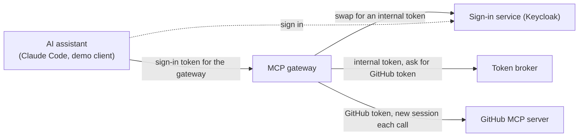
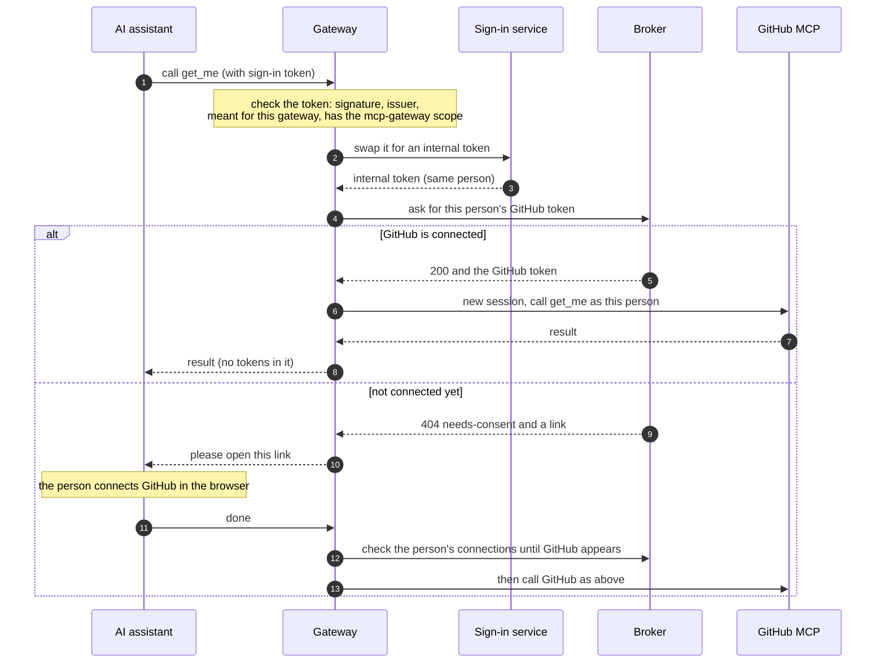

# MCP gateway

**Checked on 2026-09-26 with MCP 2026-07-28, FastMCP 4.0.10, Keycloak 26.7.4, and Claude Code 2.1.283.**

The MCP gateway lets AI assistants such as Claude Code use GitHub's tools as the signed-in person.

- To the assistant, it looks like an ordinary MCP server, protected by your company's sign-in service (the "hub").
- To GitHub, it looks like an MCP client of GitHub's own MCP server (`https://api.githubcopilot.com/mcp/`).
- On every tool call, it gets that person's GitHub token from the [token broker](api.md), uses it once, and throws it away.

The gateway is a separate service (`src/mcp_gateway/`). Adding it changed nothing in the broker: the broker still has exactly seven routes and never issues tokens of its own.

## What happens on a tool call





Three rules keep this safe:

- **The sign-in token only goes to the sign-in service.** The gateway swaps it; it never forwards it. The broker only sees the internal token, and GitHub only sees the GitHub token. Each is a different credential meant for a different place.
- **The GitHub token is used once.** Each call opens a new GitHub session with it and closes it afterwards. The token is never cached, logged, or sent to the assistant.
- **While waiting, the gateway checks the connection list, not the token.** After the person agrees to connect, the gateway polls `GET /v1/grants` every 2 seconds, for up to `CONSENT_WAIT_S`. Asking for the token instead would create a new connection link every time.

## Identity handoff: what the hub must do

The gateway swaps the person's sign-in token for an internal token (a "hub JWT") that the broker accepts. The hub (your sign-in service) does the swap, so it must support the following. The right-hand column shows how the test setup does it in Keycloak (`tests/stack/keycloak/mcp-realm.json`).

| The hub must | Why | In the Keycloak test realm |
|---|---|---|
| Let the gateway's app swap tokens (token exchange) | So the sign-in token is never forwarded | `standard.token.exchange.enabled` on `mcp-gateway` |
| Sign tokens with PS256 or ES256 | The broker never accepts RS256 or shared-secret (HMAC) signatures | `defaultSignatureAlgorithm: PS256` |
| Give the swapped token exactly one `mcp://tier/*` audience and an `mcp_contract` claim | That's what the broker checks | `hub-tier` client scope |
| Make sign-in tokens name the gateway as their audience | The gateway refuses tokens meant for anything else | `mcp-gateway` client scope |
| Use the same user IDs for sign-in, the swap, and the broker's own sign-in page | The broker refuses a connection link opened by a different person (403) | All three apps are in one realm |

Two notes on other sign-in services:

- **Keycloak ignores the "resource" parameter** that MCP clients send to say which server a token is for. So the gateway tells clients to ask for the `mcp-gateway` scope instead, and that scope sets the audience.
- **Okta and Entra sign with RS256**, and Entra uses its own "on-behalf-of" flow instead of standard token exchange. With those, you'd need a small internal service to issue the internal token.

The test realm lets MCP clients register themselves, which is how stock clients like Claude Code sign up. It only allows this for apps that return to `localhost`, only for the `mcp-gateway` and `offline_access` scopes, and only after a consent screen. That's fine on a laptop, not in production.

Standards: token exchange is RFC 8693. The `resource` parameter is RFC 8707. The audience a token is meant for is its `aud` claim.

## Tools

The assistant sees `connect_github` plus these read-only GitHub tools: `get_me`, `search_repositories`, `get_file_contents`, `list_issues`, `issue_read`, `list_pull_requests`, `pull_request_read`. Tools that change things, such as `create_issue`, are never listed.

**All of these are listed from the moment the gateway starts.** Their descriptions come from a saved copy of GitHub's tool list (`src/mcp_gateway/github_tools.json`). The first time someone with a connected account calls a tool after a restart, the gateway reads GitHub's live tool list. GitHub stays the source of truth, and the gateway writes a `gateway.catalog` log line saying what it found:

- `changed`: GitHub describes the tool differently now, so the gateway switches to GitHub's version.
- `added`: allowed but missing from the saved copy, so the gateway adds it and tells clients the list changed.
- `missing`: GitHub no longer offers it. It stays listed, and calling it returns GitHub's error.

Why keep a saved copy? The newest MCP version (2026-07-28) only lets servers announce a changed tool list over a separate subscription channel, which FastMCP 4.0.10 doesn't support. Without the saved copy, Claude Code would only see `connect_github` until it reconnected.

Protocol details: from 2026-07-28, `notifications/tools/list_changed` may only be sent on the `subscriptions/listen` stream. The gateway still sends it when it adds a tool, which only older clients act on.

To update the saved copy from GitHub:

```sh
GITHUB_TOKEN=$(gh auth token) .venv/bin/python tools/refresh-github-tool-snapshot.py
```

A test fails if the saved copy and the default tool list ever disagree. Set `UPSTREAM_TOOL_SNAPSHOT=none` to go back to showing only `connect_github` until the first connected call.

Every call to GitHub carries three settings:

- `X-MCP-Readonly: true`, so GitHub only offers read tools;
- `X-MCP-Lockdown: true`, which hides public issue content from people without push access;
- `X-MCP-Toolsets`, which chooses the tool groups.

Treat what GitHub returns (issue text, file contents) as untrusted input for the assistant. The gateway passes it through unchanged and never acts on it.

## Connecting GitHub during a tool call

If the person hasn't connected GitHub yet, any GitHub tool, or `connect_github`, asks the assistant to open the broker's connection link. What that looks like depends on the assistant:

| Assistant | What happens |
|---|---|
| Speaks MCP 2026-07-28 and can open links (Claude Code) | The call comes back asking for input. The assistant asks the person, opens the link, and repeats the call with their answer. The gateway runs the tool again from the start on that second try. |
| Speaks MCP 2025-11-25 and can open links | The gateway asks the assistant to open the link during the call, and waits for the answer. |
| Can't open links | The tool returns an error that contains the link. Open it yourself, then try again. |

Protocol details: on 2026-07-28 the call returns an `InputRequiredResult` carrying a URL-mode elicitation request. On 2025-11-25 the gateway sends `elicitation/create` with mode `url` during the call. "Can open links" means the client advertised the `url` elicitation capability.

Saying yes only means the person chose to open the link. The gateway then waits up to `CONSENT_WAIT_S` for the connection to appear. Saying no, or cancelling, ends the call with an error straight away.

## Errors

| What went wrong | What the assistant gets | Log line |
|---|---|---|
| Not connected, and the person said no | Error: GitHub was not connected | `gateway.consent` outcome `decline` or `cancel` |
| Said yes, but didn't finish in time | Error: finish in the browser, then try again | `gateway.consent` outcome `timeout` |
| Broker, sign-in service, or GitHub down (or 5xx) | Error: try again shortly. Never "connect GitHub" | `gateway.call` outcome `unavailable` or `upstream-error` |
| The sign-in service refused the swap, or the broker answered 401 | Error: the gateway is misconfigured | `gateway.call` outcome `error` |
| A disconnect is still in progress (`revoke-pending`) | Error naming the problem, with no link | `gateway.call` outcome `deny` |
| GitHub refused the token | Error: reconnect GitHub and try again | `gateway.call` outcome `upstream-error`, reason `rejected` |
| The assistant's sign-in token was refused | HTTP 401, with `WWW-Authenticate: Bearer scope="mcp-gateway", resource_metadata=…` telling it how to sign in | `gateway.auth` with reason `expired`, `audience`, `issuer`, `scope`, `algorithm`, `signature`, `malformed`, or `missing` |

Log lines are one JSON object each. They contain IDs (the person's `sub`, the app's client ID, the tool name) and outcomes, never tokens. A test searches every container's logs for the sign-in token, the internal token, and the GitHub token.

## Configuration

Required settings: `GATEWAY_PUBLIC_URL`, `HUB_ISSUER`, `HUB_JWKS_URI`, `HUB_TOKEN_ENDPOINT`, `GATEWAY_CLIENT_ID`, `GATEWAY_CLIENT_SECRET`, `BROKER_URL`. If any are missing, the gateway won't start, and it lists every missing name.

| Setting | Default | What it does |
|---|---|---|
| `GATEWAY_PUBLIC_URL` | — | The gateway's public address. Clients connect to `{GATEWAY_PUBLIC_URL}/mcp`, and sign-in tokens must name that address as their audience |
| `HUB_ISSUER` | — | The sign-in service's public address, as it appears in tokens and as clients see it |
| `HUB_JWKS_URI`, `HUB_TOKEN_ENDPOINT` | — | Where to get the sign-in service's signing keys and where to swap tokens. These may be internal addresses |
| `GATEWAY_CLIENT_ID`, `GATEWAY_CLIENT_SECRET` | — | The gateway's own app at the sign-in service, used for the swap |
| `BROKER_URL` | — | The broker's internal address |
| `HUB_ALGORITHM` | `PS256` | Signature type sign-in tokens must use. RS256 and HMAC are refused |
| `GATEWAY_SCOPE` | `mcp-gateway` | Scope sign-in tokens must include. Clients are told to ask for it |
| `HUB_EXCHANGE_SCOPE` | `hub-tier` | Scope requested in the swap. It must produce what the broker expects |
| `VENDOR` | `github` | Which broker vendor to ask for |
| `MIN_TTL_S` | `120` | Minimum seconds of life left on the GitHub token |
| `UPSTREAM_MCP_URL` | `https://api.githubcopilot.com/mcp/` | The vendor's MCP server |
| `UPSTREAM_TOOLS` | the seven read-only tools above | Comma-separated list of allowed tools |
| `UPSTREAM_TOOLSETS` | `repos,issues,pull_requests,context` | Sent as `X-MCP-Toolsets` |
| `UPSTREAM_READONLY`, `UPSTREAM_LOCKDOWN` | `true` | Sent as `X-MCP-Readonly` and `X-MCP-Lockdown` |
| `UPSTREAM_TOOL_SNAPSHOT` | the bundled saved copy | Path to a different saved copy, or `none` |
| `CONSENT_WAIT_S` | `120` | How long to wait for someone to finish connecting after they say yes |
| `HTTP_TIMEOUT_S` | `15` | Time limit for each call to the sign-in service, the broker, and GitHub |

The gateway is built from `Dockerfile.gateway`. Its dependencies come from its own checked lock file, `requirements-gateway.lock`, so FastMCP never ends up in the broker's image.

## Run it locally

The [Quickstart](quickstart.md#run-the-mcp-gateway) walks through it step by step. In short:

```sh
docker compose -f tests/stack/docker-compose.yml --profile gateway up -d --build --wait
.venv/bin/pytest tests/integration -m "gateway and not external" -q
```

This starts:

- Keycloak at `localhost:8180`;
- a broker that trusts it at `localhost:8600`, with its own OpenBao;
- the gateway at `localhost:8500`;
- a GitHub stand-in at `localhost:8330`, which only accepts live test tokens.

The test users are `alice` and `bob`, and each password is the same as the username.

## Known limitations

- **No subscription channel.** The saved tool list avoids needing one. But if you allow a tool that isn't in the saved copy, clients on MCP 2026-07-28 only see it after they reconnect.
- **Many dependencies.** FastMCP 4.0.10 brings about 50 other packages, all pinned with checksums in `requirements-gateway.lock`. Review updates to that file like any other supply-chain change.
- **One swap and one GitHub session per call.** This is simple and keeps nothing between calls, but it adds some delay. The gateway doesn't reuse connections yet.
- **Read-only.** Write tools are blocked by the tool list and by `X-MCP-Readonly`.
- **One vendor per gateway.** `VENDOR`, `UPSTREAM_MCP_URL`, and the tool list configure one upstream.
- **Signing keys are cached for an hour.** New keys from the sign-in service are picked up on first use. But a key the sign-in service removes (for example after a leak) stays trusted by the gateway until the cache runs out. Restart the gateway when you revoke a signing key. (The broker doesn't have this gap, because it never caches single keys.)
- **What we saw with Claude Code 2.1.283.** After the sign-in service moved to a new address, Claude Code kept using the old token endpoint. After a failed token refresh, its next tool call arrived with no usable sign-in (logged as `gateway.auth`). In both cases, removing and re-adding the server, then signing in once, fixed it. It also registered itself even when a pre-registered app ID was set.
