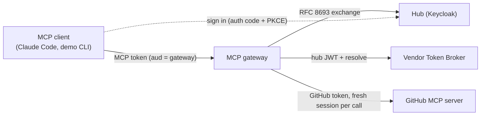
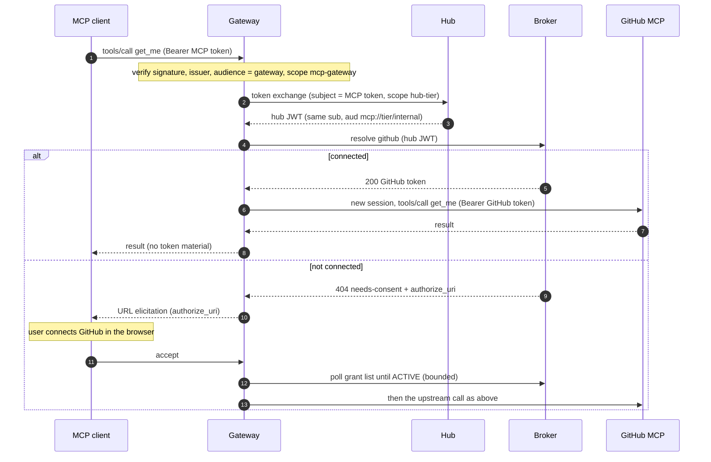

# MCP gateway

**Shipped in this repository · reviewed 2026-09-26 against MCP 2026-07-28, FastMCP 4.0.10, Keycloak 26.7.4, Claude Code 2.1.283.**

The MCP gateway (`src/mcp_gateway/`) is a separate service from the broker. To MCP clients it is an MCP server protected by your identity provider. Toward GitHub it is an MCP client of GitHub's MCP server (`https://api.githubcopilot.com/mcp/`). For every tool call it gets that user's GitHub token from the broker, uses it for one upstream call, and discards it.

The broker is unchanged by the gateway: it still serves exactly seven routes and never issues tokens.

## How a tool call works





- **The MCP token never leaves the gateway–hub hop.** It is exchanged, not forwarded: the broker only ever sees the hub JWT, and GitHub only ever sees the GitHub token. Both are separate credentials with separate audiences.
- **The GitHub token is used once.** Each call opens a new upstream session with it and closes the session afterwards. It is never cached, logged, or returned to the client.
- **Waiting polls the grant list, not resolve.** After the user accepts the prompt, the gateway polls `GET /v1/grants` (every 2 seconds, up to `CONSENT_WAIT_S`), because every unsuccessful resolve would mint a new consent link.

## Identity handoff: what the hub must do

The gateway swaps the caller's MCP token for a hub JWT with [RFC 8693 token exchange](https://www.rfc-editor.org/rfc/rfc8693), as a confidential client at the hub. The hub must therefore:

| Requirement | Why | Keycloak realm setting (`tests/stack/keycloak/mcp-realm.json`) |
|---|---|---|
| RFC 8693 token exchange for the gateway client | Handoff without forwarding the MCP token | `standard.token.exchange.enabled` on `mcp-gateway` |
| Sign with PS256 or ES256 | The broker never accepts RS256 or HMAC | `defaultSignatureAlgorithm: PS256` |
| Exchanged token: `aud` exactly one `mcp://tier/*`, `mcp_contract` claim | The broker's hub-JWT contract | `hub-tier` client scope (audience + hardcoded-claim mappers) |
| MCP tokens: `aud` includes the gateway's resource URL | Tokens meant for another resource are refused | `mcp-gateway` client scope (audience mapper) |
| One subject namespace for MCP sign-in, exchange, and broker consent sign-in | The broker refuses a consent link opened by another user (403) | All three clients live in one realm |

Keycloak does not support [RFC 8707 resource indicators](https://www.rfc-editor.org/rfc/rfc8707): it ignores the `resource` parameter MCP clients send. The gateway therefore advertises a required scope, `mcp-gateway`, in its protected-resource metadata and 401 challenge, and that scope's mapper sets the audience. Okta and Entra sign access tokens with RS256 and Entra uses its own on-behalf-of flow instead of RFC 8693, so with those IdPs a small internal token service would have to issue the hub JWT.

The local realm lets MCP clients register themselves (dynamic client registration, which stock clients such as Claude Code use), but **only for localhost redirect URIs**, only for the `mcp-gateway` and `offline_access` scopes, and only after a consent screen. That policy suits a developer machine, not production.

## Tools

The gateway lists `connect_github` plus an allowlist of read-only GitHub tools: `get_me`, `search_repositories`, `get_file_contents`, `list_issues`, `issue_read`, `list_pull_requests`, `pull_request_read`. Write tools such as `create_issue` are never listed.

The tools are listed **from startup**, using a checked-in snapshot of GitHub's schemas (`src/mcp_gateway/github_tools.json`). On the first connected call after a restart, the gateway re-reads GitHub's live schemas, which stay authoritative, and logs a `gateway.catalog` event: `changed` tools are re-registered with the live schema, `added` tools (allowlisted but missing from the snapshot) are registered and announced, and `missing` tools (no longer offered by GitHub) stay listed and return GitHub's error if called.

Why a snapshot: the tool list must not depend on a change notification. From MCP 2026-07-28, `notifications/tools/list_changed` may only be sent on the `subscriptions/listen` stream, which FastMCP 4.0.10 does not implement. A gateway that only revealed tools after the first connect would leave modern clients, including Claude Code, without them until they reconnect. Refresh the snapshot deliberately:

```sh
GITHUB_TOKEN=$(gh auth token) .venv/bin/python tools/refresh-github-tool-snapshot.py
```

It fetches with the gateway's own headers, and a unit test fails if the snapshot and the default allowlist diverge. Set `UPSTREAM_TOOL_SNAPSHOT=none` to list only `connect_github` until the first connected call.

Upstream calls always carry `X-MCP-Readonly: true`, `X-MCP-Lockdown: true` (hides public issue content from users without push access), and `X-MCP-Toolsets`. GitHub content returned by tools (issue bodies, file contents) is untrusted input for the model; the gateway passes it through unchanged and never acts on it.

## Connecting GitHub during a tool call

If the user has no usable GitHub connection, any GitHub tool, or `connect_github`, asks the client to open the broker's consent link:

| Client | What happens |
|---|---|
| 2026-07-28, supports URL elicitation (Claude Code) | The call returns an `InputRequiredResult` with a URL request; the client asks the user, opens the link, and retries with the answer. The tool body runs again on the retry. |
| 2025-11-25, supports URL elicitation | The gateway sends `elicitation/create` (mode `url`) during the call and waits for the answer. |
| No URL elicitation | The tool returns an error containing the link: open it, then retry. |

Accepting only means the user chose to open the link. The gateway then waits up to `CONSENT_WAIT_S` for the connection to appear. Declining or cancelling returns an error without waiting.

## Errors

| Situation | Tool result | Audit event |
|---|---|---|
| Not connected, user declines | Error: GitHub was not connected | `gateway.consent` outcome `decline`/`cancel` |
| Accepted, not finished in time | Error: finish in the browser, then retry | `gateway.consent` outcome `timeout` |
| Broker, hub, or GitHub unreachable or 5xx | Error: retry shortly (never "connect GitHub") | `gateway.call` outcome `unavailable` / `upstream-error` |
| Hub refuses the exchange, or broker returns 401 | Error: gateway configuration problem | `gateway.call` outcome `error` |
| Disconnect in progress (`revoke-pending`) | Error naming the problem; no consent prompt | `gateway.call` outcome `deny` |
| GitHub rejects the token | Error: reconnect GitHub and retry | `gateway.call` outcome `upstream-error`, reason `rejected` |
| MCP token refused | HTTP 401 with `WWW-Authenticate: Bearer scope="mcp-gateway", resource_metadata=…` | `gateway.auth` with reason `expired`, `audience`, `issuer`, `scope`, `algorithm`, `signature`, `malformed`, or `missing` |

Audit events are single JSON lines carrying ids (`sub`, client id, tool name) and outcomes, never token material. A test greps every container's logs for the MCP token, the hub JWT, and the GitHub token.

## Configuration

Required: `GATEWAY_PUBLIC_URL`, `HUB_ISSUER`, `HUB_JWKS_URI`, `HUB_TOKEN_ENDPOINT`, `GATEWAY_CLIENT_ID`, `GATEWAY_CLIENT_SECRET`, `BROKER_URL`. Startup fails listing every missing name.

| Variable | Default | Meaning |
|---|---|---|
| `GATEWAY_PUBLIC_URL` | — | The gateway's public base URL; the protected resource is `{GATEWAY_PUBLIC_URL}/mcp` and MCP tokens must carry it in `aud` |
| `HUB_ISSUER` | — | The hub's public issuer (checked in MCP tokens, advertised to clients) |
| `HUB_JWKS_URI`, `HUB_TOKEN_ENDPOINT` | — | The hub's signing keys and token endpoint; may be internal addresses |
| `GATEWAY_CLIENT_ID`, `GATEWAY_CLIENT_SECRET` | — | The gateway's confidential client at the hub (token exchange) |
| `BROKER_URL` | — | The broker's internal URL |
| `HUB_ALGORITHM` | `PS256` | MCP token signature algorithm; RS256 and HMAC are refused |
| `GATEWAY_SCOPE` | `mcp-gateway` | Scope MCP tokens must carry; advertised to clients |
| `HUB_EXCHANGE_SCOPE` | `hub-tier` | Scope requested in the exchange; must yield the broker's contract |
| `VENDOR` | `github` | Broker vendor id to resolve |
| `MIN_TTL_S` | `120` | Minimum remaining token lifetime asked of the broker |
| `UPSTREAM_MCP_URL` | `https://api.githubcopilot.com/mcp/` | The vendor's MCP server |
| `UPSTREAM_TOOLS` | the seven read-only tools above | Comma-separated allowlist |
| `UPSTREAM_TOOLSETS` | `repos,issues,pull_requests,context` | Sent as `X-MCP-Toolsets` |
| `UPSTREAM_READONLY`, `UPSTREAM_LOCKDOWN` | `true` | Sent as `X-MCP-Readonly` / `X-MCP-Lockdown` |
| `UPSTREAM_TOOL_SNAPSHOT` | bundled snapshot | Path to another snapshot file, or `none` |
| `CONSENT_WAIT_S` | `120` | How long to wait for a browser connection after the user accepts |
| `HTTP_TIMEOUT_S` | `15` | Timeout for hub, broker, and upstream calls |

The gateway is built from `Dockerfile.gateway` with its own hash-checked `requirements-gateway.lock`; FastMCP never enters the broker image.

## Run it locally

The `gateway` Compose profile adds Keycloak (`localhost:8180`), a broker that trusts it (`localhost:8600`, with its own OpenBao), the gateway (`localhost:8500`), and a GitHub stand-in (`localhost:8330`) that accepts only live mock-vendor tokens:

```sh
docker compose -f tests/stack/docker-compose.yml --profile gateway up -d --build --wait
.venv/bin/pytest tests/integration -m "gateway and not external" -q
```

Test users are `alice` and `bob`, each with their username as password. See the [quickstart](quickstart.md#run-the-mcp-gateway) for the demo client, Claude Code, and real GitHub.

## Known limitations

- **No `subscriptions/listen`.** The pinned tool list avoids needing it. If the allowlist gains a tool that is not in the snapshot, 2026-07-28 clients only see it after reconnecting.
- **Dependency surface.** FastMCP 4.0.10 brings about 50 transitive packages (hash-pinned in `requirements-gateway.lock`). Review lock updates as you would any supply-chain change.
- **One exchange and one upstream session per call.** Simple and stateless, at the cost of latency; there is no session pooling yet.
- **Read-only.** Write tools are excluded by the allowlist and by `X-MCP-Readonly`.
- **One vendor per gateway.** `VENDOR`, `UPSTREAM_MCP_URL`, and the allowlist configure a single upstream.
- **Signing-key cache.** FastMCP's verifier caches the hub's JWKS for an hour. New keys are fetched on first use, but a key the hub removes (for example after a compromise) stays trusted by the gateway until the cache expires. Restart the gateway when you revoke a hub signing key. (The broker does not have this gap: it never caches individual keys.)
- **Client behavior seen with Claude Code 2.1.283.** After the hub's address changed, Claude Code kept using the old token endpoint; after a failed token refresh, its next tool call arrived without usable credentials (logged as `gateway.auth`). Removing and re-adding the server, then signing in once, recovered in both cases. It also registered itself even when a pre-registered client id was configured.
