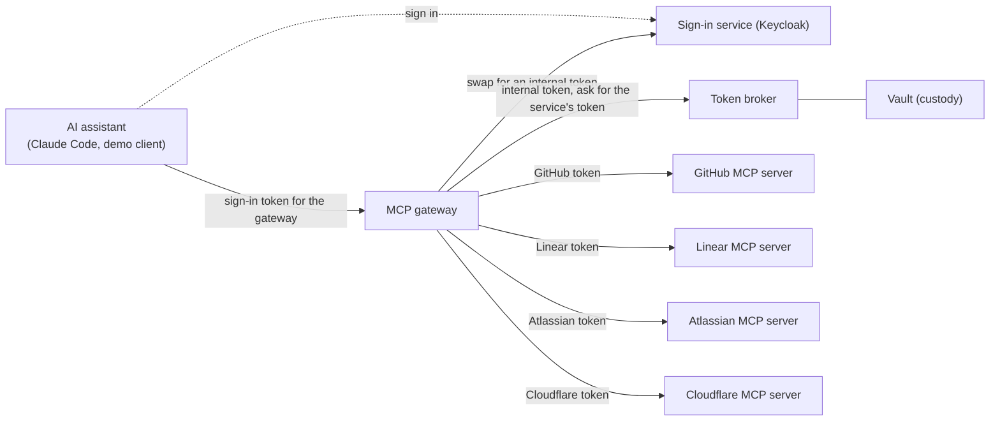
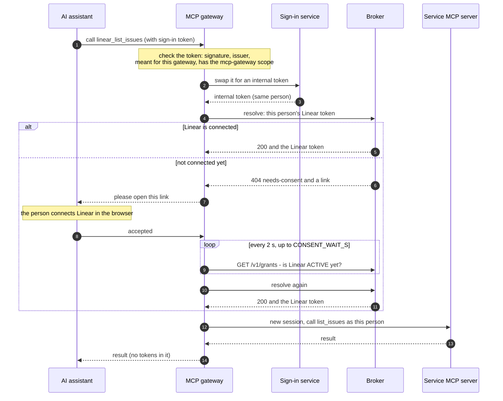
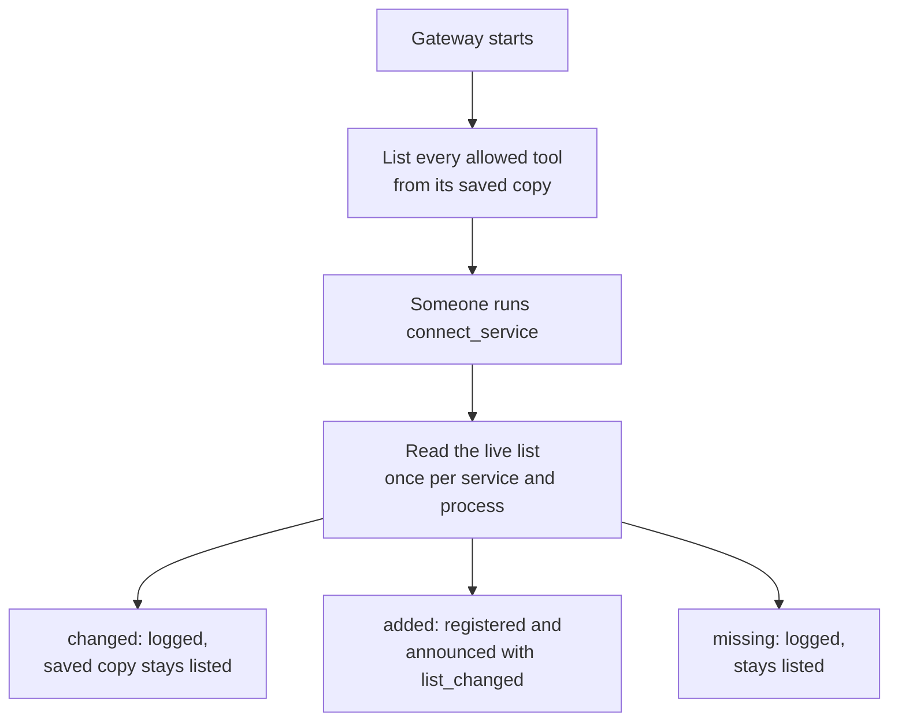
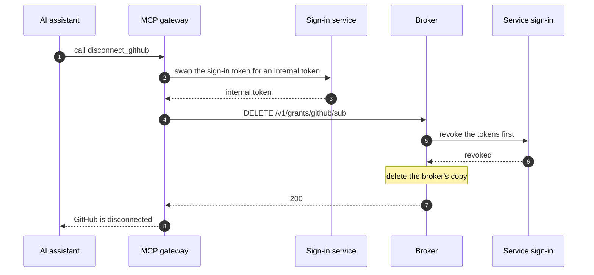
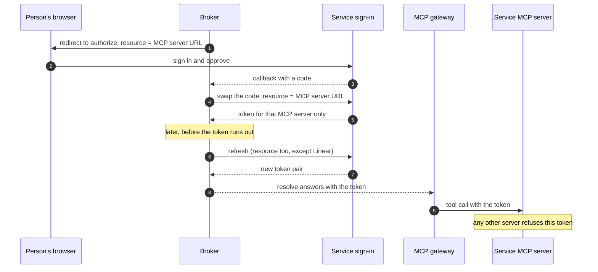

# MCP gateway

**Reviewed 2026-09-30 · MCP 2026-07-28 · FastMCP 4.0.10 and Keycloak 26.7.4 in the automated suites; manually tested with Claude Code 2.1.283.**

The MCP gateway lets AI assistants such as Claude Code use tools from several services, each as the signed-in person. It serves **GitHub**, **Linear**, **Atlassian** (Jira and Confluence), and **Cloudflare**.

- To the assistant, it looks like one ordinary MCP server, protected by your company's sign-in service (the "hub").
- Behind it, it is an MCP client of each service's own MCP server.
- On every tool call, it gets that person's token for that service from the [token broker](api.md), uses it once, and throws it away.

The gateway is a separate service (`src/mcp_gateway/`). The broker has exactly seven routes and issues no tokens of its own.

## Supported servers

| Service | Its MCP server | Tools | Read-only by |
|---|---|---|---|
| GitHub | `https://api.githubcopilot.com/mcp/` | 7: `github_get_me`, `github_search_repositories`, `github_get_file_contents`, `github_list_issues`, `github_issue_read`, `github_list_pull_requests`, `github_pull_request_read` | `X-MCP-Readonly: true` header (plus lockdown mode and a fixed toolset list), plus the tool list |
| Linear | `https://mcp.linear.app/mcp/readonly` | 13: `linear_list_issues`, `linear_get_issue`, `linear_list_comments`, `linear_list_projects`, `linear_get_project`, `linear_list_cycles`, `linear_list_teams`, `linear_get_team`, `linear_list_issue_statuses`, `linear_list_users`, `linear_get_user`, `linear_list_documents`, `linear_get_document` | Tokens are bound to Linear's read-only MCP server (its full MCP server refuses them), the `read` scope, plus the tool list |
| Atlassian | `https://mcp.atlassian.com/v2/mcp` | 8: `atlassian_getJiraIssue`, `atlassian_searchJiraIssuesUsingJql`, `atlassian_getConfluenceContent`, `atlassian_searchConfluence`, `atlassian_executeRead`, `atlassian_discover`, `atlassian_atlassianUserInfo`, `atlassian_getAccessibleAtlassianResources` | Read and search scopes only, plus the tool list |
| Cloudflare | `https://mcp.cloudflare.com/mcp` | 3: `cloudflare_search`, `cloudflare_docs`, `cloudflare_execute` | **Scopes only.** `execute` runs code against the whole Cloudflare API. What stops it writing is that the token only has 12 read scopes, plus `offline_access` |

For GitHub, only `X-MCP-Readonly` blocks writes. Lockdown mode (`X-MCP-Lockdown`) is a defence against prompt injection: in public repositories, it only returns content from people with push access. `X-MCP-Toolsets` limits which tool groups the server offers.

Each service also has two account tools:

| Tool | What it does |
|---|---|
| `connect_<service>` (`connect_github`, `connect_linear`, `connect_atlassian`, `connect_cloudflare`) | Connects the person's account, opening a browser if needed. See [Connecting a service during a tool call](mcp-gateway.md#connecting-a-service-during-a-tool-call) |
| `disconnect_<service>` (`disconnect_github`, `disconnect_linear`, `disconnect_atlassian`, `disconnect_cloudflare`) | Cancels the person's connection. See [Disconnecting a service](mcp-gateway.md#disconnecting-a-service) |

Each person connects each service separately: connecting GitHub doesn't connect Linear.

Linear, Atlassian, and Cloudflare run their own sign-in for their MCP servers, so the broker is registered with each of them once. See [Servers with their own sign-in](mcp-gateway.md#servers-with-their-own-sign-in).

## What happens on a tool call



The assistant only talks to the gateway and the sign-in service. The service tokens stay in the broker's vault, and each one goes only to its own MCP server.



Notice that the gateway resolves a second time only after the connection shows up in the grant list. Then it runs the tool as usual.

Four rules keep this safe:

- **The sign-in token only goes to the sign-in service.** The gateway swaps it and never forwards it. The broker only sees the internal token.
- **Each service only ever gets its own token.** GitHub never sees a Linear token, and Linear never sees a GitHub token.
- **Service tokens are used once.** Each call opens a new session with the service and closes it afterwards. The token is never cached, logged, or sent to the assistant.
- **While waiting, the gateway checks the connection list, not the token.** After the person agrees to connect, the gateway polls `GET /v1/grants` every 2 seconds, for up to `CONSENT_WAIT_S`. Asking for the token instead would create a new connection link every time.

## Identity handoff: what the hub must do

The gateway swaps the person's sign-in token for an internal token (a "hub JWT") that the broker accepts. The hub (your sign-in service) does the swap, so it must support the following. The right-hand column shows how the test setup does it in Keycloak (`tests/stack/keycloak/mcp-realm.json`).

| The hub must | Why | In the Keycloak test realm |
|---|---|---|
| Let the gateway's app swap tokens (token exchange) | So the sign-in token is never forwarded | `standard.token.exchange.enabled` on `mcp-gateway` |
| Sign tokens with an algorithm the broker accepts (its `HUB_ALGORITHMS`, default PS256 and ES256) | The broker never accepts RS256 or shared-secret (HMAC) signatures | `defaultSignatureAlgorithm: PS256` |
| Give the swapped token exactly one `mcp://tier/*` audience and an `mcp_contract` claim | That's what the broker checks | `hub-tier` client scope |
| Make sign-in tokens name the gateway as their audience | The gateway refuses tokens meant for anything else | `mcp-gateway` client scope |
| Use the same user IDs for sign-in, the swap, and the broker's own sign-in page | The broker refuses a connection link opened by a different person (403) | All three apps are in one realm |

Two notes on other sign-in services:

- **Keycloak ignores the "resource" parameter** that MCP clients send to say which server a token is for. So the gateway tells clients to ask for the `mcp-gateway` scope instead, and that scope sets the audience.
- **Okta and Entra sign with RS256**, and Entra uses its own "on-behalf-of" flow instead of standard token exchange. With those, you'd need a small internal service to issue the internal token.

The test realm lets MCP clients register themselves, which is how stock clients like Claude Code sign up. It only allows this for apps that return to `localhost` or `127.0.0.1`, and only after a consent screen. Such apps may use the `mcp-gateway` and `offline_access` scopes plus the realm's default scopes (`basic`). That's fine on a laptop, not in production. The pre-registered demo client is `mcp-demo-cli`.

Standards: token exchange is RFC 8693. The `resource` parameter is RFC 8707. The audience a token is meant for is its `aud` claim.

## Tools

Every service tool is named `<service>_<tool>`, for example `github_get_me` or `linear_list_issues`. The gateway strips the prefix before calling the service. Tools that change things, such as GitHub's `create_issue` or Linear's `save_issue`, are never listed.

**All of these are listed from the moment the gateway starts.** Their descriptions come from a saved copy of each service's tool list (`src/mcp_gateway/snapshots/<service>.json`). The live tool list is read only when someone runs `connect_<service>`, once per service for each gateway process. Ordinary tool calls never read it. The gateway then writes a `gateway.catalog` log line for that service (fields `upstream`, `listed`, `added`, `changed`, `missing`):

- `changed`: the live list describes the tool differently from the saved copy. The gateway keeps listing the saved copy, because the list is shared by every user and a service may personalize what it returns (Cloudflare puts the signed-in user's email and account ID in a description). Refresh the saved copy when you see this.
- `added`: allowed but missing from the saved copy. The gateway registers it and tells clients the list changed.
- `missing`: the live list doesn't include it. It stays listed, and calling it returns the service's error.



Notice that a tool with a saved copy always keeps it. Only a tool with no saved copy takes its description from the live list.

Why keep saved copies? MCP 2026-07-28 only lets servers announce a changed tool list over a separate subscription channel, which FastMCP 4.0.10 doesn't support. Without the saved copies, Claude Code would only see the `connect_…` and `disconnect_…` tools until it reconnected.

Protocol details:

- From 2026-07-28, `notifications/tools/list_changed` may only be sent on the `subscriptions/listen` stream. The gateway still sends it when it adds a tool, which only older clients act on.
- GitHub's saved tool list carries `x-mcp-header` annotations. On 2026-07-28, MCP clients mirror those arguments into `Mcp-Param-*` request headers, but only for tools they have listed. So list tools before calling them.

To update a saved copy from the live service:

```sh
UPSTREAM_TOKEN=$(gh auth token) .venv/bin/python tools/refresh-tool-snapshot.py github
UPSTREAM_TOKEN=<Linear API key> .venv/bin/python tools/refresh-tool-snapshot.py linear
UPSTREAM_TOKEN=<token from the broker> .venv/bin/python tools/refresh-tool-snapshot.py atlassian
UPSTREAM_TOKEN=<token from the broker> .venv/bin/python tools/refresh-tool-snapshot.py cloudflare
```

For Atlassian and Cloudflare, the token has to come from the broker: connect the account first, then resolve it at the broker (see [Broker API](api.md)).

The script:

- always reads the bundled `src/mcp_gateway/upstreams.json` (not `GATEWAY_UPSTREAMS`), and uses exactly the gateway's URL, headers, auth scheme, and allowlist for that service;
- writes the file named in that entry's `snapshot`, under `src/mcp_gateway/snapshots/`;
- fails, and writes nothing, if an allowlisted tool is missing from the live list.

Tests fail if any saved copy and its tool list ever disagree, if a saved tool isn't marked read-only (Cloudflare is the one exception: its scopes are what keep it read-only), or if a saved copy contains an email address or a 32-character hex ID.

**Check a new saved copy before you commit it.** It was fetched with someone's token, and a service may write that person's details into it. Cloudflare's `execute` description names the person's email and account ID. The committed copy replaces that line with "your Cloudflare account".

Treat what services return (issue text, file contents, comments) as untrusted input for the assistant. The gateway passes it through unchanged and never acts on it.

## Connecting a service during a tool call

If the person hasn't connected a service yet, any of its tools, or its `connect_…` tool, asks the assistant to open the broker's connection link for that service. What that looks like depends on the assistant:

| Assistant | What happens |
|---|---|
| Speaks MCP 2026-07-28 and can open links (Claude Code) | The call comes back asking for input. The assistant asks the person, opens the link, and repeats the call with their answer. The gateway runs the tool again from the start on that second try. |
| Speaks MCP 2025-11-25 and can open links | The gateway asks the assistant to open the link during the call, and waits for the answer. |
| Can't open links | The tool returns an error that contains the link. Open it yourself, then try again. |

Protocol details: on 2026-07-28 the call returns an `InputRequiredResult` carrying a URL-mode elicitation request. On 2025-11-25 the gateway sends `elicitation/create` with mode `url` during the call. Both carry a fresh `elicitationId`. "Can open links" means the client advertised the `url` elicitation capability.

Saying yes only means the person chose to open the link. The gateway then waits up to `CONSENT_WAIT_S` for the connection to appear, and resolves once more. Saying no, or cancelling, ends the call with an error straight away.

## Disconnecting a service

`disconnect_<service>` cancels the person's connection to that service. It needs no browser and no input.



Notice that the service is asked to cancel the tokens before the broker deletes its copy. The gateway never calls the service's MCP server here.

How it works:

- The gateway calls the broker's self-service `DELETE /v1/grants/{vendor}/{sub}` with the internal token. It takes `sub` from that token, so a person can only disconnect themselves.
- The tool is marked destructive (`destructiveHint: true`, `readOnlyHint: false`, `idempotentHint: true`). Clients such as Claude Code may ask the person before running it.
- Each outcome is explained to the person and logged as `gateway.disconnect` with `outcome`:

| `outcome` | Broker answer | What the person is told |
|---|---|---|
| `revoked` | 200 | Disconnected: the service was asked to cancel the tokens, and the broker deleted its copy. Run `connect_<service>` to connect again |
| `unsupported` | 200 with `vendor_revocation: unsupported` | Disconnected here, but the service can't cancel tokens remotely. Also remove the app's access in the service's account settings |
| `not-connected` | 404 `no-grant` | The service was not connected |
| `pending` | 502 `revoke-pending` | The service could not be reached to cancel the tokens. The broker keeps retrying, and until it succeeds the service can't be used here |

While a disconnect is `pending`, the broker parks the connection as `REVOKE_PENDING` and its sweeper retries the cancel. Tool calls for that service fail with `revoke-pending` (see [Errors](mcp-gateway.md#errors)).

## Errors

Messages name the service involved, for example "Connect Linear first".

| What went wrong | What the assistant gets | Log line |
|---|---|---|
| Not connected, and the client can't open links | Error with the link: open it, then retry | `gateway.consent` outcome `manual` |
| Not connected, and the client can open links | A request to open the link | `gateway.consent` outcome `elicit`, with `era` (the protocol revision) |
| The person said no or cancelled | Error: the service was not connected | `gateway.consent` outcome `decline` or `cancel` |
| Said yes, but didn't finish in time | Error: finish in the browser, then try again | `gateway.consent` outcome `timeout` |
| Said yes, and the connection appeared | The tool runs | `gateway.consent` outcome `connected` |
| Connection appeared, but the second resolve gave no token | Error: the connection is not usable, retry | none |
| Broker 5xx or unreachable while waiting for the person to connect | Error: try again shortly. Never "finish connecting in the browser" | `gateway.call` outcome `unavailable` |
| Broker, sign-in service, or the service down (or 5xx), or too slow | Error: try again shortly. Never "connect" | `gateway.call` outcome `unavailable` (broker or sign-in service) or `upstream-error` (the service, with a `detail`, such as a timeout) |
| The sign-in service refused the swap, or the broker answered 401 | Error: a gateway configuration problem | `gateway.call` outcome `error` |
| A disconnect is still in progress (409 `revoke-pending`) | Error: the service is not usable right now (`revoke-pending`), try again later. No link | `gateway.call` outcome `deny` |
| Any other broker 4xx on resolve, such as 404 `unknown-vendor` or a 404 or 409 without a link | Error: the service is not usable right now (the problem title), try again later | `gateway.call` outcome `deny`, reason the problem title |
| The service refused the token (its error mentions 401) | Error: reconnect the service and try again | `gateway.call` outcome `upstream-error`, reason `rejected` |
| The service's tool ran but reported an error | The tool's own error result | `gateway.call` outcome `ok` with `is_error: true` |
| The call worked | The result | `gateway.call` outcome `ok` with `is_error: false` |
| `disconnect_<service>`: broker 5xx or unreachable | Error: try again shortly | `gateway.call` outcome `unavailable` |
| `disconnect_<service>`: broker 401, 403, or another 4xx | Error: a gateway configuration problem | `gateway.call` outcome `error` |
| The assistant's sign-in token was refused | HTTP 401, with `WWW-Authenticate: Bearer scope="mcp-gateway", resource_metadata=…` telling it how to sign in | `gateway.auth` outcome `deny`, with reason `expired`, `audience`, `issuer`, `scope`, `algorithm`, `signature`, `malformed`, or `missing` |

Log lines are one JSON object each, with `event` and `ts`. They contain IDs and outcomes, never tokens:

- `gateway.call`, `gateway.consent`, `gateway.disconnect`: `upstream` (the service), `tool`, the person's `sub`, `outcome`, and a `reason` where one applies.
- `gateway.catalog`: `upstream`, `listed`, `added`, `changed`, `missing`.
- `gateway.auth` (refused sign-in tokens): `sub` and `client` (the app's client ID, from `azp`) when the token could be read, `alg` for reason `algorithm`, and `expired_s_ago` for reason `expired`. None of these for `malformed` or `missing`.
- `detail` on `upstream-error` is the service's error text, cut to 200 characters, with the token replaced by `<token>` if it ever appears.

A test (`tests/integration/test_mcp_gateway.py::test_no_token_material_in_any_container_log`) searches every container's logs for the assistant's sign-in token, the internal token (hub JWT), and the GitHub, Linear, and Atlassian stand-in tokens.

## Configuration

Required settings: `GATEWAY_PUBLIC_URL`, `HUB_ISSUER`, `HUB_JWKS_URI`, `HUB_TOKEN_ENDPOINT`, `GATEWAY_CLIENT_ID`, `GATEWAY_CLIENT_SECRET`, `BROKER_URL`. If any are missing, the gateway won't start, and it lists every missing name.

| Setting | Default | What it does |
|---|---|---|
| `GATEWAY_PUBLIC_URL` | — | The gateway's public address. Clients connect to `{GATEWAY_PUBLIC_URL}/mcp`, and sign-in tokens must name that address as their audience |
| `HUB_ISSUER` | — | The sign-in service's public address, as it appears in tokens and as clients see it |
| `HUB_JWKS_URI`, `HUB_TOKEN_ENDPOINT` | — | Where to get the sign-in service's signing keys and where to swap tokens. These may be internal addresses |
| `GATEWAY_CLIENT_ID`, `GATEWAY_CLIENT_SECRET` | — | The gateway's own app at the sign-in service, used for the swap |
| `BROKER_URL` | — | The broker's internal address |
| `GATEWAY_UPSTREAMS` | the bundled `upstreams.json` | Path to a different upstreams file (see below) |
| `GATEWAY_ENABLED_UPSTREAMS` | all | Comma-separated service names to serve, for example `github`. An unknown name stops startup |
| `HUB_ALGORITHM` | `PS256` | Signature type sign-in tokens must use. One of the broker's allowed algorithms: `PS256`, `PS384`, `PS512`, `ES256`, `ES384`, `ES512`, `EdDSA`. Anything else stops startup |
| `GATEWAY_SCOPE` | `mcp-gateway` | Scope sign-in tokens must include. Clients are told to ask for it |
| `HUB_EXCHANGE_SCOPE` | `hub-tier` | Scope requested in the swap. It must produce what the broker expects |
| `MIN_TTL_S` | `120` | Minimum seconds of life left on each service token. Must be 0 or more |
| `CONSENT_WAIT_S` | `120` | How long to wait for someone to finish connecting after they say yes. Must be 0 or more |
| `HTTP_TIMEOUT_S` | `15` | Time limit for each call to the sign-in service, the broker, and a service. Keep it well above the slowest tool (some Linear list calls take several seconds) |

### The upstreams file

`src/mcp_gateway/upstreams.json` lists the services. Each entry:

| Field | Meaning |
|---|---|
| `name` | Short name matching `^[a-z][a-z0-9]{0,19}$` (1–20 lowercase letters or digits, starting with a letter). It becomes the tool prefix, `connect_<name>`, and `disconnect_<name>` |
| `display_name` | Used in messages, for example "Connect your Linear account" |
| `vendor` | The broker's vendor ID for this service's tokens (see the [vendor registry](operations.md)) |
| `url` | The service's MCP server. Use its read-only address where it has one |
| `tools` | The allowlist: the service's own tool names |
| `headers` | Optional. Extra headers on every call, such as GitHub's `X-MCP-Readonly`. `Authorization` is not allowed here |
| `auth_scheme` | Optional. `Bearer` (default), or `Sentry-Bearer` for Sentry's MCP server |
| `protocol` | Optional. How the gateway, as a client, picks the MCP revision. `legacy` (default): the classic handshake, for servers that stop at MCP 2025-11-25, like GitHub and Linear. `auto`: try revision 2026-07-28 first, and fall back to the classic handshake for servers that don't show they support it. `2026-07-28`: use that revision without trying. All four bundled services use `legacy` |
| `snapshot` | Optional. The saved tool list. A bare file name (no `/`) always means the bundled `src/mcp_gateway/snapshots/` folder. A value with a `/` in a custom upstreams file (`GATEWAY_UPSTREAMS`) is a path relative to that file; in the bundled file it is looked up under `snapshots/` too. Without it, the service's tools only appear after someone runs its `connect_<name>` tool |

The gateway checks the file at startup and refuses to start if:

- the file can't be read, isn't JSON, or an entry lacks `name`, `display_name`, `vendor`, `url`, or `tools`, or a named snapshot file can't be read;
- a `name` breaks the rule above, or two entries share a name;
- `tools` is empty;
- `auth_scheme` isn't `Bearer` or `Sentry-Bearer`;
- `protocol` isn't `legacy`, `auto`, or `2026-07-28`;
- `headers` sets `Authorization` (in any letter case);
- `GATEWAY_ENABLED_UPSTREAMS` names a service that isn't in the file;
- no services are left to serve.

The gateway is built from `Dockerfile.gateway`. Its dependencies come from its own checked lock file, `requirements-gateway.lock`, so FastMCP never ends up in the broker's image.

## Add another server

Services whose MCP server accepts an ordinary token from that service's own OAuth app work like GitHub. Sentry, GitLab, Azure DevOps, Slack, and PagerDuty are in this group.

1. **Register an OAuth app** with the service. Use callback `https://<broker>/v1/callback/<vendor>` and read-only scopes.
2. **Add a broker registry entry** (`registry.example.json`) with the service's OAuth endpoints, `scope_ceiling`, and `enabled_env`. Store the app's client ID and secret in custody at `vendor-clients/<vendor>`. See [Deploy and operate](operations.md).
3. **Add an upstreams entry** with the MCP server's URL, the read-only tools you want, and any read-only headers or URL.
4. **Save its tool list:** `UPSTREAM_TOKEN=… .venv/bin/python tools/refresh-tool-snapshot.py <name>`.
5. **Test it:** add the service to the stand-in (`tests/stack/mock-mcp`) for CI, and to `tests/integration/test_external_mcp_servers.py` for a real-account check.

Services that run their own MCP sign-in (Linear, Atlassian, Cloudflare, Notion, and many others) need two more steps; see the next section.

## Servers with their own sign-in

Linear's, Atlassian's, and Cloudflare's MCP servers run their own OAuth sign-in, and the token it issues is only valid at that one MCP server. (Atlassian's and Cloudflare's accept no other kind of token. Linear's read-only server also accepts a personal API key, which the snapshot script can use.) So the broker is an OAuth client of that sign-in service, just like it is of GitHub's:

- **It registers itself once**, with dynamic client registration. There is no developer console to create an app in.
- **It names the MCP server on every request** with the `resource` parameter: when the person connects, when it swaps the code for a token, and on every refresh. The registry entry's `resource` field holds that address.
- **Except where refresh refuses it.** Linear rejects `resource` on refresh, and keeps the refreshed token bound to the same server anyway. Its registry entry sets `resource_on_refresh: false`.



`resource` goes on the authorize, code-swap, and refresh requests (Linear: only the first two). The token that comes back works only at that MCP server.

Standards: dynamic client registration is RFC 7591. The `resource` parameter is RFC 8707.

To add one:

1. **Add a registry entry** with `auth_metadata_url` (the sign-in service's metadata), `resource` (the MCP server's URL), `scope_ceiling` (only read scopes), and `enabled_env`. Add `resource_on_refresh: false` if the service refuses `resource` on refresh.
2. **Register the broker, once:**

   ```sh
   # writes <VENDOR>_CLIENT_ID and _SECRET to the file
   .venv/bin/python tools/register-mcp-client.py atlassian \
       --redirect-base https://broker.example.com --env-file broker.env

   # or straight into custody (needs VAULT_ADDR and an admin VAULT_TOKEN)
   .venv/bin/python tools/register-mcp-client.py atlassian \
       --redirect-base https://broker.example.com --vault
   ```

   What the script does:

   - It reads the vendor's entry from `registry.example.json` by default, or from `--registry` or `REGISTRY_PATH`. The entry must have `auth_metadata_url`.
   - It registers as `vtb-mcp-gateway`, with the callback `<redirect-base>/v1/callback/<vendor>`, the registry's `scope_ceiling` as its scopes, and the registry's `token_endpoint_auth_method` (default `client_secret_post`).
   - It refuses a service whose metadata has no registration endpoint, and a registration that comes back without a client secret (a public client): the broker needs a confidential client.
   - It never prints the secret. It warns if the registration sets an expiry date for the secret.
3. **Continue with steps 3–5 above:** the upstreams entry, its saved tool list, and tests.

**Register only once.** Each registration creates a new client, and every connection made with the old one stops working. The script refuses when credentials already exist, unless you pass `--force`. With `--env-file`, it checks whether `<VENDOR>_CLIENT_ID` is already set in that file. With `--vault`, it checks for `vendor-clients/<vendor>` in custody.

What each service needs:

| | Linear | Atlassian | Cloudflare |
|---|---|---|---|
| Before registering | Nothing | An org admin allows the broker's callback address: in Atlassian Administration, under **Rovo → MCP → Domain settings** | Nothing |
| MCP server the token is bound to | `https://mcp.linear.app/mcp/readonly` | `https://mcp.atlassian.com/v2/mcp` | `https://mcp.cloudflare.com/mcp` |
| Scopes the broker asks for | `read` | `read:me`, `read:account`, `offline_access`, and read and search for Jira and Confluence (`…:agent-interface`) | 12 read scopes plus `offline_access`: `user:read`, `account:read`, `workers-scripts.read`, `workers-routes.read`, `workers-observability.read`, `workers-tail.read`, `workers-ci.read`, `workers-kv-storage.read`, `workers-r2.read`, `workers-r2-bucket-item.read`, `logs.read`, `account-logs.read`. Asked without a `scope`, Cloudflare granted 194 read scopes |
| Tokens | 24 hours, refresh token rotates, reusing an old one fails. `resource` is left off refresh | 8 hours, refresh token rotates | 1 hour, refresh token rotates |
| Client secret | **Expires after about 90 days.** The test registration expires on 2026-12-27. Register again, update custody, and everyone reconnects | The script warns if the registration sets an expiry date | **Expires after about 90 days.** The test registration expires on 2026-12-26. There's no way to renew it: register again, update custody, and everyone reconnects |

Cloudflare's separate observability and builds MCP servers each have their own sign-in and would need their own registration. The main server covers the same read APIs through `execute`.

The test stack stands in for Atlassian's and Cloudflare's sign-in: mock-vendor plays it, and refuses a code exchange or refresh that doesn't name the right server. The stand-ins at `/atlassian/mcp` and `/cloudflare/mcp` refuse tokens issued for any other server. Linear's stand-in uses an ordinary test app (vendor `mockhub-jwt`), and its `resource_on_refresh: false` rule is covered by unit tests (`tests/unit/test_vendor_client.py`).

Figma's MCP server also runs its own sign-in, but only lets clients from its approved list register. It refused the broker's registration.

## Run it locally

The [Quickstart](quickstart.md#run-the-mcp-gateway) walks through it step by step. In short:

```sh
docker compose -f tests/stack/docker-compose.yml --profile gateway up -d --build --wait
.venv/bin/pytest tests/integration -m "gateway and not external" -q
```

This starts:

- Keycloak at `localhost:8180`;
- a broker that trusts it at `localhost:8600`, with its own OpenBao;
- the gateway at `localhost:8500`;
- stand-ins for GitHub, Linear, Atlassian, and Cloudflare at `localhost:8330` (`/github/mcp`, `/linear/mcp`, `/atlassian/mcp`, `/cloudflare/mcp`), which only accept live test tokens.

By default the gateway uses the stand-ins (`tests/stack/gateway/stand-in-upstreams.json`). To use the real services, set `GATEWAY_UPSTREAMS=` (empty). The test users are `alice` and `bob`, and each password is the same as the username.

The stack sets shorter limits so the tests run quickly:

| Gateway setting | Stack default | Override with |
|---|---|---|
| `CONSENT_WAIT_S` | `15` | `GATEWAY_CONSENT_WAIT_S` (use `120` when a person connects in the browser) |
| `HTTP_TIMEOUT_S` | `5` | `GATEWAY_HTTP_TIMEOUT_S` (use `15` against the real services) |

## Known limitations

- **No subscription channel.** The saved tool lists avoid needing one. But if you allow a tool that isn't in a saved copy, it only appears after someone runs `connect_<service>`, and clients on MCP 2026-07-28 only see it after they reconnect.
- **Many dependencies.** `requirements-gateway.lock` pins 80 packages with checksums, including FastMCP 4.0.10 and the broker's own dependencies. Review updates to that file like any other supply-chain change.
- **FastMCP reads `FASTMCP_*` settings from a `.env` file in the working directory** (override the file name with `FASTMCP_ENV_FILE`). The gateway's own settings come only from the environment. The image's working directory holds no `.env` (`.dockerignore` excludes it), so this matters only when you run the gateway from a checkout.
- **One swap and one service session per call.** This is simple and keeps nothing between calls, but it adds some delay. The gateway doesn't reuse connections.
- **Read-only.** Write tools are blocked by the tool lists, and by each service's read-only header, URL, or scope. For Cloudflare, only the scopes do this, because `execute` can call any Cloudflare API. `disconnect_<service>` changes only the person's own connection in the broker, never data at the service.
- **Linear's and Cloudflare's client secrets expire** after about 90 days. The test registrations expire on 2026-12-27 and 2026-12-26. Register again, update custody, and everyone reconnects. See [Servers with their own sign-in](mcp-gateway.md#servers-with-their-own-sign-in). Put the date in your calendar.
- **Saved tool lists win.** If a service changes a tool, the gateway keeps listing the saved copy until you refresh it. Cloudflare's `execute` is always reported as `changed` when someone runs `connect_cloudflare`, because its live description is personalized.
- **Linear account IDs aren't recorded.** Linear's API only speaks GraphQL, so the broker logs Linear connections with `vendor_user_id` `unknown`. This only affects audit joins.
- **Signing keys are cached for an hour.** New keys from the sign-in service are picked up on first use. But a key the sign-in service removes (for example after a leak) stays trusted by the gateway until the cache runs out. Restart the gateway when you revoke a signing key. (The broker's window is shorter: it never caches single keys, and it re-fetches the whole key set at least every 5 minutes (`JWKS_CACHE_S`), so a removed key stops working there within 5 minutes.)
- **What we saw with Claude Code 2.1.283.** After the sign-in service moved to a new address, Claude Code kept using the old token endpoint. After a failed token refresh, its next tool call arrived with no usable sign-in (logged as `gateway.auth`). In both cases, removing and re-adding the server, then signing in once, fixed it. It also registered itself even when a pre-registered app ID was set.
