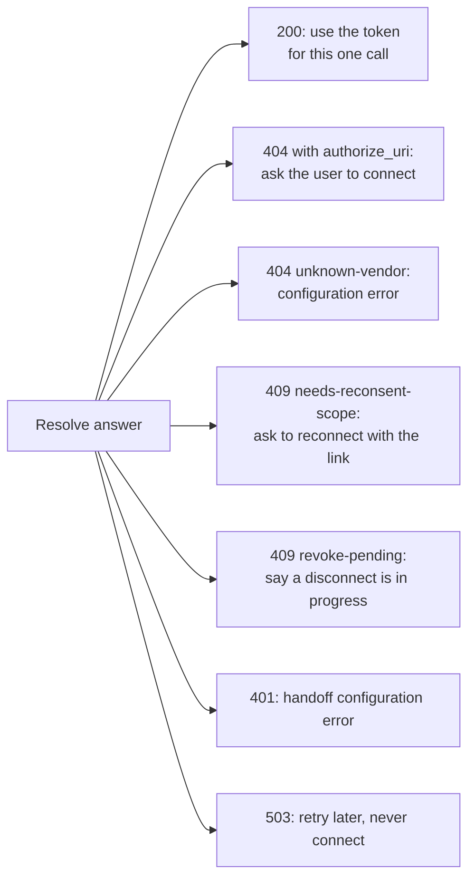

# Connect your own MCP server

**Reviewed 2026-09-30 · MCP 2026-07-28.**

Use this page to connect **your own** MCP server or gateway to the broker.

- **Just want GitHub, Linear, Atlassian, or Cloudflare?** You do not need this page. The shipped [MCP gateway](mcp-gateway.md) already connects their MCP servers to the broker and handles all the MCP work described here.
- The broker itself does not speak MCP. It offers an internal REST API ([API reference](api.md)). Your gateway sits between MCP clients and that API.

## Three authorization boundaries

Three separate credentials are in play. Keep them apart.

| Boundary | Credential and validator | Owner |
|---|---|---|
| MCP client → MCP server | Access token issued for that MCP resource; checked by the MCP server | Your MCP client and authorization server; the shipped gateway checks it |
| Gateway → broker | Internal hub JWT, checked again by the broker | Your identity handoff and this broker |
| Gateway → vendor API | Vendor access token obtained through broker consent | Gateway, broker, vendor |

**The hub** is your company's sign-in service (identity provider). The **hub JWT** is the internal token it issues, which the broker accepts.

**Do not forward the MCP client's token to the broker.** Get an internal credential that matches the broker's configured issuer, audience, and contract instead. The shipped gateway does this with a [token exchange at the hub](mcp-gateway.md#identity-handoff-what-the-hub-must-do) (RFC 8693).

These parts of the hub JWT are this project's own conventions. They are not MCP protocol versions or standard MCP claim names:

- the `mcp_contract` claim
- the `mcp://tier/*` audiences
- the algorithm policy

**Your MCP server must handle MCP authorization itself.** The broker does not provide these MCP endpoints. The shipped gateway does. You need:

- protected-resource metadata
- authorization-server discovery
- resource indicators
- checking the token's intended audience
- the right HTTP authorization challenges

See [MCP authorization requirements](https://modelcontextprotocol.io/specification/2026-07-28/basic/authorization).

## Calling the broker

For each tool call that needs a vendor:

1. Check and authorize the MCP tool operation in your server.
2. Map the operation to an approved vendor and the vendor scopes it needs.
3. Have the trusted gateway call [resolve](api.md#resolve-a-token) with the internal hub JWT.
4. On success, use the token only for the approved vendor API call. Keep it out of tool results, model context, browser storage, and logs.
5. Return business data to the MCP client. Never send the hub JWT to the vendor.

The broker gives a token to any caller that passes its internal authentication. So you must isolate the network and authenticate the gateway workload when you deploy. The REST response cannot enforce this for you.

## Connecting a vendor during a tool call

**The shipped gateway already does this. See [its consent behavior](mcp-gateway.md#connecting-a-service-during-a-tool-call).** The guidance below applies to any adapter.

A missing vendor connection is a different problem from the client's permission to call the MCP server. Handle it separately.

**How to ask the user to connect (MCP 2026-07-28):**

- If the client advertises `elicitation.url`, put a URL-mode `elicitation/create` inside an `InputRequiredResult`.
- Set its URL to the broker's `authorize_uri`.
- The MCP bearer token stays the same.
- The client asks the user for permission before it opens the URL.
- Use the SDK for the negotiated protocol revision to build the full envelope.

See [URL-mode elicitation](https://modelcontextprotocol.io/specification/2026-07-28/client/elicitation).

The nested request looks like this. This is an example: the URL comes from resolve, and `elicitationId` is a fresh random ID for each request. MCP 2025-11-25 requires it in URL mode, and the shipped gateway always sends one. Clients on 2025-11-25 get the same request directly as `elicitation/create` during the call.

```json
{
  "method": "elicitation/create",
  "params": {
    "mode": "url",
    "message": "Connect your vendor account to continue this operation.",
    "url": "https://broker.example.com/v1/authorize/acme?txn=opaque-handle",
    "elicitationId": "a-fresh-random-id"
  }
}
```

**What the adapter should do with each broker result:**

| Broker outcome | Adapter action |
|---|---|
| 200 | Call the approved vendor with the returned token |
| 400 `invalid-request` | Fix the resolve body your adapter sends. Do not ask the user to connect |
| 400 `sub-mismatch` | Drop or fix the `sub` field. The broker uses the hub JWT's subject |
| 401 `invalid-hub-token` | Fix internal authentication. Do not assume the MCP client's own token expired |
| 403 `scope-exceeds-ceiling` | The tool asks for scopes the vendor's registry entry does not allow. Fix the tool mapping or the registry. Do not loop through consent |
| 404 `needs-consent` with `authorize_uri` | Ask for a vendor connection through the supported browser flow |
| 404 `unknown-vendor` (no `authorize_uri`) | Configuration error: the vendor is not registered or not enabled. Never show a connect prompt |
| 409 `needs-reconsent-scope` | Explain the extra vendor permissions and use the supplied connection URL |
| 409 `revoke-pending` | Say that a disconnect is pending. Do not restart consent automatically |
| 503 | Retry a limited number of times with backoff. Do not treat an outage as missing consent |

Tell the two 404s apart by `authorize_uri`, not by status: only `needs-consent` carries a link. Full list: [Errors and caller actions](api.md#errors-and-caller-actions).



Only two answers lead to a connect prompt, and both carry a link. Every other failure is either a configuration problem or an outage.

**After the browser flow:**

- Confirm the connection before you resolve again, with the same user and required scopes.
- The user accepting the prompt does not prove the connection worked.
- Each failed resolve creates a new connection link. So while you wait, poll the [grant list](api.md#list-and-disconnect) (`GET /v1/grants`), not resolve. Wait for the vendor to show `state` `ACTIVE`. The grant list reports a grant that is mid-refresh as `ACTIVE` too.
- Treat a 5xx or unreachable broker while polling as an outage (retry later), never as "not connected yet".
- A suggested policy: at most one consent retry per operation, then return an error the user can act on.
- Stop if the user declines or cancels.
- If the client does not support URL elicitation, return a clear tool error. Point to a manual connection route that your application supports.
- Never ask for vendor tokens in chat or form fields.

**Offering disconnect.** An adapter can let the user disconnect a vendor with the broker's self-service `DELETE /v1/grants/{vendor}/{sub}` and the hub JWT. Take `sub` from that hub JWT: the broker refuses any other subject (403 `forbidden`). Handle each answer:

| Broker answer | Tell the user |
|---|---|
| 200 `{"revoked": true}` | Disconnected: the vendor cancelled the token, and the broker deleted its copy |
| 200 with `"vendor_revocation": "unsupported"` | Disconnected here only. The vendor can't cancel tokens remotely, so the user should also remove the app's access in the vendor's settings |
| 404 `no-grant` | Nothing was connected |
| 502 `revoke-pending` | The vendor could not be reached. The broker keeps retrying, and the vendor can't be used until it succeeds |
| 5xx (such as 503 `vault-unavailable` or `coordination-unavailable`) | Retry later |

The shipped gateway does this as `disconnect_<service>` ([Disconnecting a service](mcp-gateway.md#disconnecting-a-service)).

**What the shipped gateway's tests cover.** Use them as a model for your own. `tests/integration/test_mcp_gateway.py` drives the gateway with a real MCP client against Keycloak and the stand-in servers. It covers:

- consent in both protocol revisions (2025-11-25 and 2026-07-28), and a connected user never being prompted;
- declining (`test_declining_leaves_github_disconnected`) and a link opened by someone else (`test_link_opened_by_someone_else_never_connects`);
- a client without URL elicitation (`test_client_without_url_elicitation_is_given_the_link`);
- a revoked connection prompting again, and `disconnect_github` revoking at the vendor first;
- broker and vendor outages being retryable and never asking to connect;
- parallel calls never burning a rotating refresh-token family;
- each vendor getting only its own token, and tokens working only at the server they were issued for;
- tokens not issued for the gateway being refused;
- no token material in any container log.

Unit tests (`tests/unit/test_gateway.py`) add consent timeouts, polling the grant list instead of resolve, and a broker outage while waiting.

The shipped gateway never sends `required_scopes`, so it never asks for extra scopes and never sees `needs-reconsent-scope`. If your adapter asks for scopes per tool, test that case yourself.

**List all tools from the start.** Do not count on `notifications/tools/list_changed` to reveal tools after a connection. From 2026-07-28, servers may only send it on `subscriptions/listen`. The [gateway's pinned tool list](mcp-gateway.md#tools) shows this approach.

## Existing gateway compatibility

Existing gateway plugins can keep calling the internal broker API as they are: its statuses, fields, and problem titles are frozen.

Some existing gateway plugins turn broker 404/409 consent results into custom `401 authorization_required` and 401 step-up responses. That is an adapter convention, not a tested MCP flow.

If you are keeping an existing deployment, see [the legacy mapping](api.md#legacy-gateway-mapping).

## Protocol revision and enterprise authorization

**Use the revision your MCP implementation negotiated** for capabilities and message envelopes. The 2026-07-28 release:

- adds per-request protocol capabilities, Multi Round-Trip Requests, and routing headers
- deprecates Dynamic Client Registration in favor of Client ID Metadata Documents

Your integration layer handles these, not the broker. See the [release notes](https://blog.modelcontextprotocol.io/posts/2026-07-28/).

**Enterprise-Managed Authorization** is an optional extension. It involves the client, the enterprise identity provider, and the resource's authorization server.

- This broker does not implement ID-JAG exchange.
- The registry field `ema_status` only tracks how ready a vendor is to migrate. Changing it does not turn off consent or remove tokens.
- If you consider it as a replacement, check that it also gives your tools the vendor access they need.

See [Enterprise-Managed Authorization](https://modelcontextprotocol.io/extensions/auth/enterprise-managed-authorization).
