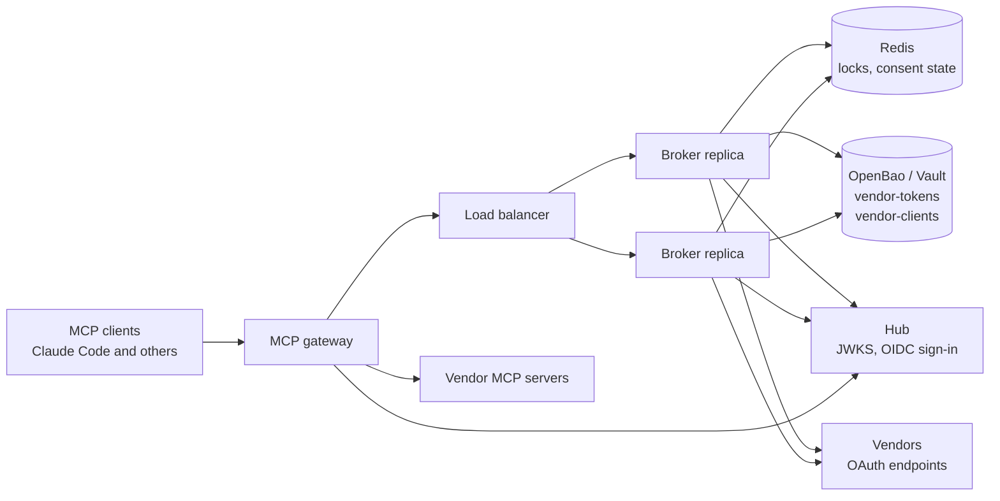
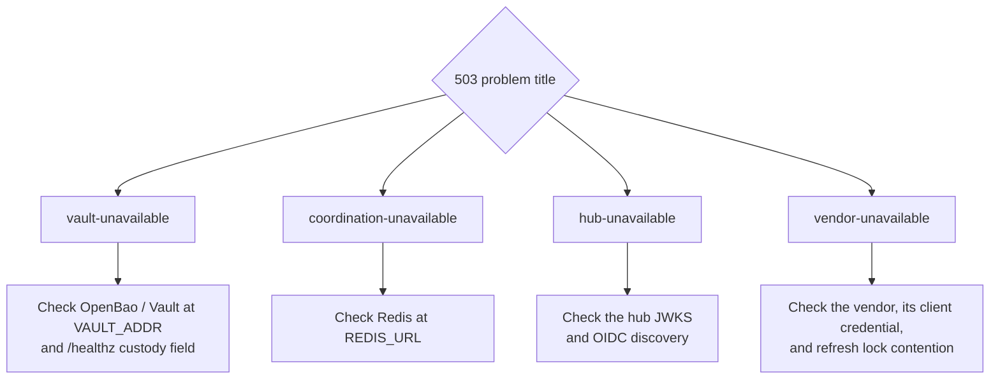

# Deploy and operate

This page shows how to set up and run the broker in a private deployment.

- To try it on your own machine, use the [quickstart](quickstart.md).
- For how callers use the broker, see the [API reference](api.md).
- Before rollout, read the [security limits](security.md#known-limitations).
- If you are deploying the [MCP gateway](mcp-gateway.md), you need the broker too. The gateway section below covers what changes.

## Production topology



The gateway is the only caller of the token routes. Browsers call the consent routes, and admins call `/v1/admin`. Every replica shares one Redis and one secrets store. No session affinity is needed. The gateway talks to the vendors' MCP servers, and the broker talks to the vendors' OAuth endpoints. A single replica can run without Redis (`COORD_BACKEND=memory`).

## Set up token storage (OpenBao / Vault, KV v2)

The broker keeps vendor tokens in a secrets store (OpenBao or Vault, KV v2 engine). You create two storage paths ("mounts"), each with its own access rules:

| Mount | Holds | Broker access | Admin access |
|---|---|---|---|
| `vendor-tokens` | Each user's vendor tokens ("grant entries") | Read and write | — |
| `vendor-clients` | Each vendor's client credentials (client ID and secret or key) | Read only | Write only |

The supplied broker policy does not limit what storage administrators can read. Use your own deployment policies to restrict human read access.

```sh
bao secrets enable -path=vendor-tokens kv-v2
bao secrets enable -path=vendor-clients kv-v2
bao write vendor-tokens/config max_versions=2   # retain up to two credential versions
bao policy write broker deploy/openbao-policy.hcl
bao token create -policy=broker -period=24h -orphan -display-name=broker
```

### The broker's storage token

- Give the broker the scoped token from the last command, in `VAULT_TOKEN` or `VAULT_TOKEN_FILE`. **Never give it the root token.**
- Use a **periodic** token, as shown above. The broker renews its own token at half the remaining TTL. A periodic token can be renewed forever.
- A token with a hard maximum TTL (an explicit max TTL such as `-explicit-max-ttl=768h`, or the auth mount's or system's max TTL) can only be renewed up to that maximum. `/healthz` starts failing 10 minutes before it expires. You must then replace the token and restart the broker.
- The token also needs the built-in `default` policy. It grants `lookup-self` and `renew-self`. The policy is attached unless you pass `-no-default-policy`.

### Storage auditing

Turn on an audit device in the storage backend. Check that read events reach your audit sink. The broker's own audit events do not replace storage auditing.

### Startup checks

Before it serves requests, the broker checks three things: its storage token, the hub's signing keys (JWKS), and the hub's OIDC discovery document. The hub is your company's sign-in service (identity provider).

- If the storage backend or hub is unreachable, the broker retries for `STARTUP_TIMEOUT_S`.
- Startup stops at once, with a message that names what to fix, when:
  - the storage token is rejected,
  - the hub JWKS is unusable (for example, it has no keys),
  - the hub discovery document is malformed or names an issuer other than `HUB_ISSUER`,
  - a vendor ID in the registry does not match the allowed pattern (IDs become storage path segments).

### Vendor client credentials

Write each vendor's confidential client credential on the admin path:

```sh
bao kv put vendor-clients/github  client_id=… client_secret=…
bao kv put vendor-clients/acmehub client_id=… private_key=@key.pem alg=RS256
```

A vendor with `enabled_env` in the registry (for example GitHub: `GITHUB_CLIENT_ID`, Atlassian: `ATLASSIAN_CLIENT_ID`) is only active when that variable is set on the broker.

Linear, Atlassian, and Cloudflare (their MCP servers' own sign-in) have no developer console: `tools/register-mcp-client.py <vendor> --redirect-base <broker URL> --vault` registers the broker once and writes `vendor-clients/<vendor>` itself. Register again only when you must: it disconnects everyone. Linear and Cloudflare secrets expire (see [Client secret expiring](#client-secret-expiring-linear-cloudflare)). See [Servers with their own sign-in](mcp-gateway.md#servers-with-their-own-sign-in).

The credential must match the vendor's `token_endpoint_auth_method` in the registry:

| `token_endpoint_auth_method` | Needs |
|---|---|
| `client_secret_post` or `client_secret_basic` | `client_secret` |
| `private_key_jwt` | `private_key` (PEM; PKCS#8 or PKCS#1). Optional: `alg` (default RS256) and `kid` |

### If storage goes down

The broker fails closed. Resolve returns 503 `vault-unavailable`. The only grace is each replica's in-memory cache (`CACHE_TTL_S`, default 60s).

## Configuration reference

The broker reads its settings from environment variables.

**Required.** If any are missing, startup stops and lists every missing name:
`HUB_ISSUER`, `HUB_JWKS_URI`, `BROKER_PUBLIC_URL`, `VAULT_ADDR`,
`VAULT_TOKEN` or `VAULT_TOKEN_FILE`, `REGISTRY_PATH`, `HUB_LOGIN_CLIENT_ID`.

If both `VAULT_TOKEN_FILE` and `VAULT_TOKEN` are set, the file wins. If the file cannot be read, startup stops.

**Optional, no default value shown in the table:**

- `HUB_DISCOVERY_URL`: where to fetch the hub's OIDC discovery document. Use it when the broker reaches the hub by an internal URL. Defaults to `HUB_ISSUER/.well-known/openid-configuration`. The document must still name `HUB_ISSUER`.
- `HUB_LOGIN_HINT`: `sub` (the default) sends the user's subject as the OIDC `login_hint`. Set `none` for a real IdP such as Keycloak, which expects a username.
- `HUB_LOGIN_CLIENT_SECRET`: leave it out for a public client. The broker always uses PKCE.

**Optional, with defaults:**

| Variable | Default | Notes |
|---|---|---|
| `HUB_TIER_AUDIENCE` | `mcp://tier/internal` | The hub token must have exactly one `mcp://tier/*` audience |
| `HUB_ALGORITHMS` | `PS256,ES256` | Allowed: PS256/384/512, ES256/384/512, EdDSA. RS256, HMAC, and `none` fail startup |
| `HUB_CONTRACT_VERSION` | `1.0` | Required value of the `mcp_contract` claim |
| `ADMIN_GROUP` | `mcp-platform-admin` | Callers of `/v1/admin/*` must have this in their `groups` array claim |
| `PROBLEM_URN_PREFIX` | `urn:vendor-token-broker` | Changes only the `type` prefix. `title` slugs never change |
| `COORD_BACKEND` | `memory` | Use `redis` for more than 1 replica |
| `REDIS_URL` | `redis://localhost:6379/0` | Used by the redis backend |
| `REFRESH_BUFFER_S` | `300` | A resolve refreshes the token if it expires within this many seconds |
| `PROACTIVE_REFRESH_S` | `900` | Upper edge of the window where the sweeper refreshes tokens ahead of time |
| `TXN_TTL_S` | `600` | Lifetime of consent state: each consent step's state and the browser binding cookie. An authorize link must still be opened within 5 minutes, or within `TXN_TTL_S` if that is shorter |
| `CACHE_TTL_S` | `60` | Per-replica cache lifetime, and so the most grace during a storage outage. The broker does not cap it. Keep it ≤ 60 to keep the documented bound |
| `SWEEP_INTERVAL_S` | `60` | `0` turns off the sweeper. Every other integer setting must be ≥ 1 (`CACHE_TTL_S` may be `0`: no cache) |
| `SWEEP_MAX_ENTRIES` | `500` | Entries checked per sweep pass. The next pass starts where this one stopped |
| `LOCK_TIMEOUT_S` / `LOCK_TTL_MS` | `10` / `20000` | How long a waiter waits for the lock / how long a redis lock lives. With `COORD_BACKEND=redis`, startup rejects `LOCK_TTL_MS` below `(VENDOR_TIMEOUT_S + 2 × VAULT_TIMEOUT_S) × 1000` |
| `REFRESHING_TTL_S` | `30` | After this, another replica may take over an abandoned refresh marker |
| `MASS_STALE_THRESHOLD` / `MASS_STALE_WINDOW_S` | `3` / `60` | How many entries at one vendor must go stale within the window to raise the uninstall alert (`broker.stale.mass`) |
| `VAULT_TIMEOUT_S` | `3` | Time limit on storage calls, so an outage is detected quickly and fails closed |
| `VENDOR_TIMEOUT_S` | `10` | Time limit on each vendor HTTP call (metadata, token, userinfo, revocation) |
| `JWKS_TIMEOUT_S` | `5` | Time limit on fetching the hub JWKS, the hub OIDC discovery document, and the hub token-endpoint call during consent |
| `STARTUP_TIMEOUT_S` | `30` | How long startup waits for an unreachable storage backend, hub JWKS, or hub OIDC discovery |

## Hub login client (consent)

When a user connects a vendor ("consent"), they must sign in at the hub in the same browser that opened the authorize link ([consent](design.md#6-consent-dance-first-time)). For this, register the broker at the hub as an OIDC client:

- **Redirect URI:** `{BROKER_PUBLIC_URL}/v1/callback/_hub` (exact match).
- **Grant:** authorization code, with PKCE (S256) required. Scope `openid`.
- **ID tokens:** signed with an algorithm in `HUB_ALGORITHMS`, by keys the hub publishes at `HUB_JWKS_URI`.
- **Client auth:** confidential (`HUB_LOGIN_CLIENT_SECRET`, sent as `client_secret_post`) or public (no secret).

The broker finds the hub's endpoints in its OIDC discovery document, at `HUB_DISCOVERY_URL` if set, otherwise at `{HUB_ISSUER}/.well-known/openid-configuration`. At startup it checks that this document names `HUB_ISSUER`.

Serve the broker over https. The consent cookie that ties the flow to one browser is then marked `Secure`.

## Vendor registry review workflow

The registry (`REGISTRY_PATH`) lists the allowed vendors and each vendor's policy. Treat every change as a reviewed change:

1. Edit a copy of `registry.example.json`.
2. Check it against `schemas/vendor-registry.schema.json` with `jsonschema`. CI checks `registry.example.json` on every push (`tests/unit/test_registry.py`). Do the same for your copy locally.
3. Get the same sign-off for a `scope_ceiling` change as for a token-contract change. The ceiling is a security boundary: a caller can never go past it at runtime.
4. Hardcode endpoints **only** when the vendor publishes no authorization server metadata (e.g. GitHub). When metadata exists, use `auth_metadata_url`. (Standards: RFC 8414.)
5. Set `resource` only for a vendor whose tokens are bound to one MCP server (Linear, Atlassian, Cloudflare). The broker sends it on authorize, code exchange, and every refresh (RFC 8707), unless `resource_on_refresh` is false (Linear, which refuses it on refresh). Changing either later can break existing connections at their next refresh.
6. `revocation.type` is `rfc7009` or `github_grant`. For GitHub Enterprise Server, set `revocation.grant_url` (default `https://api.github.com/applications/{client_id}/grant`).
7. Never put credentials in the registry. They live only in `vendor-clients/*`.

## Gateway contract

Gateways that call the broker depend on a frozen contract. That includes the shipped [MCP gateway](mcp-gateway.md) (`src/mcp_gateway`) and any other gateway plugin. Do not change it:

- Resolve statuses 200, 404, 409, and 5xx.
- Response fields `access_token`, `authorize_uri`, and `missing_scopes`.
- Problem `title` slugs. Only the URN prefix in `type` is configurable (`PROBLEM_URN_PREFIX`).
- Audit event names (below).

For the fields and titles in detail, see the [API reference](api.md) and the [legacy gateway mapping](api.md#legacy-gateway-mapping). For the protocol boundaries and how a gateway asks the user to connect during a tool call, see [Connect your own MCP server](mcp-integration.md).

Frozen audit event names: `broker.resolve`, `broker.consent.start`,
`broker.consent.complete`, `broker.consent.fail`, `broker.refresh`,
`broker.stale`, `broker.stale.mass`, `broker.revoke`, `broker.admin.deny`,
`broker.sweep.error`, `broker.custody.renew_failed`. These names never change.

## Runbook

Each entry says what you see and what to do.

### Which 503 is it?



Read the problem `title`, not only the status. Each title points at one dependency:

- `vault-unavailable`: see [503 `vault-unavailable`](#503-vault-unavailable) and [`/healthz` body says unreachable](#healthz-body-says-custody-unreachable).
- `coordination-unavailable`: see [503 `coordination-unavailable`](#503-coordination-unavailable-redis-backend).
- `hub-unavailable`: the broker cannot fetch the hub's signing keys (`HUB_JWKS_URI`) or its discovery document. Check the hub and the network path to it. Calls are limited by `JWKS_TIMEOUT_S`.
- `vendor-unavailable`: the vendor is down or slow (`VENDOR_TIMEOUT_S`), its client credential is missing from `vendor-clients/<vendor>`, or refreshes of one connection are contending (a waiter timed out after `LOCK_TIMEOUT_S`). Retrying with backoff is safe. See also [A replica died mid-refresh](#a-replica-died-mid-refresh).

### `/healthz` returns 503

`/healthz` returns `{"ok", "custody"}`. It returns 503 only when this replica's own storage token has a problem:

- `token-rejected`: the token is revoked, expired, or wrong.
- `token-expiring`: under 10 minutes left.

**Do this:** replace the token and restart the replica.

### `/healthz` body says `"custody": "unreachable"`

The storage backend is down. `/healthz` still returns 200 on purpose. Every replica shares the outage. Draining or restarting them would throw away the cache hits that keep serving meanwhile.

**Do this:** restore the storage backend. Alert on the body, not only the status code. The health result is cached for 10 seconds.

### `broker.custody.renew_failed`

The broker could not renew its storage token. It keeps retrying with backoff. `ttl_remaining_s` says how long is left.

**Do this:** if the backend is up, check the token's policies and max TTL.

### `broker.consent.fail` with `reason: login_sub_mismatch`

This event has `security_event: true`. Someone opened an authorize link issued to another user. `sub` is the user the link was for. `login_sub` is who signed in.

**Do this:** look at the pattern.

- One event can be a user opening a colleague's link by mistake.
- Repeats from one `login_sub`, or links sent to many users, suggest a linking attack.

### `broker.consent.fail` with `reason: browser_mismatch`

Someone finished a consent step in a browser that did not start it, for example through a forwarded callback or vendor URL. The broker did not redeem the code.

### `broker.stale.mass`

Many entries at one vendor went stale at once. The likely cause is an org-level app uninstall or credential rotation at that vendor. The broker does not send pages itself.

**Do this:**

1. Set up monitoring to route this event to on-call.
2. Investigate the cause at the vendor before you notify users in bulk.
3. Each user recovers by connecting again (re-consent) themselves.

### 503 `vault-unavailable`

The storage backend is down. The broker fails closed by design.

**Do this:** restore the backend. Entries and generations stay intact (the storage write check, CAS, protects them).

### 503 `coordination-unavailable` (redis backend)

Redis is down. Operations that need coordination fail: refresh, minting consent links, the authorize and callback routes, and DELETE. Every resolve that needs no refresh keeps serving, whether it comes from the cache or from a storage read.

**Do this:** restore Redis. Consent records lost with Redis need a fresh browser flow. Stored credentials stay safe in storage.

### A replica died mid-refresh

**Do nothing.** The broker recovers on its own:

1. The lock TTL expires.
2. Another replica takes over the abandoned `REFRESHING` marker.
3. In the worst case, a rotating refresh-token family burns. The entry goes STALE and the user re-consents.

CAS stops a losing writer from overwriting a newer version. It cannot recover credentials already used up at the vendor.

### Sweeper errors or missed proactive refreshes

The sweeper refreshes tokens before they expire. With the redis backend, only the replica holding the leader lease runs it.

- A `broker.sweep.error` event for one entry carries that entry's `vendor` and `sub`. A bad entry never stops the loop. A `broker.sweep.error` without `vendor` or `sub` means the whole pass failed. The loop tries again on the next tick.
- Each pass lists the entries of every enabled vendor, then checks at most `SWEEP_MAX_ENTRIES` of them. Vendors switched off through `enabled_env` are skipped. The next pass starts where the previous one stopped.
- A full cycle over all entries fits in the 10-minute proactive window (`PROACTIVE_REFRESH_S − REFRESH_BUFFER_S`) while `total entries ≤ SWEEP_MAX_ENTRIES × 600 / SWEEP_INTERVAL_S` (5,000 with the defaults).
- With the redis backend each interval is jittered by ±20%. In the worst case (every interval 20% longer) the bound is `SWEEP_MAX_ENTRIES × 600 / (1.2 × SWEEP_INTERVAL_S)`, about 4,166 with the defaults.
- Past that, some entries miss the proactive refresh. They are refreshed on their next resolve instead.

### 502 `revoke-pending` on disconnect

The service was down when someone disconnected. The broker marked the connection `REVOKE_PENDING` and kept its tokens, so it can revoke them later.

- Meanwhile, resolve answers 409 `revoke-pending` for that connection.
- The sweeper retries the revoke on each pass. It takes the entry's lock, reads the entry again, and revokes at the service. It then deletes only the version it revoked.
- A repeated DELETE from the person also retries the revoke.

**Do this:** check that the broker can reach the service's revocation endpoint. The `broker.revoke` event with `outcome: pending` carries the error. The sweeper does not run when `SWEEP_INTERVAL_S` is `0`.

### Client secret expiring (Linear, Cloudflare)

`tools/register-mcp-client.py` registers the broker with Linear's and Cloudflare's MCP sign-in. Their client secrets expire after about 90 days. The test registrations expire on 2026-12-27 (Linear) and 2026-12-26 (Cloudflare). The script prints the expiry date when it registers.

**Do this before that date:**

1. Register again: `tools/register-mcp-client.py <vendor> --redirect-base <broker URL> --vault --force`. It writes the new credential to `vendor-clients/<vendor>`.
2. Tell people to reconnect. Every connection made with the old client stops working.

### Slow requests while storage is frozen

Storage (hvac) and hub JWKS calls run in worker threads, never on the event loop. A frozen storage backend holds one thread per in-flight uncached request for up to `VAULT_TIMEOUT_S`. Cache hits and `/healthz` keep answering.

## Storage layout and upgrades

Grant entries live at `vendor-tokens/{vendor}/sub-b64.{base64url(sub)}`. There is one key per subject, whatever characters the hub puts in `sub` (including URIs with `/`).

Entries may also sit at the unencoded key `vendor-tokens/{vendor}/{sub}`:

- The broker reads both keys.
- It moves an entry to the encoded key on its next refresh or re-consent. A delete removes both keys.
- You need no migration job.

**Run one broker version across all replicas.** A replica without encoded-key support answers needs-consent for moved entries.

What stays in storage:

- A current STALE entry holds no tokens (both are blanked). Older retained KV versions may still hold credentials.
- `REVOKE_PENDING` entries keep their tokens until the vendor revocation succeeds.

## MCP gateway

The [MCP gateway](mcp-gateway.md) is a separate deployment (`Dockerfile.gateway`, `requirements-gateway.lock`). It has its own configuration, hub requirements, audit events, and limitations: see [MCP gateway](mcp-gateway.md#configuration).

Two broker settings matter when you run it with a real IdP:

- If the broker reaches the hub by an internal address that differs from the public issuer (as in the Keycloak profile), set `HUB_DISCOVERY_URL`.
- Set `HUB_LOGIN_HINT=none` for a real IdP.

## Single-replica deployment

`deploy/docker-compose.yml` is the single-replica shape. Next to it, put `.env` (a copy of `.env.example`; every variable in it reaches the broker, including the vendor client IDs that enable registry vendors), your reviewed `registry.json`, and `broker-vault-token`. The image runs as UID 65534, and compose bind-mounts the token file with its host owner and mode: on a Linux host a `0600` file is unreadable, so make it readable by that user (`chown 65534`, or `chmod 0444`). The broker serves plain HTTP on 8300; terminate TLS in front of it and set `BROKER_PUBLIC_URL` to the https address.

## Multi-replica deployment

Run 2 or more replicas only with `COORD_BACKEND=redis`. See `deploy/docker-compose.multi.yml` for the shape: two replicas sharing OpenBao and Redis. Put any L4/L7 load balancer in front; no session affinity is needed.

Timing rules:

- Keep `LOCK_TTL_MS` above the slowest vendor token round-trip plus storage overhead.
- `REFRESHING_TTL_S` should be larger than `LOCK_TTL_MS / 1000`. Watch the units: seconds versus milliseconds.

Sweep leader handoff: a stopped sweep leader can keep its Redis lease for up to twice its sweep interval (120 seconds with defaults). A successor must then reach its next sweep attempt. Allow for that handoff when you change profiles or timing settings. The [test guide](quickstart.md#run-the-automated-checks) explains how to keep standalone and multi-replica runs apart.
