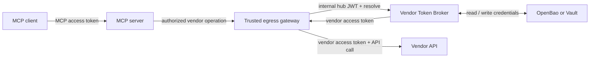

# Vendor Token Broker

Store each user's vendor credentials once. Resolve a usable token when a trusted gateway needs to call that vendor, refresh it when needed, and revoke the connection when the user disconnects.

The broker is an internal OAuth client and credential custodian. It exposes a REST API for the gateway; the surrounding application provides the MCP server.

## Start here

| Your task | Start with |
|---|---|
| Run a complete local connection | [Quickstart](quickstart.md) |
| Connect an MCP application | [Integrate with MCP](mcp-integration.md) |
| Implement a broker caller | [API reference](api.md) |
| Provision, deploy, or troubleshoot | [Deploy and operate](operations.md) |
| Assess controls and limitations | [Security and MCP alignment](security.md) |
| Understand refresh and concurrency | [Design](design.md) and [token lifecycle](token-lifecycle.md) |

## Where it fits

The MCP server validates access to its own resource. The gateway supplies a separately valid internal hub JWT to the broker. The broker validates that JWT and returns the user's vendor token to the trusted gateway. The gateway must strip internal credentials before calling the vendor and keep vendor tokens out of MCP results.

This repository implements the broker. The MCP server, gateway, and their identity handoff are deployment responsibilities. See the [three authorization boundaries](mcp-integration.md#three-authorization-boundaries).

## A user's connection

1. A tool needs a vendor operation. The gateway asks the broker for a token.
2. If no usable connection exists, the broker returns a short-lived connection URL.
3. The user opens that URL, signs in through the enterprise identity provider, and authorizes the vendor in the same browser.
4. The gateway retries. The broker returns a vendor token, refreshing it when necessary.
5. The user can disconnect. The broker attempts vendor revocation before deleting the stored connection; unsupported revocation is reported explicitly.

## What is available

Software **1.1.0** is marked **unreleased** in the repository changelog. The implementation includes browser-bound consent, three vendor client-authentication methods, in-memory or Redis coordination, and versioned credential storage.

The documentation was reviewed against MCP **2026-07-28** on **2026-09-25**. [Security and MCP alignment](security.md) records which controls are implemented, partial, externally owned, or planned. There is no blanket MCP conformance claim.

## Terms used in these guides

| Term | Meaning here |
|---|---|
| Hub | Enterprise identity provider; validates workforce identity and issues the internal hub JWT |
| Grant / connection | A user's stored authorization to one vendor |
| Custody | Protected storage for vendor tokens and client credentials |
| Scope ceiling | Registry policy limiting requested and recorded scopes; it cannot shrink permissions on a vendor-issued token |
| Single-flight | Concurrent callers share one refresh operation |
| CAS | Compare-and-swap: a write succeeds only if the stored version still matches |
| STALE | A stored connection requiring the user to reconnect |
| EMA | Enterprise-Managed Authorization, an optional MCP extension and a possible future migration path |

## Project background

Extracted from the internal `mcp-healthcare-reference` lab at commit `ab699f3a46bb18ab96cb9d17f3cb9e883e6011c6`. The [design](design.md) describes the implementation; [ADR-0001](adr/0001-redis-coordination.md) explains the Redis choice.
