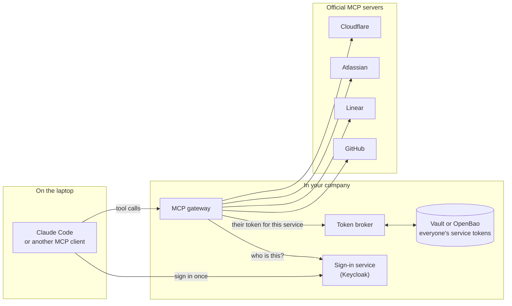
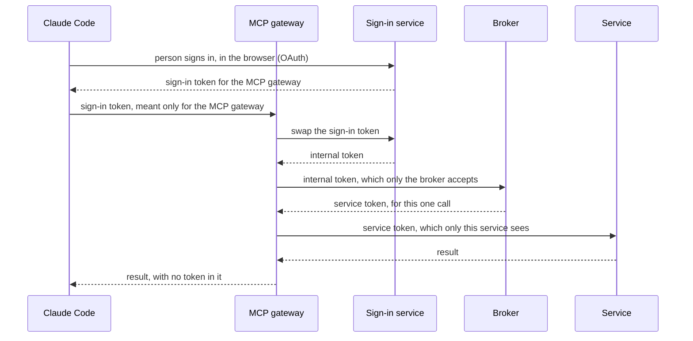
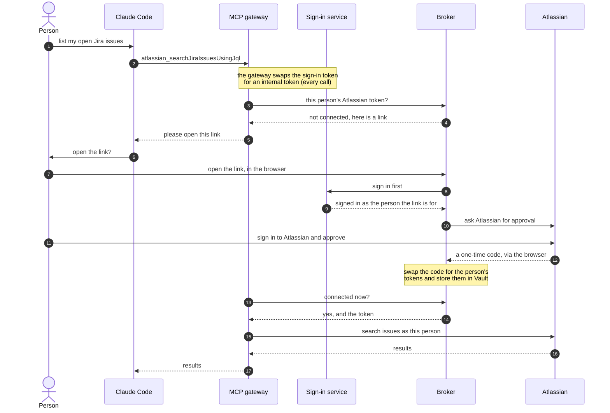
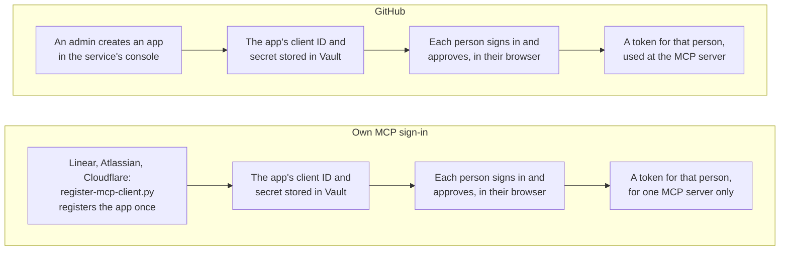
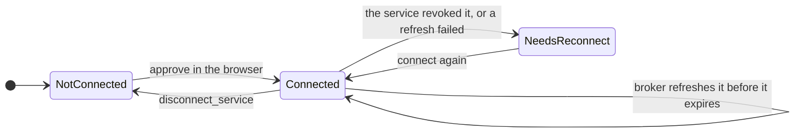

# Overview

Let Claude Code and other AI assistants work in your team's tools as the person who is signed in. The assistant connects to one **MCP gateway**. The gateway calls each service's official MCP server using that person's own account. A **token broker** keeps everyone's service tokens in Vault, never on laptops and never in the chat.

| Service | Tools | Examples |
|---|---|---|
| GitHub | 7 | `github_get_me`, `github_list_issues`, `github_pull_request_read` |
| Linear | 13 | `linear_list_issues`, `linear_get_project`, `linear_list_cycles` |
| Atlassian (Jira and Confluence) | 8 | `atlassian_searchJiraIssuesUsingJql`, `atlassian_getConfluenceContent` |
| Cloudflare | 3 | `cloudflare_search`, `cloudflare_docs`, `cloudflare_execute` |

Every service also has `connect_<service>` and `disconnect_<service>`. More services can be added with configuration (see [Add another server](mcp-gateway.md#add-another-server)).

## The picture

- **One sign-in.** People sign in with your company's sign-in service (the "hub"), then connect each service once in their browser.
- **Tokens stay in one place.** The broker keeps each person's service tokens in Vault and refreshes them before they expire. The laptop only holds the sign-in token for the gateway.
- **Used once, then forgotten.** On every call, the gateway gets the person's token from the broker, uses it for that one call, and throws it away.

## Three tokens that never cross

Claude Code gets the sign-in token when the person signs in at the sign-in service, once (`/mcp`, then **Authenticate**). It is issued for the MCP gateway only. Each hop after that uses its own credential. The sign-in token never reaches the broker or a service. A service token never reaches the assistant, the chat, or a log. A test searches every container's logs for all of them. See [Security](security.md).

## The first time someone uses a service

Later calls skip steps 4 to 14: the broker answers step 3 with the token straight away. How the link reaches the person depends on the assistant:

| Assistant | What happens |
|---|---|
| Claude Code (MCP 2026-07-28) | It asks in the chat, opens the link, and repeats the call |
| Other clients that can open links (MCP 2025-11-25) | The gateway asks it to open the link during the call |
| Clients that can't open links | The tool's error contains the link. Open it, then try again |

The link only works for the person it was made for, in the browser that opened it: that is the sign-in check in steps 8 and 9. See [Connecting a service during a tool call](mcp-gateway.md#connecting-a-service-during-a-tool-call).

## Two ways services sign in

Either way, the client ID and secret only identify the broker as an OAuth app. Only a person signing in and approving produces a token, and it acts as that person. The broker uses no system-to-system (client credentials) grant.

Linear, Atlassian, and Cloudflare run their own sign-in for their MCP servers. The broker is registered with each of them once, and names the MCP server when the person connects (the `resource` parameter, RFC 8707). The token then only works at that server: Linear's only at its read-only server. Registering again would disconnect everyone. See [Servers with their own sign-in](mcp-gateway.md#servers-with-their-own-sign-in).

## What keeps each service read-only

Each service has several layers. If one fails, the others still hold.

| Service | Tool list | At the service | Scopes the token gets |
|---|---|---|---|
| GitHub | 7 read tools | `X-MCP-Readonly` and `X-MCP-Lockdown` headers | Read-only App permissions |
| Linear | 13 read tools | tokens only work at its read-only MCP server | `read` |
| Atlassian | 8 read and search tools | none | read and search scopes only |
| Cloudflare | `search`, `docs`, `execute` | none | **The only layer:** 12 read scopes plus `offline_access` |

`cloudflare_execute` can call any Cloudflare API. What stops it writing is that the token only carries read scopes. The `disconnect_<service>` tools change only the person's own connection in the broker, never data at the service.

## What happens to a connection

- **Refresh.** When many calls need a new token at once, only one refresh happens, even across several broker replicas (through Redis). A compare-and-swap write in Vault is the final safeguard.
- **Disconnect.** `disconnect_<service>` asks the service to cancel the token first, then deletes the broker's copy. If the service is down, the broker keeps retrying and the service can't be used until the cancel succeeds.
- **Needs reconnect.** The next tool call asks the person to connect again.

[Token lifecycle](token-lifecycle.md) walks through every path step by step.

## Built in

| | |
|---|---|
| **Consent bound to the person** | A connect link works once, for 5 minutes, only for the person it was made for, in the browser that opened it |
| **Fails closed, visibly** | A Vault, Redis, or broker outage is a "try again shortly" error, never "please connect" |
| **Saved tool lists** | Tools are listed from the moment the gateway starts. Changes in a service's live list are logged, never adopted, so one person's details never reach another |
| **Audited, without tokens** | Every decision is a JSON log line with IDs and outcomes only |
| **Kept fresh ahead of time** | A background sweeper refreshes tokens before they're needed and retries cancels that are still pending |
| **Alert on mass breakage** | When many connections to one service break within a minute, the broker logs a `broker.stale.mass` alert: the service may have revoked the app |
| **Custodian, not issuer** | The broker has exactly seven routes and never issues tokens of its own |

## Where to go next

| You want to | Read |
|---|---|
| Try it on your laptop | [Quickstart](quickstart.md) |
| Understand and configure the gateway | [MCP gateway](mcp-gateway.md) |
| Connect your own MCP server instead | [Connect your own MCP server](mcp-integration.md) |
| Call the broker directly | [Broker API](api.md) |
| Deploy, configure, or troubleshoot | [Deploy and operate](operations.md) |
| Check the security controls and limits | [Security](security.md) |
| Learn how refresh and concurrency work | [Design](design.md) and [Token lifecycle](token-lifecycle.md) |

## Status

Software **1.1.0**, marked **unreleased** in the changelog. Tested end to end with Keycloak as the sign-in service, Claude Code 2.1.283 as the assistant, and the real GitHub, Linear, Atlassian, and Cloudflare MCP servers.

These docs describe MCP **2026-07-28** (the MCP specification version) and were checked against the code on **2026-09-27**. [Security](security.md) lists which controls are built in, which are partial, and which your deployment must supply. This project makes no blanket claim of MCP conformance.

## Words used in these docs

| Word | Meaning |
|---|---|
| MCP | Model Context Protocol: how AI assistants talk to tool servers |
| MCP client | The AI assistant side, such as Claude Code |
| Hub | Your company's sign-in service (identity provider), such as Keycloak |
| Vendor, service | An outside service that people connect, such as GitHub |
| Connection (grant) | A person's stored permission to use one service |
| Custody | The protected storage (Vault or OpenBao) that holds tokens and app secrets |
| Scope | A named permission, such as "read issues" |
| Refresh | Swapping an expiring token for a new one without asking the person again |
| STALE | A connection that no longer works, so the person must reconnect |
| Single-flight | When many requests need a refresh at once, only one does it and the rest share the result |
| Saved tool list (snapshot) | The checked-in copy of a service's tools that the gateway lists from startup |
| Stand-in | A test double of a service's MCP server, used by the local test stack |
