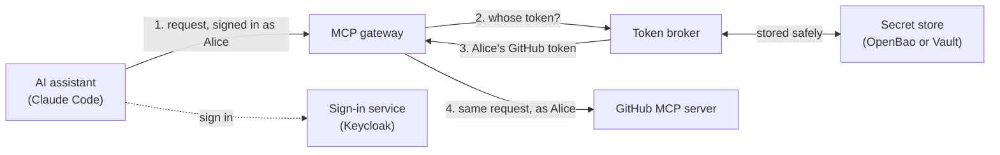

# Overview

Let Claude Code and other AI assistants use your development tools, such as GitHub and Linear, on each person's behalf. Nobody pastes tokens, and each person only ever acts as themselves.

This project has two parts:

- **The MCP gateway.** Your AI assistant connects to it like any MCP server. It forwards the assistant's requests to each service's own MCP server (GitHub's and Linear's today), using the account of the person who is signed in.
- **The token broker.** It keeps each person's tokens for each service safe, refreshes them when they expire, and deletes them when the person disconnects. The gateway asks it for a token on every request.

You get:

- **One sign-in.** People sign in with your company's sign-in service, then connect each service once in their browser.
- **No token handling.** The assistant, the chat, and the logs never see a service token.
- **Read-only tools by default**, from each service's official MCP server: 7 for GitHub and 13 for Linear. More services can be added the same way.

## How it works

Here's GitHub as the example.

1. The assistant calls a GitHub tool, such as "who am I?". It sends a sign-in token that proves who the person is.
2. The gateway checks that token. It swaps it at the sign-in service for a separate internal token, and asks the broker for that person's GitHub token.
3. The broker returns the GitHub token, refreshing it first if it's about to expire.
4. The gateway calls GitHub with it, returns the answer, and forgets the token.

Each hop uses its own credential. The assistant's sign-in token never reaches GitHub or the broker, and the GitHub token never reaches the assistant.

## The first time someone uses it

1. They add the gateway to Claude Code and sign in with the company sign-in service.
2. They ask for something from a service, such as GitHub. That account isn't connected yet, so Claude Code asks to open a link.
3. In the browser, they sign in again if needed and approve access on the service.
4. The request finishes. From then on, requests just work, and the broker keeps the token fresh.
5. Each service asks once. They can disconnect at any time: the broker asks the service to cancel the token, then deletes its copy.

## Where to go next

| You want to | Read |
|---|---|
| Try it on your laptop | [Quickstart](quickstart.md) |
| Understand and configure the gateway | [MCP gateway](mcp-gateway.md) |
| Connect your own MCP server instead | [Connect your own MCP server](mcp-integration.md) |
| Call the broker directly | [Broker API](api.md) |
| Deploy, configure, or troubleshoot | [Deploy and operate](operations.md) |
| Check the security controls and limits | [Security](security.md) |
| Learn how refresh and concurrency work | [Design](design.md) and [Token lifecycle](token-lifecycle.md) |

## Status

Software **1.1.0**, marked **unreleased** in the changelog. It has been tested end to end with Keycloak as the sign-in service, Claude Code as the assistant, and the real GitHub and Linear MCP servers.

These docs were checked against MCP **2026-07-28** (the MCP specification version) on **2026-09-27**. [Security](security.md) lists which controls are built in, which are partial, and which your deployment must supply. This project makes no blanket claim of MCP conformance.

## Words used in these docs

| Word | Meaning |
|---|---|
| MCP | Model Context Protocol: how AI assistants talk to tool servers |
| MCP client | The AI assistant side, such as Claude Code |
| Hub | Your company's sign-in service (identity provider), such as Keycloak |
| Vendor | An outside service that people connect, such as GitHub |
| Connection (grant) | A person's stored permission to use one vendor |
| Custody | The protected storage that holds tokens and app secrets |
| Scope | A named permission, such as "read issues" |
| Refresh | Swapping an expiring token for a new one without asking the person again |
| STALE | A connection that no longer works, so the person must reconnect |
| Single-flight | When many requests need a refresh at once, only one does it and the rest share the result |

## Background

The token broker was taken from the internal `mcp-healthcare-reference` lab at commit `ab699f3a46bb18ab96cb9d17f3cb9e883e6011c6`. The MCP gateway was added in this repository. For the reasoning behind the design, see [Design](design.md) and the [Redis decision record](adr/0001-redis-coordination.md).
