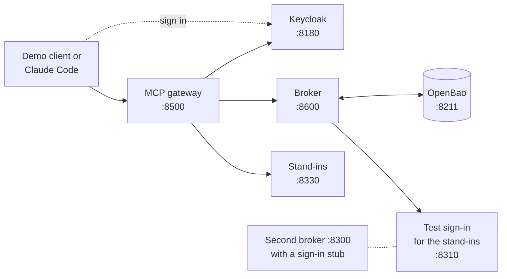

# Quickstart

Try the whole thing on your own machine: sign in, connect accounts, and call GitHub, Linear, Atlassian, and Cloudflare tools from Claude Code. Everything runs in Docker. You don't need any of those accounts for the first part: stand-ins play all four services.

You need Docker Compose, Python 3.12, and a copy of this repository. Run every command from the repository's top folder.

This setup is for trying things out. It uses plain HTTP, test passwords, and storage that is wiped when the containers stop. For a real deployment, see [Deploy and operate](operations.md).

## Install

```sh
python3.12 -m venv .venv
.venv/bin/pip install --require-hashes -r requirements-dev.lock
.venv/bin/pip install --no-deps -e .
```

## Run the MCP gateway

### 1. Start everything

```sh
docker compose -f tests/stack/docker-compose.yml --profile gateway up -d --build --wait
.venv/bin/pytest tests/integration -m "gateway and not external" -q
```

This starts:

| Service | Address | What it is |
|---|---|---|
| Keycloak | `http://localhost:8180` | The sign-in service. Test users: `alice` / `alice` and `bob` / `bob` |
| MCP gateway | `http://localhost:8500/mcp` | What your MCP client connects to |
| Token broker | `http://localhost:8600` | Keeps each user's GitHub, Linear, Atlassian, and Cloudflare tokens |
| Stand-ins | `http://localhost:8330` | Pretend to be GitHub's, Linear's, Atlassian's, and Cloudflare's MCP servers |



The gateway uses the broker on port 8600, which trusts Keycloak. The second broker on port 8300 uses a simple sign-in stub instead. It's for [looking under the hood](quickstart.md#look-under-the-hood-the-broker-on-its-own) and the broker's own tests.

The tests should all pass. They sign in, connect accounts, call tools, and disconnect, the same way you are about to.

### 2. Try the demo client

```sh
.venv/bin/python tools/mcp-demo-client.py github_get_me
.venv/bin/python tools/mcp-demo-client.py linear_list_issues
.venv/bin/python tools/mcp-demo-client.py disconnect_github
```

1. A browser tab opens on Keycloak. Sign in as `alice`.
2. The first time you use a service, the gateway asks you to connect it, and a second tab opens. Finish there. With the stand-ins, this happens by itself.
3. The client prints the list of tools and the result.
4. `disconnect_github` cancels the GitHub token and deletes the broker's copy. The next GitHub tool asks you to connect again.

Tool names start with the service: `github_…`, `linear_…`, `atlassian_…`, or `cloudflare_…`. The demo client signs in as the pre-registered app `mcp-demo-cli` and listens for the sign-in result on port 33418.

### 3. Try Claude Code

Add the gateway to Claude Code:

```sh
claude mcp add --transport http vtb-gateway http://localhost:8500/mcp --callback-port 33419
```

Then, in a new Claude Code session:

1. Run `/mcp`, choose `vtb-gateway`, then **Authenticate**.
2. Keycloak opens. Sign in as `alice` and click **Yes** on the "Grant Access" screen. (Claude Code registers itself with Keycloak the first time.)
3. Ask Claude to use the gateway, for example: *"Using vtb-gateway, list my Linear issues, then tell me my GitHub login."*
4. If a service isn't connected yet, Claude Code asks to open a link. Accept, finish in the browser, and the answer comes back. Each service asks once.
5. To disconnect, ask for it, for example: *"Disconnect my Linear account from vtb-gateway."* `disconnect_linear` is marked as a destructive tool, so MCP clients can ask you before they run it.

If sign-in later fails with an error that names an old address, run `claude mcp remove vtb-gateway`, add it again, and sign in once.

### 4. Switch to the real services

1. **GitHub:** create a GitHub App at <https://github.com/settings/apps/new>:
   - Callback URLs: `http://localhost:8300/v1/callback/github` and `http://localhost:8600/v1/callback/github`
   - **Expire user authorization tokens**: on
   - Webhook: off
   - Repository permissions, all **read-only**: Contents, Issues, Pull requests, Metadata

   Then generate a client secret, and install the App on the repositories you want to use.
2. **Linear, Atlassian, and Cloudflare:** these register the broker with a script instead of a developer console ([why](mcp-gateway.md#servers-with-their-own-sign-in)).
   - For Atlassian, first ask an org admin to allow `http://localhost:*/**` in Atlassian Administration, under **Rovo → MCP → Domain settings**.
   - Then register once per service. The script writes the ID and secret into `tests/stack/.env`:

     ```sh
     .venv/bin/python tools/register-mcp-client.py linear \
         --redirect-base http://localhost:8600 --env-file tests/stack/.env
     .venv/bin/python tools/register-mcp-client.py atlassian \
         --redirect-base http://localhost:8600 --env-file tests/stack/.env
     .venv/bin/python tools/register-mcp-client.py cloudflare \
         --redirect-base http://localhost:8600 --env-file tests/stack/.env
     ```

     Don't run it again later: a new registration disconnects every account connected with the old one. Linear's and Cloudflare's secrets expire after about 3 months, and the script prints the date.
3. Put the GitHub App's ID and secret in `tests/stack/.env` too (git ignores this file):

   ```sh
   GITHUB_CLIENT_ID=...
   GITHUB_CLIENT_SECRET=...
   ```

   Run the `up` command from step 1 again, so the broker gets them. You can set up any subset of the services.
4. Point the gateway at the real services. Give people two minutes to finish connecting, and give slow calls 15 seconds:

   ```sh
   GATEWAY_UPSTREAMS= GATEWAY_CONSENT_WAIT_S=120 GATEWAY_HTTP_TIMEOUT_S=15 \
     docker compose -f tests/stack/docker-compose.yml --profile gateway up -d --no-deps --wait mcp-gateway
   ```

   To serve only some services, add for example `GATEWAY_ENABLED_UPSTREAMS=github,atlassian`.
5. Use the demo client or Claude Code as before. `github_get_me` returns your own GitHub account, `linear_list_teams` your Linear teams, and `atlassian_getAccessibleAtlassianResources` your Atlassian sites. `connect_cloudflare` connects Cloudflare. To check them all automatically, run `.venv/bin/pytest tests/integration/test_external_mcp_servers.py -m external`.

To go back to the stand-ins, run the `up` command for `mcp-gateway` again without those variables.

## Look under the hood: the broker on its own

The gateway gets tokens from the broker. You can talk to the broker directly, the way a gateway does. Step 1 also started a second broker on port 8300, with a simple sign-in stub instead of Keycloak. This section uses that one. If you skipped step 1, start it with:

```sh
docker compose -f tests/stack/docker-compose.yml up -d --build --wait
curl -fsS http://localhost:8300/healthz
```

Expected: `{"ok":true,"custody":"ok"}`.

The script below pretends to be the gateway, so it receives a token. It prints only status codes and scope names. A real MCP client must never see that token.

```sh
.venv/bin/python - <<'PY'
import requests

broker = "http://localhost:8300"
hub = "http://localhost:8320"
subject = "wf-quickstart"
mint = requests.post(f"{hub}/_test/token", json={"sub": subject}, timeout=10)
mint.raise_for_status()
headers = {"Authorization": "Bearer " + mint.json()["access_token"]}
body = {"vendor": "mockhub", "required_scopes": ["issues:read"]}

# Make the walkthrough repeatable for this dedicated test subject.
reset = requests.delete(f"{broker}/v1/grants/mockhub/{subject}",
                        headers=headers, timeout=15)
assert reset.status_code in (200, 404), reset.status_code
challenge = requests.post(f"{broker}/v1/tokens/resolve", json=body,
                          headers=headers, timeout=15)
assert challenge.status_code == 404, challenge.status_code
print("Resolve:", challenge.status_code, challenge.json()["title"])

# Session preserves the consent cookie across hub and vendor redirects.
# The mock hub signs in automatically; a real hub requires browser login.
with requests.Session() as browser:
    connected = browser.get(challenge.json()["authorize_uri"], timeout=15)
    assert connected.status_code == 200 and "Connected" in connected.text
print("Consent: connected")

resolved = requests.post(f"{broker}/v1/tokens/resolve", json=body,
                         headers=headers, timeout=15)
resolved.raise_for_status()
print("Resolve:", resolved.status_code, "scopes:", resolved.json()["granted_scopes"])

deleted = requests.delete(f"{broker}/v1/grants/mockhub/{subject}",
                          headers=headers, timeout=15)
deleted.raise_for_status()
print("Disconnect:", deleted.json())
again = requests.post(f"{broker}/v1/tokens/resolve", json=body,
                      headers=headers, timeout=15)
assert again.status_code == 404
print("Resolve after disconnect:", again.status_code, again.json()["title"])
PY
```

What you should see:

1. `404 needs-consent`: not connected yet.
2. The account connects.
3. `200`: the broker hands over a token.
4. `{"revoked": true}`: disconnected.
5. `404 needs-consent` again.

The test vendor widens scopes when it refreshes, so step 3 may list both `issues:read` and `issues:write` (see [scope policy](api.md#scope-policy)). For a guided tour with a browser, including attack attempts, see [Smoke tests](smoke-tests.md).

## Run the automated checks

```sh
.venv/bin/pytest tests/unit -q
.venv/bin/pytest tests/integration -m "not external and not multi and not gateway" -q
```

To run the same checks with Redis doing the coordination:

```sh
COORD_BACKEND=redis docker compose -f tests/stack/docker-compose.yml \
  up -d --no-deps --wait broker
.venv/bin/pytest tests/integration -m "not external and not multi and not gateway" -q
```

To test two brokers sharing the work, first stop the single broker. Then wait until its sweep lease has run out (up to 120 seconds with default settings). Don't flush a Redis that others share.

```sh
docker compose -f tests/stack/docker-compose.yml stop broker
docker compose -f tests/stack/docker-compose.yml --profile multi \
  up -d --build --wait broker-a broker-b broker-lb
# Inspect the remaining lease; wait until the previous lease has expired.
docker compose -f tests/stack/docker-compose.yml exec -T redis \
  redis-cli PTTL vtb:sweep-lease
BROKER_URL=http://localhost:8400 BROKER_CONTAINERS=vtb-broker-a,vtb-broker-b \
  .venv/bin/pytest tests/integration/test_multi_replica.py -q
```

The two brokers use a 10-second sweep lease. If `PTTL` shows more than 10000 ms, the old broker's lease is still there, so wait. When the test finishes, it restarts the single broker. Stop the two brokers before you run the single-broker tests again, so their background sweeps don't interfere.

## Stop everything

```sh
docker compose -f tests/stack/docker-compose.yml --profile multi --profile gateway down
```

This wipes the test storage. Next time, run the setup again and reconnect accounts.
