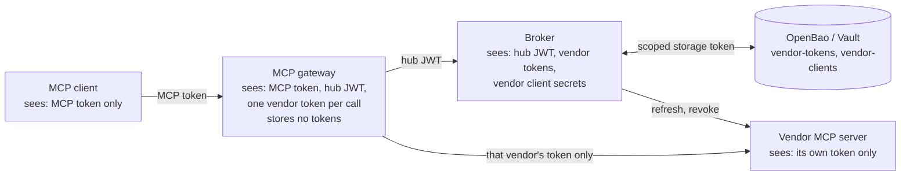

# Security and MCP alignment

**Reviewed 2026-09-27 · software 1.1.0 (unreleased) · MCP 2026-07-28.**

This page lists which security controls the broker and gateway have, where the proof lives, and what is still missing.

- The broker stores each user's vendor tokens and runs the vendor sign-in (OAuth) flows. It is one part of a larger MCP deployment.
- The shipped [MCP gateway](mcp-gateway.md) handles the MCP boundary for GitHub's, Linear's, Atlassian's, and Cloudflare's MCP servers.
- Passing these tests does not mean a complete deployment meets the MCP standard. [The current specification](https://modelcontextprotocol.io/specification/2026-07-28) sets the protocol baseline.

## Control ownership and evidence

Status words in the table:

- **Implemented**: present in this broker (or the gateway, where named).
- **Partial**: present, with limits the row names.
- **External**: another component must provide it.
- **Planned**: not available here.

Source and test paths refer to the private repository available to maintainers. The hub is your company's sign-in service (identity provider).

| Control | Status / owner | Implementation and evidence |
|---|---|---|
| PKCE S256, nonce, subject/browser binding | Implemented / broker | `main.py`, `hub_login.py`; `tests/unit/test_consent_binding.py`, `test_hub_login.py`, `tests/integration/test_consent.py` |
| Vendor callback issuer validation | Partial / broker | `main.py` callback checks; `tests/integration/test_consent.py`; see the metadata limits below |
| Hub JWT revalidation | Implemented / broker | `hub.py`; `tests/unit/test_hub.py`, `tests/integration/test_security.py` |
| Hub signature algorithms | Implemented / broker + gateway | The broker's `HUB_ALGORITHMS` and the gateway's `HUB_ALGORITHM` are checked against one allowlist: PS256/384/512, ES256/384/512, EdDSA. Anything else (RS256, HMAC, `none`) stops startup. `src/token_broker/config.py`, `src/mcp_gateway/config.py`; `tests/unit/test_config.py`, `tests/unit/test_gateway_auth.py` (`test_config_fails_fast`) |
| Scope ceiling and scope union | Implemented / broker policy | `main.py`, `refresh.py`; `tests/unit/test_scope_math.py`, `tests/integration/test_refresh.py` |
| Per-user custody, generation CAS, single-flight | Implemented / broker + custody + coordination | `custody.py`, `refresh.py`, `coordination.py`; storage, refresh, and multi-replica tests |
| Revocation | Implemented with exceptions / broker + vendor | `main.py`, `vendors.py`, `sweeper.py`; `tests/integration/test_grants.py` |
| No access-token issuance endpoint | Implemented / broker | `tests/unit/test_routes.py` checks there are exactly seven routes. The broker may still sign client assertions |
| Sensitive values absent from tested logs | Implemented test coverage / broker | `tests/integration/test_security.py` checks sample hub/vendor tokens, the client secret, and the assertion key. It does not prove every possible provider error is clean |
| Protected-resource metadata and MCP discovery | Implemented / gateway | `mcp_gateway/server.py` (`build_auth`); `tests/unit/test_gateway_auth.py`, `tests/integration/test_mcp_gateway.py`; checked with Claude Code 2.1.283 |
| Resource-specific token audience | Partial / gateway + hub | The gateway requires `aud` = its resource URL, a pinned algorithm, issuer, and scope (tested). Keycloak ignores the RFC 8707 `resource` parameter, so the audience comes from the required `mcp-gateway` scope |
| MCP authorization challenges | Implemented / gateway | 401 `WWW-Authenticate` with `resource_metadata` and `scope`. Every refusal is audited as `gateway.auth` with its reason |
| MCP client registration | External / hub | The development realm allows dynamic registration from localhost only, with consent (tested). It has no pre-registered Claude Code client: Claude Code registers itself. Production policy belongs to the IdP |
| Broker registration with vendor MCP sign-in | Implemented / operator tool | `tools/register-mcp-client.py`: one RFC 7591 registration per vendor, with the broker's callback and the registry's scope ceiling. It refuses to register again unless forced, never prints the secret, and warns about an expiring secret. `tests/integration/test_register_mcp_client.py` |
| Resource indicators to vendor MCP servers | Implemented / broker | The registry `resource` goes on authorize, code exchange, and every refresh (RFC 8707). `tests/unit/test_resource_indicator.py`, `test_vendor_client.py`; `tests/integration/test_mcp_resource.py` against a mock that refuses a missing or wrong resource; accepted by the real Atlassian and Cloudflare servers |
| Identity handoff without token passthrough | Implemented / gateway + hub | RFC 8693 token exchange. The broker rejects a raw MCP token (`tests/integration/test_keycloak_hub.py`) |
| Vendor consent via URL elicitation | Implemented / gateway | Both protocol eras and the fallback for clients without the capability; `tests/unit/test_gateway.py`, `tests/integration/test_mcp_gateway.py`; checked with Claude Code 2.1.283 |
| Token-free MCP results and logs | Implemented for the shipped gateway | The leak test (`tests/integration/test_mcp_gateway.py`, `test_no_token_material_in_any_container_log`) greps every container's logs for the MCP token, the hub JWT, and the GitHub, Linear, and Atlassian stand-in tokens. Upstream error details are logged with the token replaced by `<token>`. Custom gateways must run their own test. Resolve returns a token to its trusted caller on purpose |
| Read-only tool allowlist | Partial / gateway + broker policy | Per-service allowlist, plus each service's read-only control: `X-MCP-Readonly` and `X-MCP-Lockdown` for GitHub, the `/mcp/readonly` URL and `read` scope for Linear, read and search scopes for Atlassian. Write tools stay hidden (tested against the stand-ins). The `disconnect_<service>` tools change only the person's own broker connection, never data at the service. **Cloudflare relies on scopes alone:** `cloudflare_execute` runs code against the whole API, and only the scope ceiling (12 read scopes plus `offline_access`) stops writes |
| Shared tool list never taken from one user | Implemented / gateway | Every user sees the saved tool lists. Live schemas that differ are logged, never listed, because Cloudflare writes the signed-in user's email and account ID into a description. `tests/unit/test_gateway.py` (`test_drifted_schema_is_reported_but_the_snapshot_stays_listed`), and `test_gateway_auth.py` refuses saved lists that contain an email address or a 32-character hex ID |
| Outage never asks to connect | Implemented / gateway | Broker and hub outages (unreachable or 5xx), including while the gateway waits for the person to finish connecting, end the call with a retryable "retry shortly" error, never a request to connect. A rejected hub token is reported as a gateway configuration problem. `tests/unit/test_gateway.py` (`test_broker_failures_never_ask_to_connect`, `test_broker_outage_while_waiting_is_retryable_not_a_timeout`), `tests/unit/test_gateway_clients.py` |
| User-initiated disconnect | Implemented / gateway + broker | `disconnect_<service>` calls the broker's self-service `DELETE /v1/grants/{vendor}/{sub}` with the person's hub JWT. The broker revokes at the vendor first, then deletes its copy. `tests/unit/test_gateway.py` (`test_disconnect_*`), `tests/unit/test_gateway_clients.py` (`test_disconnect_outcomes`), `tests/integration/test_mcp_gateway.py` (`test_disconnect_revokes_at_the_vendor_and_the_next_call_asks_again`) |
| Per-service token isolation | Implemented / gateway | Each service only receives its own vendor's token, and connecting one service never connects another. `tests/unit/test_gateway.py` (`test_each_upstream_gets_only_its_own_vendors_token`, `test_connections_are_per_upstream`), `tests/integration/test_mcp_gateway.py` |
| Issuer-bound vendor client credentials | Partial / configuration control | Storage keys use the vendor ID. A change of issuer does not invalidate stored credentials on its own |
| Enterprise-Managed Authorization / ID-JAG | Planned / cooperating identity systems | `ema_status` tracks readiness. There is no exchange and no automated drain |

### What each component can see

Each boundary narrows what passes through. The client never sees a hub JWT or a vendor token. The gateway gets one vendor token for one call and keeps none. Only the broker and the secrets store hold stored credentials. Each vendor sees only its own token.

Protected-resource metadata, resource indicators, and checking the intended audience belong at the MCP boundary. [MCP authorization](https://modelcontextprotocol.io/specification/2026-07-28/basic/authorization)

## Known limitations

### Issuer discovery and callback checks

The broker does not fully check who issued a vendor's sign-in response (the "issuer"). In detail:

- Vendor discovery checks the shape of the endpoints. It does not require an issuer, or compare it with a separately trusted expected issuer.
- If no issuer is stored, the vendor callback skips the issuer comparison.
- The registry schema has no way to state issuer or support fields for explicit endpoints.
- The hub callback rejects an issuer that does not match. It does not reject a missing issuer when the metadata says one should be sent.
- Vendor credentials are stored per vendor ID, with no issuer stamp. Nothing blocks their reuse after a metadata change.

**What to do:** restrict who can change the registry and metadata, and review provider changes. These are follow-up code items. Documentation changes do not fix them.

So standards alignment here is partial. Current MCP callback checks depend on issuer metadata that is authenticated and checked. [Authorization response validation](https://modelcontextprotocol.io/specification/2026-07-28/basic/authorization#authorization-response-validation)

### Scope and lifetime

- The broker can cap the scope names it requests and records. It cannot narrow a token the vendor issued by editing metadata.
- An empty ceiling leaves permission policy to the vendor.
- The minimum token lifetime is a target. It has clamping and exceptions for short-lived tokens.

See [scope and lifetime semantics](api.md#resolve-a-token).

### Revocation, historical storage, and recovery

- If the vendor does not support revocation, disconnecting removes only the local connection.
- If storage fails after the broker redeems a code, revoking the new grant is best-effort.
- `max_versions=2` keeps up to two credential versions. Blanking the current STALE entry does not erase every older kept version.
- CAS (the storage write check) stops a losing refresh write from overwriting a newer stored version. It cannot undo a refresh the vendor has already used. A replica failure at that point can burn a rotating-token family and force the user to re-consent.
- Cache invalidation is best-effort. Its limit is `CACHE_TTL_S` (default 60 seconds).

### MCP gateway

- It depends on FastMCP 4.0.10. `requirements-gateway.lock` pins 80 packages by hash, FastMCP included.
- Its JWKS cache can keep trusting a removed hub signing key for up to an hour.
- It cannot send tool-list changes to 2026-07-28 clients (no `subscriptions/listen`). The pinned tool list works around this.
- The local realm's self-registration policy is for development only.

Details: [gateway limitations](mcp-gateway.md#known-limitations).

### Deployment controls

The development Compose stack does not supply these controls. You must add them:

- Private ingress, and workload authentication for the gateway.
- TLS.
- Controlled storage policies.
- Audit logging set up in the storage backend.

The broker can sign `private_key_jwt` client-authentication assertions. It does not issue access tokens. Treat vendor client signing keys as credential material.

`broker.stale.mass` carries `page: true`, but that does not contact an alert service. Route the event to monitoring if you need an on-call notification. Availability and latency values in the design are targets, not measured guarantees.

## Verification record

Review baseline: application commit `811965f` (the gateway serving GitHub, Linear, Atlassian, and Cloudflare, with `disconnect_<service>`). Checks on 2026-09-27:

| Check | Result |
|---|---|
| Unit suite | 422 passed |
| Docker integration / memory | 64 passed |
| Gateway profile (Keycloak hub, broker-kc, gateway, stand-ins for all four services) | 47 passed, including disconnect through the broker with a vendor revoke |
| Real Atlassian and Cloudflare through the gateway (`test_external_mcp_servers.py`) | 2 passed, with the broker registered by `tools/register-mcp-client.py` |
| Demo client (`tools/mcp-demo-client.py`) against the real services | `connect_atlassian` and `connect_cloudflare` connected through each service's own sign-in, and listed 8 and 3 tools |
| Claude Code 2.1.283 against the gateway | One session used all four real services: the Atlassian account and open Jira issues, the Cloudflare Worker's settings, Linear issues, and the GitHub profile |

The real-service checks ran against the gateway before `disconnect_<service>` existed. Disconnect is covered by the unit suite and the gateway profile, against the stand-ins.

### Known flaky test

The 20-parallel single-flight test in the multi-replica suite occasionally sees 2 refreshes instead of 1. Rerunning it passes.

This is a timing race in the test, not a single-flight bug. Mock tokens last 60 seconds, which is inside `REFRESH_BUFFER_S` (300). So a resolve whose first read lands after the first refresh finishes correctly refreshes again.

A multi-replica run right after a standalone Redis broker can also fail, most likely because that broker keeps its 120-second sweep lease, longer than the test's 60-second deadline. The documented [test isolation](quickstart.md#run-the-automated-checks) avoids this handoff problem.

### What these checks do not show

- Most checks use the mock vendor and the stand-ins.
- The real-GitHub and Claude Code checks show that this one configuration works together. They say nothing wider.
- None of this shows production load capacity or penetration-test results.

[Manual verification](smoke-tests.md) explains the individual probes.

## Enterprise migration

Enterprise-Managed Authorization (EMA) is optional. It needs compatible clients, IdPs, and resource authorization servers.

- Check downstream vendor access before you retire a broker integration.
- Keep readiness evidence per vendor, with a review date.
- Changing `ema_status` alone has no runtime effect.

[Enterprise-Managed Authorization](https://modelcontextprotocol.io/extensions/auth/enterprise-managed-authorization)
