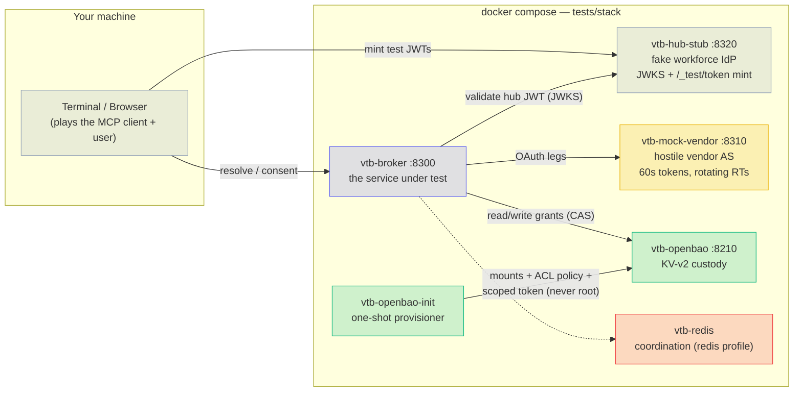
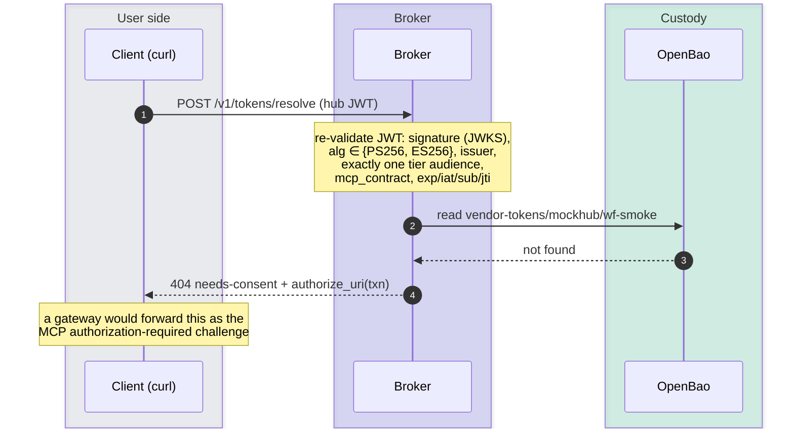
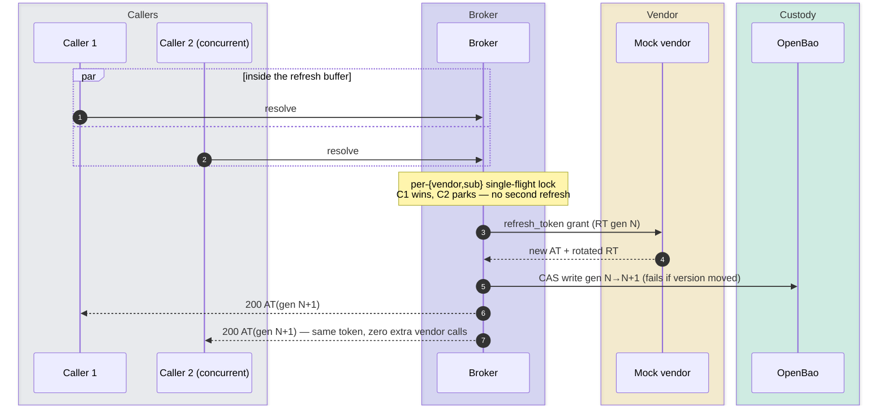
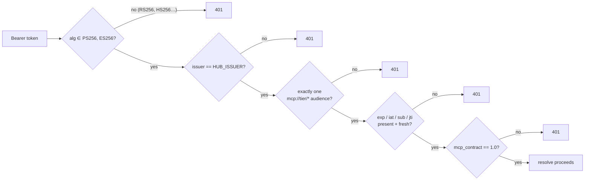
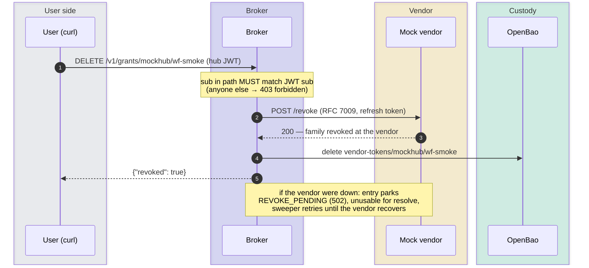
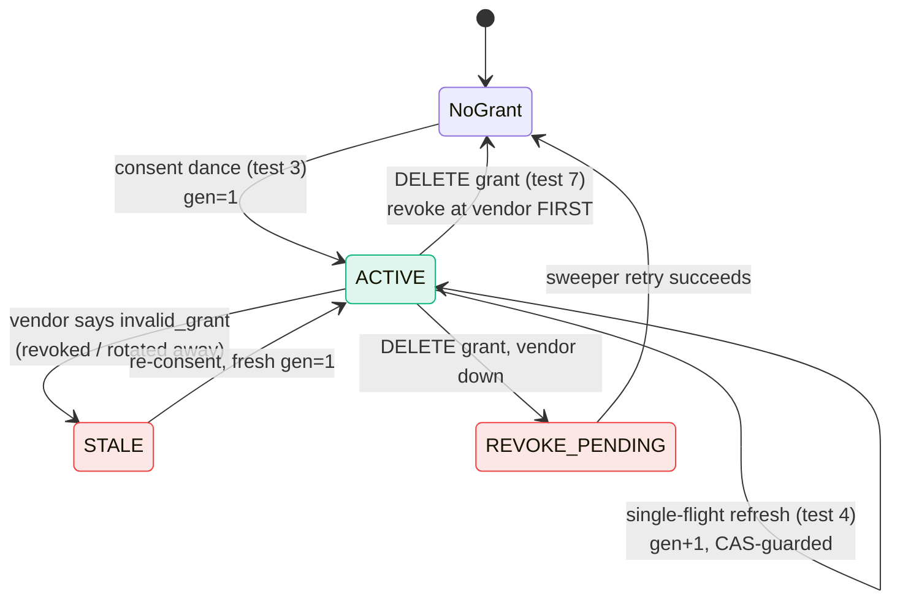

# Manual smoke tests — illustrated walkthrough

A hands-on verification of every security property the broker claims, run
against the self-contained test stack with nothing but `curl` and a
browser. Each test below was executed for real; the outputs shown are
actual captures. The same properties are enforced continuously by the
automated suite (`tests/unit`, `tests/integration`).

**Conventions used throughout** (wrap-proof for narrow terminals):

```sh
echo '{"vendor":"mockhub"}' > /tmp/req.json    # resolve request body
# hub JWT lives in /tmp/tok; every resolve is:
#   curl -s -X POST localhost:8300/v1/tokens/resolve \
#        -d @/tmp/req.json -H "Authorization: Bearer $(cat /tmp/tok)"
```

## The stack under test



The mock vendor is deliberately hostile in the ways that matter: 60-second
access tokens (every resolve lands inside the refresh buffer), rotating
refresh tokens where replaying a consumed one **revokes the whole family**
(GitHub-class), PKCE verified for real, RFC 8414 metadata + RFC 9207 `iss`
on redirects, RFC 7009 revocation.

---

## Test 1 — stack up, scoped custody token

```sh
docker compose -f tests/stack/docker-compose.yml up -d --build --wait
curl -s http://localhost:8300/healthz        # -> {"ok":true}
docker logs vtb-openbao-init
```

Observed provisioner receipt:

```
==> Waiting for OpenBao at http://openbao:8200...
==> Writing vendor client credentials to vendor-clients/...
==> mockhub-jwt (private_key_jwt) client configured
==> OpenBao initialized (scoped broker token ready)
```

**What this proves:** the broker runs with a policy-scoped custody token
(read/write on `vendor-tokens/*`, read-only on `vendor-clients/*`) — never
root. Vendor client credentials (including the `private_key_jwt` signing
key) live in custody, not in the registry or environment.

---

## Test 2 — hub-JWT validation at the door, consent challenge

Mint a workforce JWT from the hub-stub, then ask the broker to resolve:

```sh
curl -s -X POST localhost:8320/_test/token -d '{"sub":"wf-smoke"}' -o /tmp/mint.json
sed 's/.*"access_token":"\([^"]*\)".*/\1/' /tmp/mint.json > /tmp/tok
curl -s -X POST localhost:8300/v1/tokens/resolve -d @/tmp/req.json \
     -H "Authorization: Bearer $(cat /tmp/tok)"
```

Observed:

```json
{"type":"urn:vendor-token-broker:needs-consent","title":"needs-consent",
 "detail":"no usable grant for mockhub",
 "authorize_uri":"http://localhost:8300/v1/authorize/mockhub?txn=RiHcUB2s..."}
```



**What this proves:** a valid hub JWT is accepted but *authorization is
per-user*: no grant → no token, only a one-time consent transaction
(`txn`, TTL 10 min).

---

## Test 3 — the consent dance (terminal and real browser)

Follow the `authorize_uri`. In a terminal, with a cookie jar (the flow is
bound to the browser that starts it, so cookies must persist across the
redirects): `curl -sL -c /tmp/jar -b /tmp/jar "<authorize_uri>"`. In a real
browser (what an actual user experiences):

```sh
curl -s -X POST localhost:8300/v1/tokens/resolve -d @/tmp/req.json \
     -H "Authorization: Bearer $(cat /tmp/tok)" -o /tmp/challenge.json
open "$(sed 's/.*"authorize_uri":"\([^"]*\)".*/\1/' /tmp/challenge.json)"
```

Observed (v1.1, captured with `curl -sL -D -`; codes, states, nonces and
the cookie value elided): the browser travels broker → hub login → broker →
vendor → broker:

```
307  location: http://localhost:8320/authorize?client_id=vtb-broker&response_type=code
       &scope=openid&redirect_uri=http%3A%2F%2Flocalhost%3A8300%2Fv1%2Fcallback%2F_hub
       &state=…&nonce=…&code_challenge=…&code_challenge_method=S256&login_hint=wf-smoke
     set-cookie: vtb_consent_mockhub=…; HttpOnly; Max-Age=600; Path=/v1/callback; SameSite=lax
307  location: http://localhost:8300/v1/callback/_hub?code=…&state=…&iss=http%3A%2F%2Fhub-stub%3A8320
307  location: http://localhost:8310/authorize?client_id=mcp-lab-broker&response_type=code
       &redirect_uri=http%3A%2F%2Flocalhost%3A8300%2Fv1%2Fcallback%2Fmockhub
       &scope=issues%3Aread+issues%3Awrite&state=…&code_challenge=…&code_challenge_method=S256
307  location: http://localhost:8300/v1/callback/mockhub?code=…&state=…&iss=http%3A%2F%2Fmock-vendor%3A8310
200  <h1>Connected — return to your client.</h1>
```

The hub stub signs the browser in automatically as the `login_hint`; a real
hub shows its own sign-in page (or reuses an existing session).

with the page **"Connected — return to your client."** The broker log
shows the matching audit pair:

```json
{"audit": "broker.consent.start",    "sub": "wf-smoke", "vendor": "mockhub"}
{"audit": "broker.consent.complete", "sub": "wf-smoke", "vendor": "mockhub", "vendor_user_id": "mock-4217"}
```


Then the retry resolves cleanly:

```sh
curl -s -X POST localhost:8300/v1/tokens/resolve -d @/tmp/req.json \
     -H "Authorization: Bearer $(cat /tmp/tok)"
```

```json
{"access_token":"mock-at-nV2-JGwg…","expires_at":1784286345.61,
 "granted_scopes":["issues:read","issues:write"]}
```

**What this proves:**
- The PKCE verifier and `state` never leave the broker in decodable form;
  the vendor `code` is redeemed server-side only.
- Consent is bound to the **user** (the hub login must be the link's `sub`)
  and to the **browser** (the binding cookie). A link forwarded to or stolen
  from someone else is refused before the vendor is involved
  (`reason: login_sub_mismatch`), and a leg finished in another browser is
  refused before any code is redeemed (`reason: browser_mismatch`). Both
  are `security_event: true` audit lines.
- The authorize link is single use: opening it again returns 400
  `invalid-transaction`.
- The RFC 9207 `iss` in the callback URL is string-compared against the
  issuer recorded at transaction creation *before* the code is redeemed
  (mix-up defense). An AS that advertises `iss` support but omits it is
  rejected the same way.
- **Replay demo:** reloading the "Connected" page returns
  *"Invalid or expired authorization state."* — the state was consumed;
  the replay raises a `security_event: true` audit line
  (`reason: state_invalid_or_replayed`).
- The caller now holds a **vendor** token — the hub JWT never transits to
  the vendor.

---

## Test 4 — single-flight refresh and the generation counter

The mock's 60-second tokens force a refresh on every resolve. Resolve
twice, then read the audit trail:

```sh
curl -s -X POST localhost:8300/v1/tokens/resolve -d @/tmp/req.json \
     -H "Authorization: Bearer $(cat /tmp/tok)"       # new mock-at-… each time
docker logs --since 5m vtb-broker 2>&1 | grep broker.refresh | tail -3
```

Observed:

```json
{"audit": "broker.refresh", "sub": "wf-smoke", "vendor": "mockhub", "generation_from": 1, "generation_to": 2}
{"audit": "broker.refresh", "sub": "wf-smoke", "vendor": "mockhub", "generation_from": 2, "generation_to": 3}
```



**What this proves:** every refresh advances the monotonic
`refresh_generation`, and the KV-v2 compare-and-swap on that version is
the correctness backstop: two racing refreshes can never both persist, so
a rotating refresh-token family is never burned. (The automated suite
drives 20 parallel resolves and asserts *exactly one* vendor refresh and
*zero* RT replays — including across two replicas behind a load balancer.)
Note also what the audit lines contain: ids, states, generations — never
token material.

---

## Test 5 — forged-algorithm token rejected at the door

The hub-stub mints an **RS256** token signed with the *same trusted RSA
key* that's in its JWKS — cryptographically valid, key resolvable, wrong
algorithm:

```sh
curl -s -X POST localhost:8320/_test/token -d '{"sub":"wf-smoke","kind":"rs256"}' -o /tmp/mint2.json
sed 's/.*"access_token":"\([^"]*\)".*/\1/' /tmp/mint2.json > /tmp/badtok
curl -s -X POST localhost:8300/v1/tokens/resolve -d @/tmp/req.json \
     -H "Authorization: Bearer $(cat /tmp/badtok)"
```

Observed:

```json
{"type":"urn:vendor-token-broker:invalid-hub-token","title":"invalid-hub-token",
 "detail":"The specified alg value is not allowed"}
```



The same 401 lands for every bad variant the stub can mint —
`wrong_issuer`, `external_tier`, `two_tiers` (cross-tier token),
`expired`, `no_jti`, `wrong_contract`, `no_contract` — and, as we saw
live, a *genuinely expired* previously-good token:
`"detail":"Signature has expired"`.

**What this proves:** the broker never trusts the gateway; it re-validates
every inbound hub JWT itself, with algorithms pinned.

---

## Test 6 — the no-issuance wall

```sh
for p in /token /oauth/token /keys /v1/tokens/issue \
         /.well-known/jwks.json /.well-known/openid-configuration; do
  curl -s -o /dev/null -w "$p -> %{http_code}\n" localhost:8300$p
done
```

Observed:

```
/token -> 404
/oauth/token -> 404
/keys -> 404
/v1/tokens/issue -> 404
/.well-known/jwks.json -> 404
/.well-known/openid-configuration -> 404
```

**What this proves:** the broker is a custodian, not an issuer. Its whole
API is seven routes — `/healthz`, `/v1/tokens/resolve`,
`/v1/authorize/{vendor}`, `/v1/callback/{vendor}`,
`/v1/grants/{vendor}/{sub}`, `/v1/grants`, `/v1/admin/vendors/{vendor}` —
no token minting, no JWKS, no signing keys anywhere in the process.
(`tests/unit/test_routes.py` freezes this at the OpenAPI level on every
push.)

---

## Test 7 — self-service revocation, vendor-first

```sh
curl -s localhost:8310/_test/state | grep -o '"revoke":[0-9]*'   # "revoke":0
curl -s -X DELETE localhost:8300/v1/grants/mockhub/wf-smoke \
     -H "Authorization: Bearer $(cat /tmp/tok)"                   # {"revoked":true}
curl -s localhost:8310/_test/state | grep -o '"revoke":[0-9]*'   # "revoke":1
curl -s -X POST localhost:8300/v1/tokens/resolve -d @/tmp/req.json \
     -H "Authorization: Bearer $(cat /tmp/tok)"                   # needs-consent again
```



**What this proves:** revocation is ordered vendor-first, so a vendor-side
token can never outlive the broker's record; grants are strictly
self-service; the lifecycle returns cleanly to `needs-consent`.

---

## The full lifecycle we walked



## Scorecard

| # | Property | Verified by |
|---|---|---|
| 1 | Scoped custody token, never root | provisioner receipt |
| 2 | Hub-JWT re-validation + per-user consent challenge | 404 `needs-consent` |
| 3 | PKCE + single-use sub-bound state + RFC 9207 iss | browser dance → "Connected"; reload → rejected replay |
| 4 | Single-flight refresh, generation CAS, id-only audit | gen 1→2→3 in `broker.refresh` |
| 5 | Algorithm pinning / contract shape at the door | RS256 & expired → 401 `invalid-hub-token` |
| 6 | No-issuance surface | six issuer paths → 404 |
| 7 | Vendor-first revocation, self-service only | RFC 7009 counter 0→1, entry gone |

Tear down with:

```sh
docker compose -f tests/stack/docker-compose.yml down
```
