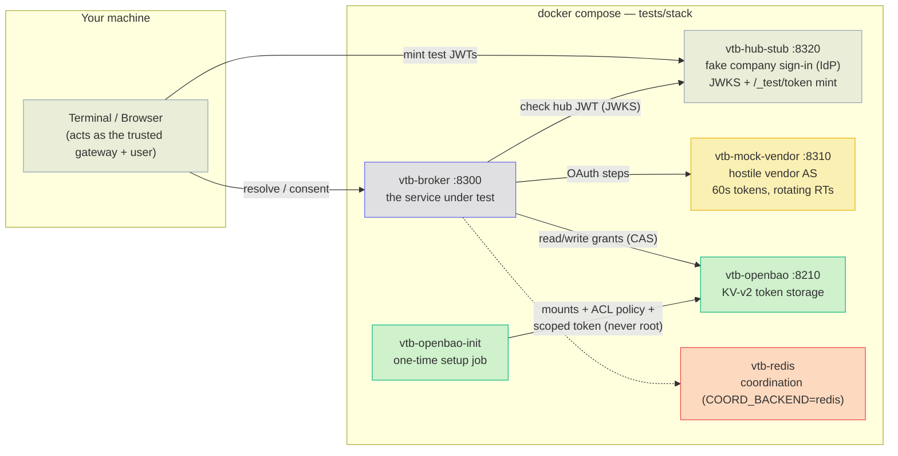
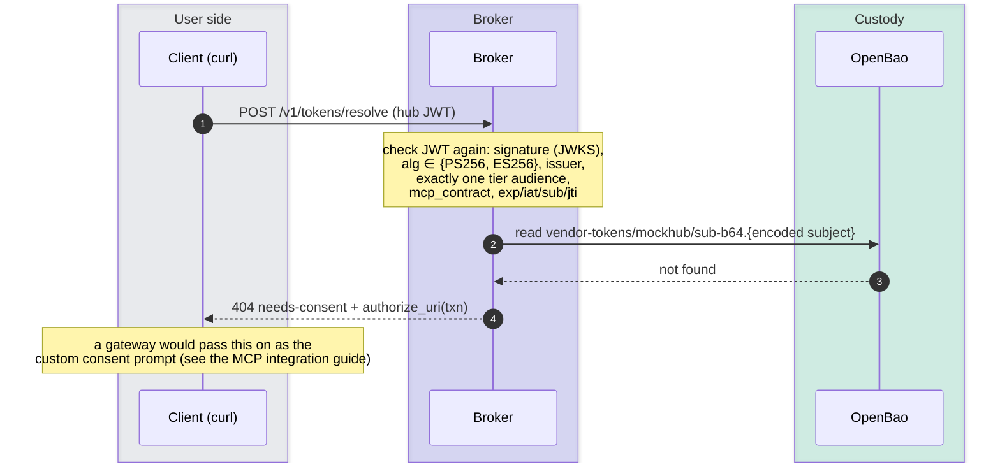
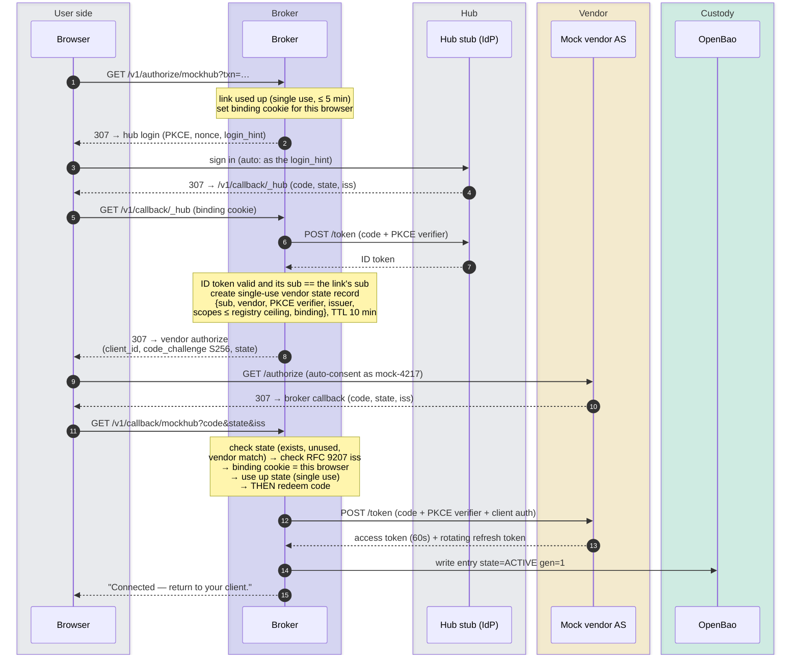
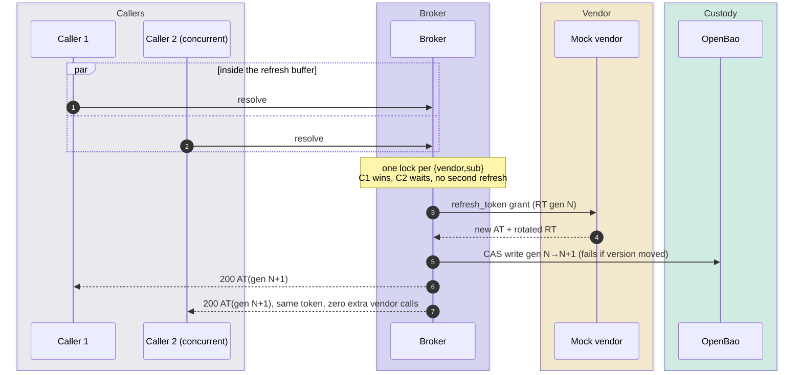
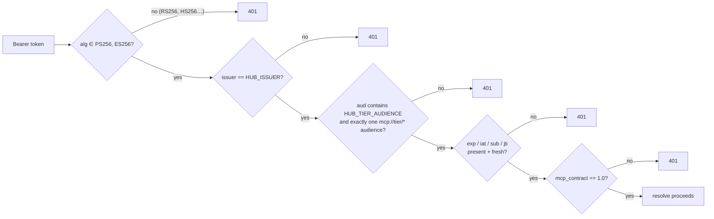
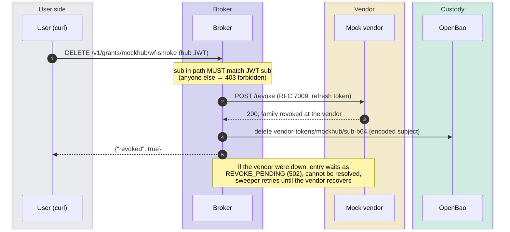
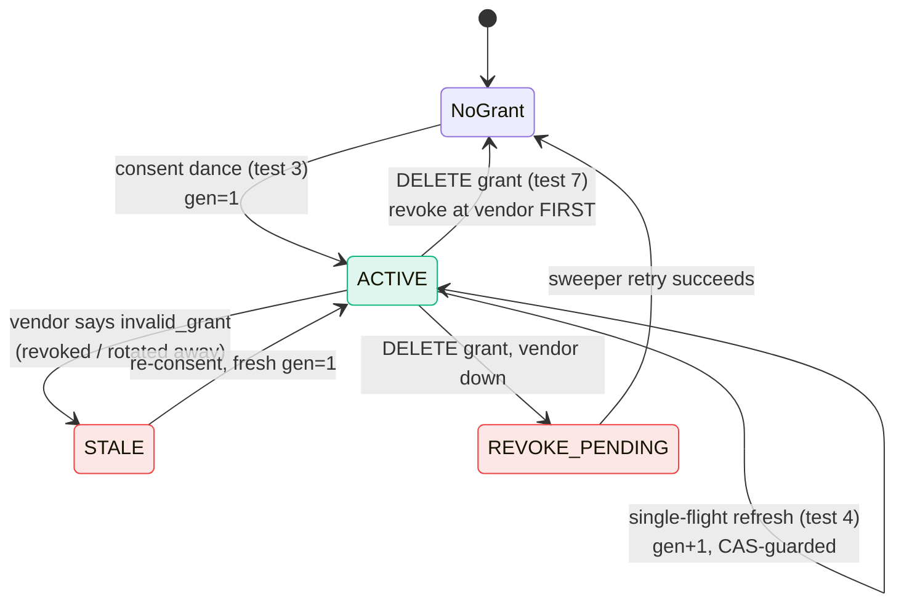

# Manual smoke tests — illustrated walkthrough

This page walks you through key security and lifecycle checks by hand. You
run them against the self-contained test stack, using only `curl` and a
browser.

- The outputs below show what to expect. Ids and timestamps will differ.
- For dated suite results, see the
  [verification record](security.md#verification-record).
- The automated suite (`tests/unit`, `tests/integration`) checks the same
  properties on every run.
- These tests exercise the broker directly. For the MCP gateway that sits
  in front of it, see [the MCP gateway page](mcp-gateway.md).

**Conventions used on this page.** The commands are written to fit narrow
terminals:

```sh
echo '{"vendor":"mockhub"}' > /tmp/req.json    # resolve request body
# hub JWT lives in /tmp/tok; every resolve is:
#   curl -s -X POST localhost:8300/v1/tokens/resolve \
#        -d @/tmp/req.json -H "Authorization: Bearer $(cat /tmp/tok)"
```

## The stack under test

The test stack runs in Docker Compose. Your terminal and browser play the
part of the trusted gateway and the user.



Terms used on this page:

- **Hub** — your company's sign-in service (identity provider). Here, a
  stub plays it. A **hub JWT** is the signed token it issues for a user.
- **Custody** — where the broker stores vendor tokens (OpenBao KV-v2).
- **Grant** — one user's stored vendor tokens for one vendor.

The mock vendor is hostile on purpose, in the ways that matter:

- Access tokens last 60 seconds, so every resolve lands inside the refresh
  buffer.
- Refresh tokens rotate. Sending a used one again **revokes the whole
  family** (GitHub-class).
- It checks PKCE for real.
- It publishes RFC 8414 metadata and adds the RFC 9207 `iss` to redirects.
- It supports RFC 7009 revocation.

---

## Test 1 — stack up, scoped custody token

Start the stack and check that the broker does not use a root token.

```sh
docker compose -f tests/stack/docker-compose.yml up -d --build --wait
curl -s http://localhost:8300/healthz        # -> {"ok":true,"custody":"ok"}
docker logs vtb-openbao-init
```

The setup job prints:

```
==> Waiting for OpenBao at http://openbao:8200...
==> Writing vendor client credentials to vendor-clients/...
==> mockhub-jwt (private_key_jwt) client configured
==> OpenBao initialized (scoped broker token ready)
```

**What this proves:**

- The broker uses a custody token limited by policy, never root. It can
  read and write `vendor-tokens/*` and only read `vendor-clients/*`.
- Vendor client credentials live in custody, not in the registry or the
  environment. This includes the `private_key_jwt` signing key.

---

## Test 2 — hub-JWT validation at the door, consent challenge

Get a hub JWT from the hub stub, then ask the broker to resolve a token:

```sh
curl -s -X POST localhost:8320/_test/token -d '{"sub":"wf-smoke"}' -o /tmp/mint.json
sed 's/.*"access_token":"\([^"]*\)".*/\1/' /tmp/mint.json > /tmp/tok
curl -s -X POST localhost:8300/v1/tokens/resolve -d @/tmp/req.json \
     -H "Authorization: Bearer $(cat /tmp/tok)"
```

Expected:

```json
{"type":"urn:vendor-token-broker:needs-consent","title":"needs-consent",
 "detail":"no usable grant for mockhub",
 "authorize_uri":"http://localhost:8300/v1/authorize/mockhub?txn=RiHcUB2s..."}
```



**What this proves:** the broker accepts a valid hub JWT, but access is
*per user*. With no grant, the user gets no token. Instead the broker
returns a one-time consent link (`txn`).

- The link can start consent for 5 minutes.
- Consent state lasts 10 minutes by default.

---

## Test 3 — the consent dance (terminal and real browser)

Follow the `authorize_uri`. You can do this in a terminal or a real
browser.

**In a terminal**, use a cookie jar. The flow is tied to the browser that
starts it, so cookies must carry across the redirects:
`curl -sL -c /tmp/jar -b /tmp/jar "<authorize_uri>"`.

**In a real browser** (what a real user sees):

```sh
curl -s -X POST localhost:8300/v1/tokens/resolve -d @/tmp/req.json \
     -H "Authorization: Bearer $(cat /tmp/tok)" -o /tmp/challenge.json
open "$(sed 's/.*"authorize_uri":"\([^"]*\)".*/\1/' /tmp/challenge.json)"
```

The browser goes broker → hub login → broker → vendor → broker. Output from
v1.1, captured with `curl -sL -D -` (codes, states, nonces and the cookie
value are hidden):

```
307  location: http://localhost:8320/authorize?client_id=vtb-broker&response_type=code
       &scope=openid&redirect_uri=http%3A%2F%2Flocalhost%3A8300%2Fv1%2Fcallback%2F_hub
       &state=…&nonce=…&code_challenge=…&code_challenge_method=S256&login_hint=wf-smoke
     set-cookie: vtb_consent_mockhub=…; HttpOnly; Max-Age=600; Path=/v1/callback; SameSite=lax
307  location: http://localhost:8300/v1/callback/_hub?code=…&state=…&iss=http%3A%2F%2Fhub-stub%3A8320
307  location: http://localhost:8310/authorize?client_id=mcp-lab-broker&response_type=code
       &redirect_uri=http%3A%2F%2Flocalhost%3A8300%2Fv1%2Fcallback%2Fmockhub
       &scope=issues%3Aread+issues%3Awrite&state=…&code_challenge=…&code_challenge_method=S256
307  location: http://localhost:8300/v1/callback/mockhub?code=…&state=…&iss=http%3A%2F%2Fmock-vendor%3A8310
200  <h1>Connected — return to your client.</h1>
```

The hub stub signs the browser in automatically as the `login_hint` user.
A real hub shows its own sign-in page, or reuses an existing session.

The flow ends on the page **"Connected — return to your client."** The
broker log shows the matching audit pair:

```json
{"audit": "broker.consent.start",    "sub": "wf-smoke", "vendor": "mockhub"}
{"audit": "broker.consent.complete", "sub": "wf-smoke", "vendor": "mockhub", "vendor_user_id": "mock-4217"}
```



Now the retry succeeds:

```sh
curl -s -X POST localhost:8300/v1/tokens/resolve -d @/tmp/req.json \
     -H "Authorization: Bearer $(cat /tmp/tok)"
```

```json
{"access_token":"mock-at-nV2-JGwg…","expires_at":1784286345.61,
 "granted_scopes":["issues:read","issues:write"]}
```

**What this proves:**

- The PKCE verifier appears only in server-side token requests. The
  browser sees `state` values only as opaque handles. The broker redeems
  the vendor `code` on the server only.
- Consent is tied to the **user** and to the **browser**:
  - The hub login must match the link's `sub`. A link forwarded to someone
    else, or stolen, is refused before the vendor is involved
    (`reason: login_sub_mismatch`).
  - The binding cookie must match. A step finished in another browser is
    refused before any code is redeemed (`reason: browser_mismatch`).
  - Both refusals write `security_event: true` audit lines.
- The authorize link works once. Opening it again returns 400
  `invalid-transaction`.
- The broker compares the `iss` in the callback URL, as an exact string,
  with the issuer it recorded when the link was made. It does this
  *before* redeeming the code (this stops mix-up attacks). If the vendor
  says it supports `iss` but leaves it out, the broker rejects the
  callback the same way.
- **Replay demo:** reload the "Connected" page. You get
  *"Invalid or expired authorization state."* The state was already used.
  The replay writes a `security_event: true` audit line
  (`reason: state_invalid_or_replayed`).
- The stand-in gateway (your terminal) now holds a **vendor** token. The
  hub JWT never goes to the vendor.

Standards: RFC 9207.

---

## Test 4 — single-flight refresh and the generation counter

The mock's 60-second tokens force a refresh on every resolve. The Test 3
retry already refreshed gen 1→2. Resolve once more, then read the audit
trail:

```sh
curl -s -X POST localhost:8300/v1/tokens/resolve -d @/tmp/req.json \
     -H "Authorization: Bearer $(cat /tmp/tok)"       # new mock-at-… each time
docker logs --since 5m vtb-broker 2>&1 | grep broker.refresh | tail -3
```

Expected:

```json
{"audit": "broker.refresh", "sub": "wf-smoke", "vendor": "mockhub", "generation_from": 1, "generation_to": 2}
{"audit": "broker.refresh", "sub": "wf-smoke", "vendor": "mockhub", "generation_from": 2, "generation_to": 3}
```



**What this proves:**

- Every refresh raises `refresh_generation` by one. It never goes down.
- The KV-v2 compare-and-swap (CAS) on that version keeps data correct. Two
  racing refreshes can never both be saved. A writer that loses the race
  cannot overwrite a newer stored version.
- Limit: if the broker crashes after the vendor accepts a refresh token,
  the family can still be burned. The user must then consent again.
- The automated suite sends 20 resolves at once. It checks for *exactly
  one* vendor refresh and *zero* RT replays, including across two replicas
  behind a load balancer.
- The audit lines hold ids, states and generations only, never token
  material.

---

## Test 5 — forged-algorithm token rejected at the door

The hub stub can make an **RS256** token signed with the *same trusted RSA
key* that is in its JWKS. The signature is valid and the key can be found.
Only the algorithm is wrong:

```sh
curl -s -X POST localhost:8320/_test/token -d '{"sub":"wf-smoke","kind":"rs256"}' -o /tmp/mint2.json
sed 's/.*"access_token":"\([^"]*\)".*/\1/' /tmp/mint2.json > /tmp/badtok
curl -s -X POST localhost:8300/v1/tokens/resolve -d @/tmp/req.json \
     -H "Authorization: Bearer $(cat /tmp/badtok)"
```

Expected:

```json
{"type":"urn:vendor-token-broker:invalid-hub-token","title":"invalid-hub-token",
 "detail":"The specified alg value is not allowed"}
```



You get the same 401 for every bad token the stub can make:
`wrong_issuer`, `external_tier`, `two_tiers` (a token for two tiers),
`expired`, `no_jti`, `wrong_contract`, `no_contract`. A good token that
has *really expired* also gets it, with
`"detail":"Signature has expired"`.

**What this proves:** the broker does not trust the gateway. It checks
every incoming hub JWT itself, and accepts only the allowed algorithms.

---

## Test 6 — the no-issuance wall

The broker has no endpoints for issuing tokens. Probe the usual paths:

```sh
for p in /token /oauth/token /keys /v1/tokens/issue \
         /.well-known/jwks.json /.well-known/openid-configuration; do
  curl -s -o /dev/null -w "$p -> %{http_code}\n" localhost:8300$p
done
```

Expected:

```
/token -> 404
/oauth/token -> 404
/keys -> 404
/v1/tokens/issue -> 404
/.well-known/jwks.json -> 404
/.well-known/openid-configuration -> 404
```

**What this proves:** the broker stores tokens. It does not issue them.

- Its whole API is seven routes: `/healthz`, `/v1/tokens/resolve`,
  `/v1/authorize/{vendor}`, `/v1/callback/{vendor}`,
  `/v1/grants/{vendor}/{sub}`, `/v1/grants`, `/v1/admin/vendors/{vendor}`.
- It has no access-token issuance endpoint and no JWKS endpoint.
- It can hold vendor client-authentication keys and sign
  `private_key_jwt` assertions.
- `tests/unit/test_routes.py` checks the actual route table on every push.

---

## Test 7 — self-service revocation, vendor-first

A user deletes their own grant. The broker revokes at the vendor first,
then deletes the stored entry.

```sh
curl -s localhost:8310/_test/state | grep -o '"revoke":[0-9]*'   # "revoke":0
curl -s -X DELETE localhost:8300/v1/grants/mockhub/wf-smoke \
     -H "Authorization: Bearer $(cat /tmp/tok)"                   # {"revoked":true}
curl -s localhost:8310/_test/state | grep -o '"revoke":[0-9]*'   # "revoke":1
curl -s -X POST localhost:8300/v1/tokens/resolve -d @/tmp/req.json \
     -H "Authorization: Bearer $(cat /tmp/tok)"                   # needs-consent again
```



**What this proves:**

- This mock supports revoking at the vendor first. For vendors without
  revocation support, the broker deletes the entry locally only.
- Users can delete only their own grants.
- The lifecycle returns cleanly to `needs-consent`.

---

## The full lifecycle we walked



For every path in detail, see [the token lifecycle](token-lifecycle.md).

## Scorecard

| # | Property | Verified by |
|---|---|---|
| 1 | Scoped custody token, never root | setup job output |
| 2 | Hub-JWT re-check + per-user consent challenge | 404 `needs-consent` |
| 3 | PKCE + single-use state tied to `sub` + RFC 9207 iss | browser flow → "Connected"; reload → replay rejected |
| 4 | Single-flight refresh, generation CAS, id-only audit | gen 1→2→3 in `broker.refresh` |
| 5 | Only allowed algorithms / contract shape at the door | RS256 & expired → 401 `invalid-hub-token` |
| 6 | No token-issuing endpoints | six issuer paths → 404 |
| 7 | Revoke at vendor first, users delete only their own | RFC 7009 counter 0→1, entry gone |

Tear down with:

```sh
docker compose -f tests/stack/docker-compose.yml down
```
