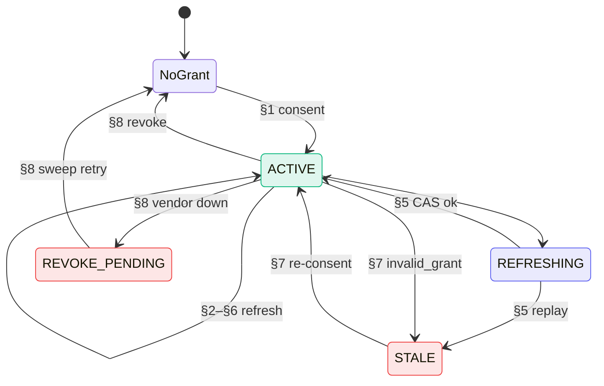
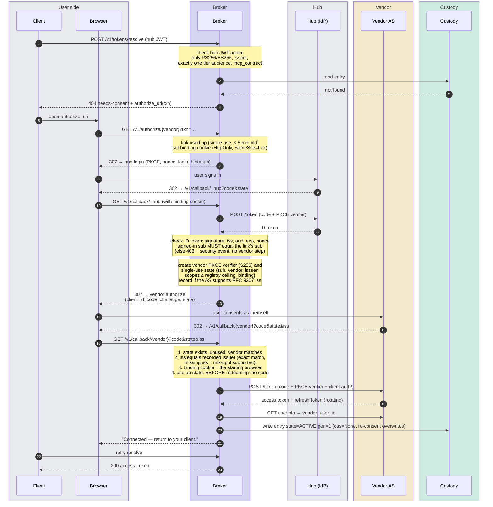
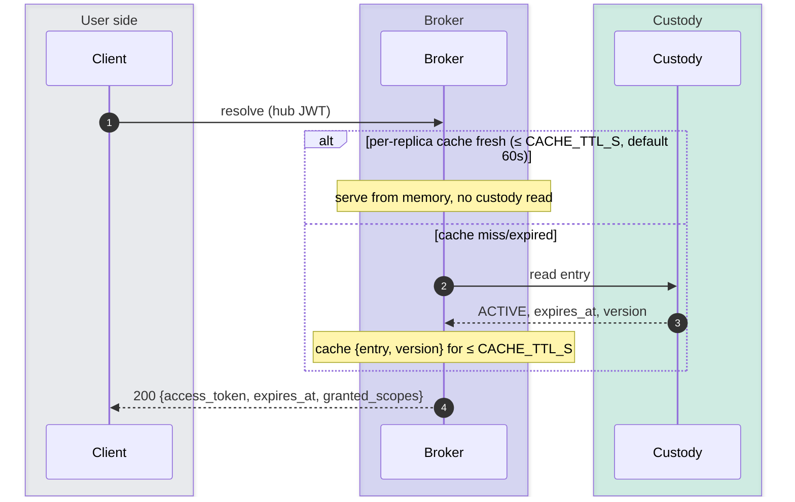
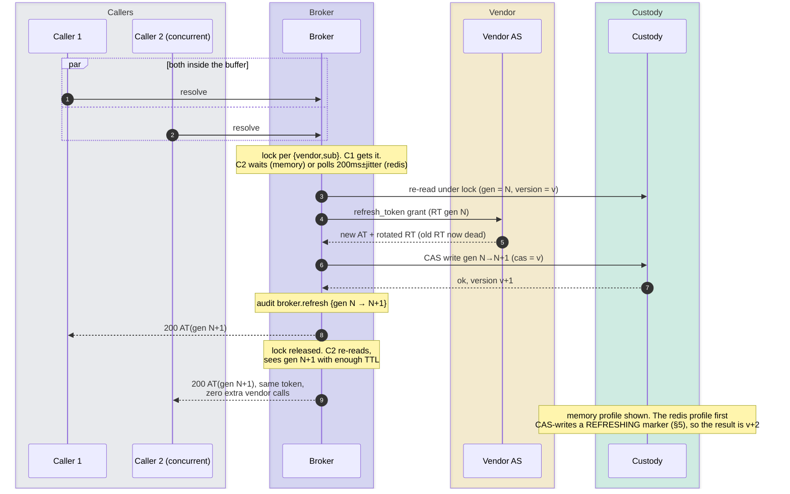
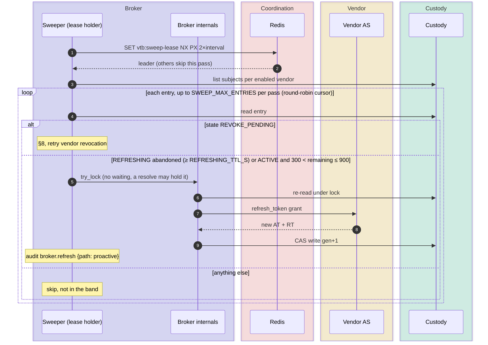
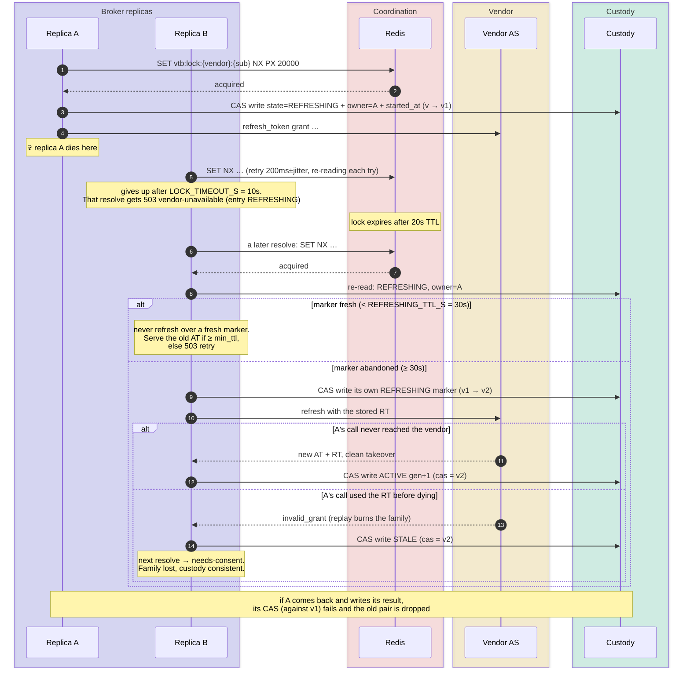
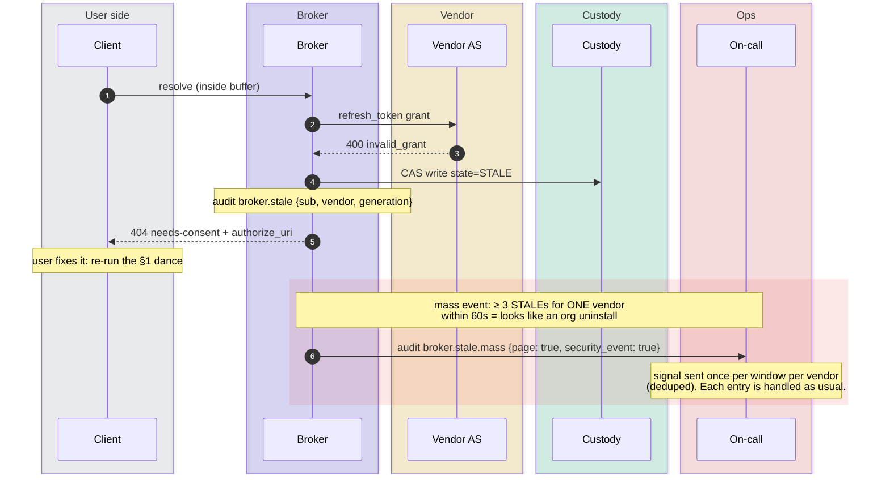
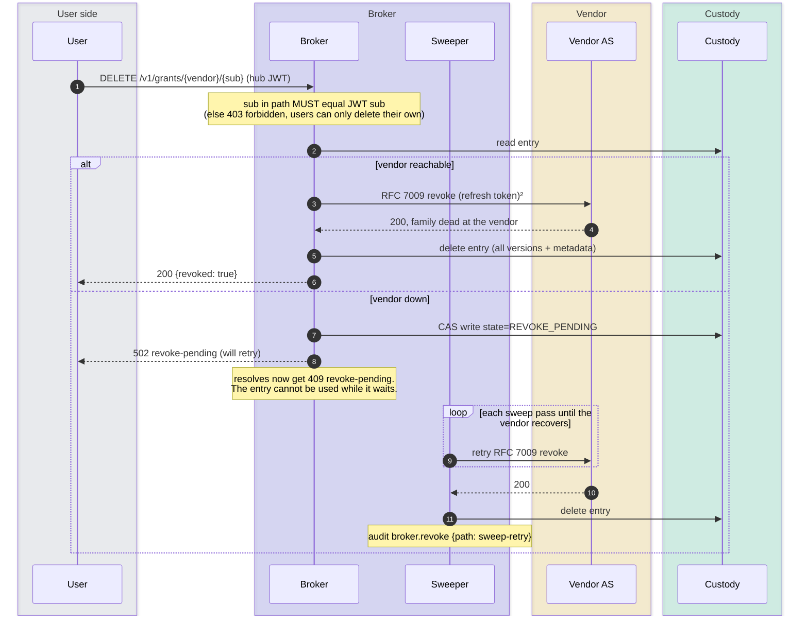
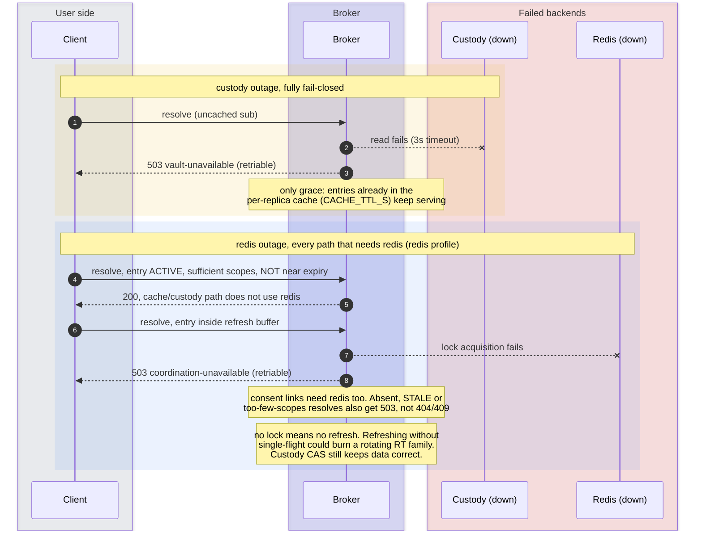

# Token lifecycle — sequence diagrams

This page shows every path a user's vendor connection (a "grant") can take
through the broker. It starts at first consent and ends at deletion. It also
shows what happens when things fail.

- A **grant** is the stored pair of vendor tokens for one user and one
  vendor (for example, one person's GitHub tokens).
- Timings are the defaults from `config.py`.
- For the rules behind these diagrams, see `design.md`. To try these same
  paths by hand, see `smoke-tests.md`.
- If you use the broker through the MCP gateway, see
  [the MCP gateway page](mcp-gateway.md) first. This page covers the engine
  underneath.

**Cast** (the same in every diagram):

| Actor | Role |
|---|---|
| Client | The trusted gateway that calls the broker. It sends the user's hub JWT (a signed sign-in token from the hub, your company's sign-in service). It is not the MCP client. |
| Broker | This service. One replica unless the diagram says otherwise. |
| Vendor AS | The vendor's authorization server, which issues vendor tokens. GitHub-class: it rotates refresh tokens. |
| Custody | OpenBao/Vault KV-v2, where tokens are stored. Each entry's KV version is the CAS handle (CAS = compare-and-swap: a write succeeds only if the version has not changed). |
| Redis | The coordination backend. Used only in the multi-replica (redis) profile. |

## 0. Orientation — the states and which diagram covers each transition

A grant is always in one of these states. The numbers (§1 to §8) point to
the diagram that shows each change.

| Transition group | Diagram | What happens |
|---|---|---|
| §1 | Birth | The consent flow writes `ACTIVE gen=1`. |
| §2–§4 | Steady state / refresh | The broker serves from cache, or refreshes on demand or ahead of time (`gen+1`). |
| §5 | Multi-replica | A stored `REFRESHING` marker, takeover by another replica, and the CAS backstop. |
| §6 | Scope step-up | Re-consent for the combined scopes writes a fresh `gen=1`. |
| §7 | STALE | `invalid_grant` leads to re-consent. A burst of these pages on-call. |
| §8 | Revocation | The broker revokes at the vendor first, then deletes. If the vendor is down, the entry waits in `REVOKE_PENDING`. |

`REFRESHING` exists only in the redis profile. Callers never see it:
`/v1/grants` reports it as `ACTIVE`.

---

## 1. Birth — first-time consent dance

This runs when a resolve finds no entry, or a STALE one, for `{vendor, sub}`.
(`sub` is the user's id from the hub JWT.)

¹ Client auth follows the registry's `token_endpoint_auth_method`:
`client_secret_post`, `client_secret_basic`, or `private_key_jwt`. For
`private_key_jwt`, the broker signs an assertion with the key from
`vendor-clients/{vendor}` (RFC 7523).

How this flow protects the user:

- Only the user the link was made for can finish consent, and only in the
  browser that opened the link. The hub login and the binding cookie
  enforce this.
- The broker redeems the code on the server only.
- The browser sees only opaque state handles.
- The PKCE verifier appears only in server-side token requests.
- A replayed callback (state already used) gets a 400 **and** a
  `security_event: true` audit line.
- A changed or missing `iss` is rejected *before* the state is used up. So
  the real callback can still finish.

Standards: RFC 7523, RFC 9207.

---

## 2. Steady state — cache-hit resolve

This runs when the token has plenty of time left:
`expires_at − now ≥ max(min_ttl_s, REFRESH_BUFFER_S=300)`.

- This is the hot path. Target: p99 ≤ 25 ms.
- The 60-second cache is also the **only** grace the broker gives during a
  custody outage (§9).

---

## 3. Lazy refresh — single-flight inside the buffer

This runs when the entry is ACTIVE but close to expiry:
`expires_at − now < max(min_ttl, 300)`.

Some vendors rotate refresh tokens. If a used refresh token is sent again,
they revoke the whole token family. So when many resolves arrive at once,
the broker must make exactly one vendor call ("single-flight").

What a waiting caller gets, best case first:

1. The generation moved forward: it gets the winner's token.
2. It waited more than 10s for the lock: it re-reads once. If the token is
   still usable, it gets it. If not, it gets `503 vendor-unavailable`
   (safe to retry).
3. The winner got `invalid_grant`: the waiter finds STALE and gets
   `needs-consent`.

---

## 4. Proactive refresh — the sweeper

The sweeper is a background loop. It refreshes tokens before callers need
them.

- It runs every `SWEEP_INTERVAL_S=60`. In the redis profile, only the leader
  runs it, with ±20% jitter.
- It targets entries with 5–15 minutes left.
- Entries with 0–5 minutes left are left to lazy refresh (§3).

One failed entry never stops the loop. The sweeper logs
`broker.sweep.error` and moves on.

---

## 5. Multi-replica refresh — persisted REFRESHING, takeover, CAS backstop

This applies to the redis profile only.

- The lock is a speed-up. The custody CAS is what keeps data correct.
- A replica that dies mid-refresh can never corrupt the stored token pair.

---

## 6. Scope step-up — 409 needs-reconsent-scope

This runs when a grant exists but lacks some of the tool's
`required_scopes`. The caller can never ask for more than the registry
ceiling (the most scopes the registry allows for that vendor).

---

## 7. Death by vendor — STALE and the mass-STALE page

`invalid_grant` on refresh means the grant is gone at the vendor. Common
causes:

- the user revoked access at the vendor
- the refresh token expired from disuse
- the org uninstalled the app

- One STALE is normal and not an incident.
- To notify on-call about a burst, route the burst signal through your
  monitoring.

---

## 8. Death by choice — revocation, vendor-first

Order matters: the broker tries to revoke at the vendor before it deletes
from custody.

- If a vendor has no revocation endpoint, the broker deletes the entry
  locally only. It reports `vendor_revocation: "unsupported"`.
- In that case, access at the vendor can outlive the deletion.

² GitHub does this differently. It uses its grant-deletion API with basic
auth instead of RFC 7009 (`revocation.type: github_grant` in the registry).

---

## 9. Outages — fail closed, distinguishably

When a backend is down, the broker refuses rather than guesses ("fails
closed"). Each backend fails in its own, recognizable way.

Neither failure ever looks like "no grant". That would send every user
into re-consent at once.

- Normal service resumes when the backends come back.
- Custody stays the lasting store of credentials.
- If Redis loses consent records, users must start a new browser flow.

---

## Reading the audit trail

Every transition above writes JSON log lines with ids only, never token
material. One action can log more than one event. For example, a lazy
refresh logs both `broker.refresh` and `broker.resolve`.

How to link events together:

| Event | Emitted in | Joins on |
|---|---|---|
| `broker.resolve` {decision, path} | §§2,3,6,7,9 | `hub_jti`, `sub`, `vendor` |
| `broker.consent.start` / `.complete` / `.fail` | §1, §6 | `sub`, `vendor`, `vendor_user_id` |
| `broker.refresh` {generation_from → to} | §§3,4,5 | `sub`, `vendor` |
| `broker.stale` / `broker.stale.mass` | §7 | `sub`/`vendor`; mass carries `page: true` |
| `broker.revoke` {outcome: revoked\|unsupported\|pending, path?: sweep-retry\|reconsent} | §8 | `sub`, `vendor`; `hub_jti` only on self-service DELETE |

You can trace a vendor-side action from end to end: hub `jti` →
`broker.resolve` → gateway record → vendor audit log via `vendor_user_id`.
