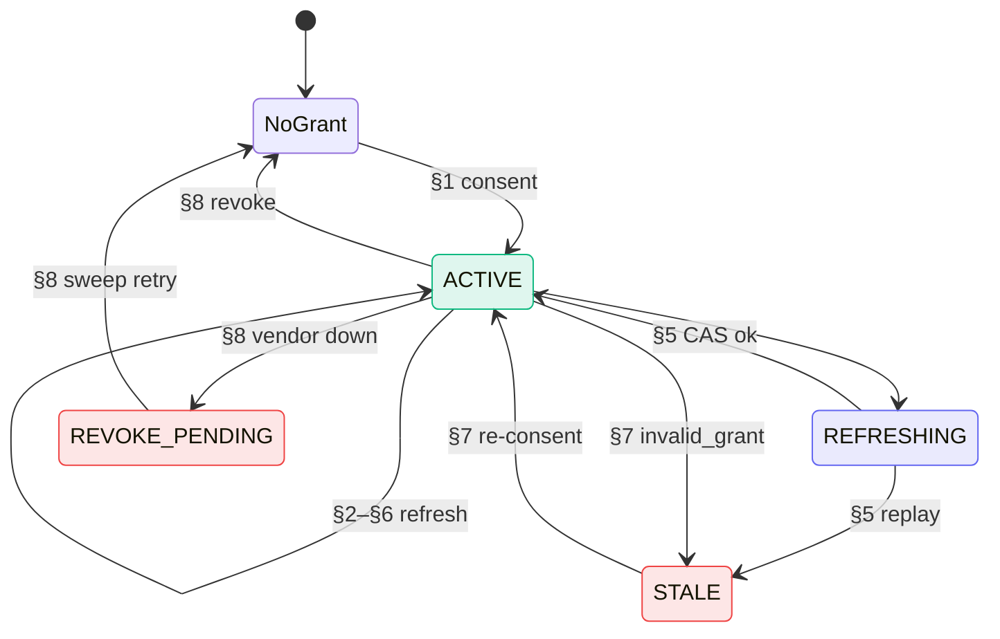
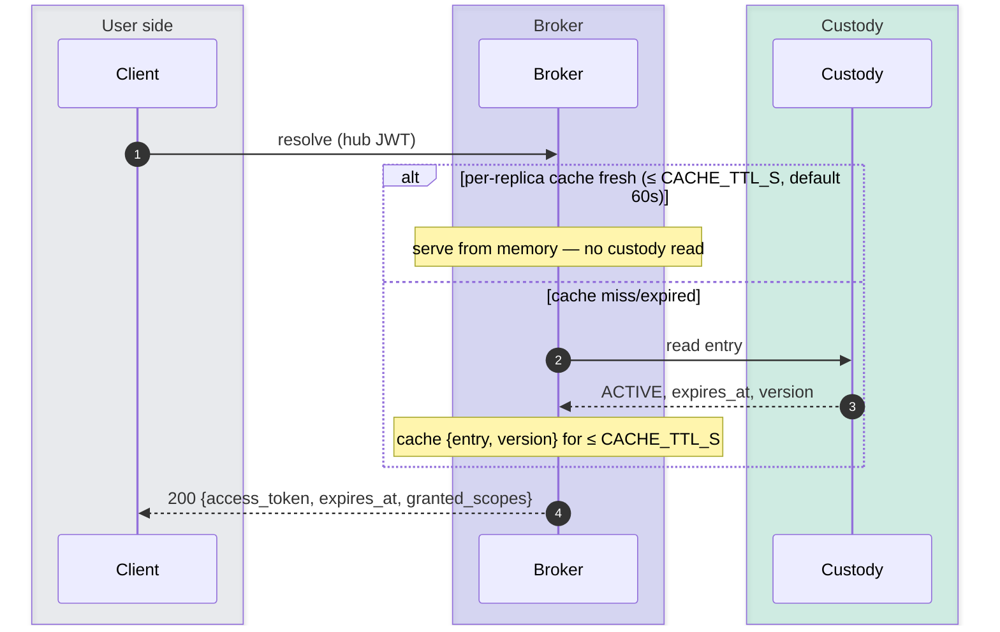
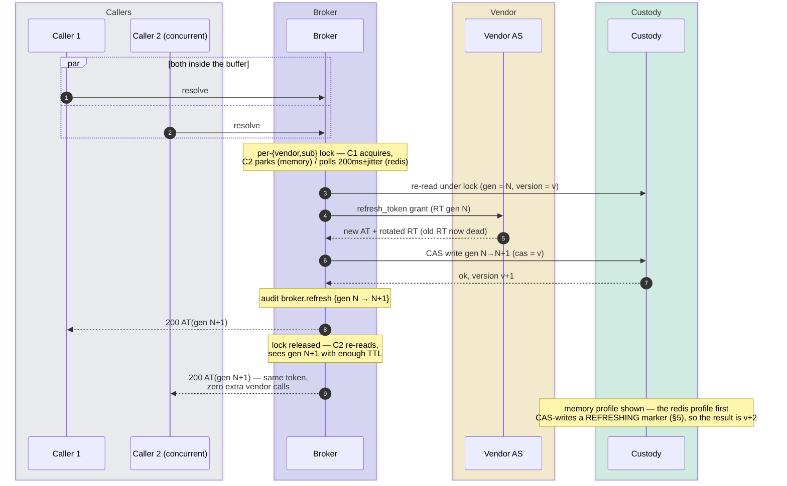
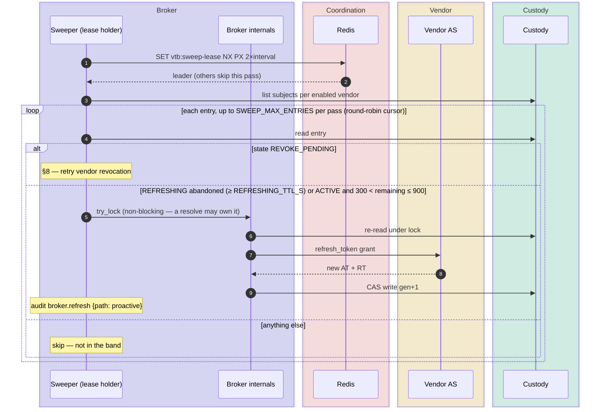
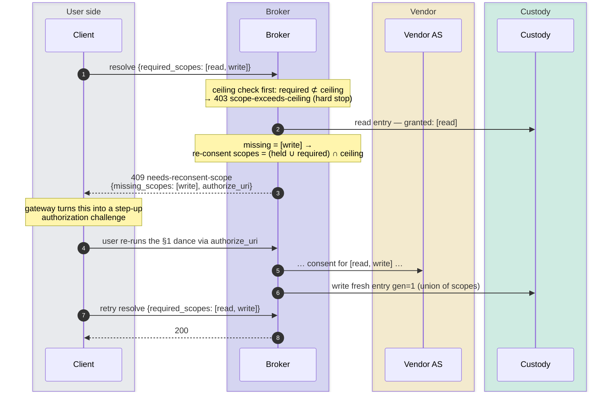
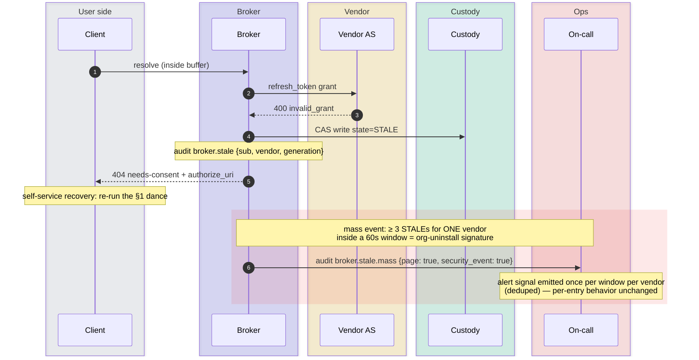
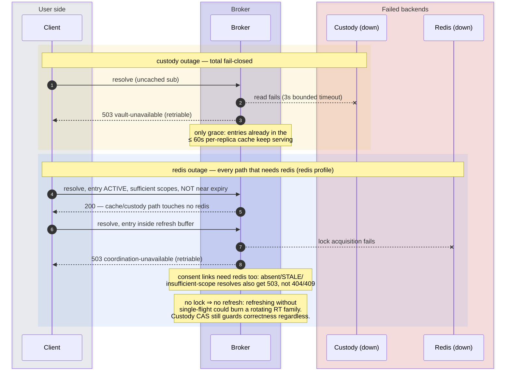

# Token lifecycle — sequence diagrams

Every path a vendor grant can take through the broker, from first consent
to deletion, illustrating the implementation and its failure paths (timings are the
defaults from `config.py`). Companion documents: `design.md` (normative
behavior), `smoke-tests.md` (hands-on verification of these same paths).

**Cast**, common to all diagrams:

| Actor | Role |
|---|---|
| Client | The trusted gateway calling the broker with the user's internal hub JWT; not the MCP client |
| Broker | This service (one replica unless the diagram says otherwise) |
| Vendor AS | The third-party authorization server (GitHub-class: rotating refresh tokens) |
| Custody | OpenBao/Vault KV-v2 — the entry's KV version is the CAS handle |
| Redis | Coordination backend (multi-replica profile only) |

## 0. Orientation — the states and which diagram covers each transition

| Transition group | Diagram | What happens |
|---|---|---|
| §1 | Birth | consent dance writes `ACTIVE gen=1` |
| §2–§4 | Steady state / refresh | cache-hit serve, lazy + proactive refresh (`gen+1`) |
| §5 | Multi-replica | persisted `REFRESHING` marker, takeover, CAS backstop |
| §6 | Scope step-up | re-consent union writes a fresh `gen=1` |
| §7 | STALE | `invalid_grant` → re-consent (mass burst pages) |
| §8 | Revocation | vendor-first delete, `REVOKE_PENDING` parking |

`REFRESHING` exists only in the redis profile and never surfaces
externally (`/v1/grants` reports it as `ACTIVE`).

---

## 1. Birth — first-time consent dance

Trigger: a resolve finds no entry (or a STALE one) for `{vendor, sub}`.

¹ Client auth per registry `token_endpoint_auth_method`:
`client_secret_post`, `client_secret_basic`, or `private_key_jwt`
(RFC 7523 assertion signed with the key from `vendor-clients/{vendor}`).

Defenses in this diagram: only the user the link was issued for, in the
browser that opened it, can complete consent (hub login + binding cookie);
the code is redeemed server-side only; the browser sees only opaque state handles; the verifier is sent only in server-side token requests; a replayed
callback (state already consumed) is a 400 **and** a
`security_event: true` audit line; a tampered or missing `iss` is rejected
*before* consumption, so the legitimate callback still completes.

---

## 2. Steady state — cache-hit resolve

Condition: `expires_at − now ≥ max(min_ttl_s, REFRESH_BUFFER_S=300)`.

This is the hot path (SLO p99 ≤ 25 ms). The 60-second cache is also the
**only** grace the broker allows during a custody outage (§9).

---

## 3. Lazy refresh — single-flight inside the buffer

Condition: entry ACTIVE but `expires_at − now < max(min_ttl, 300)`.
Rotating-RT vendors revoke the whole token family if a consumed refresh
token is replayed — so concurrent resolves must produce exactly one
vendor call.

Waiter outcomes, in order of preference: generation advanced → serve the
winner's token; lock wait exceeds 10s → re-read once and serve if still
usable, else `503 vendor-unavailable` (retriable); winner hit
`invalid_grant` → the waiter finds STALE and answers `needs-consent`.

---

## 4. Proactive refresh — the sweeper

Runs every `SWEEP_INTERVAL_S=60` (leader-only + ±20% jitter in the redis
profile). Targets entries in the 5–15 minute band; the 0–5 minute band is
left to lazy resolve.

A failed entry never kills the loop (`broker.sweep.error` and continue).

---

## 5. Multi-replica refresh — persisted REFRESHING, takeover, CAS backstop

Redis profile only. The lock is the optimization; the custody CAS is the
correctness guarantee — a replica that dies mid-refresh can never corrupt
the stored pair.

---

## 6. Scope step-up — 409 needs-reconsent-scope

A grant exists but is narrower than the tool's `required_scopes`.
The caller can never widen past the registry ceiling.

---

## 7. Death by vendor — STALE and the mass-STALE page

`invalid_grant` on refresh means the grant itself is gone: user revoked at
the vendor, refresh token expired from disuse, or the org uninstalled the
app.

A single STALE is expected hygiene, not an incident. Route the burst signal through monitoring if it should notify on-call.

---

## 8. Death by choice — revocation, vendor-first

Order matters: attempt vendor revocation before deleting custody. A vendor
without a revocation endpoint is deleted locally only, with
`vendor_revocation: "unsupported"`. Upstream access can survive that deletion.

² GitHub's documented deviation: grant-deletion API with basic auth
instead of RFC 7009 (`revocation.type: github_grant` in the registry).

---

## 9. Outages — fail closed, distinguishably

The two backends fail differently on purpose, and neither failure is ever
conflated with "no grant" (which would trigger a mass re-consent
stampede).

Recovery resumes after dependencies return. Custody remains the durable
source of credentials; lost Redis consent records require users to start
a new browser flow.

---

## Reading the audit trail

Every transition above emits id-only JSON lines (never token material);
a lazy refresh, for example, logs both `broker.refresh` and `broker.resolve`. The joins:

| Event | Emitted in | Joins on |
|---|---|---|
| `broker.resolve` {decision, path} | §§2,3,6,7,9 | `hub_jti`, `sub`, `vendor` |
| `broker.consent.start` / `.complete` / `.fail` | §1, §6 | `sub`, `vendor`, `vendor_user_id` |
| `broker.refresh` {generation_from → to} | §§3,4,5 | `sub`, `vendor` |
| `broker.stale` / `broker.stale.mass` | §7 | `sub`/`vendor`; mass carries `page: true` |
| `broker.revoke` {outcome: revoked\|unsupported\|pending, path?: sweep-retry\|reconsent} | §8 | `sub`, `vendor`; `hub_jti` only on self-service DELETE |

A vendor-side action is traceable end-to-end: hub `jti` → `broker.resolve`
→ gateway record → vendor audit log via `vendor_user_id`.
